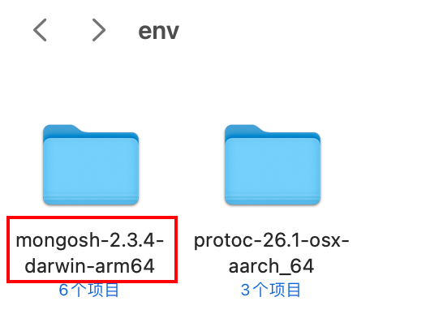
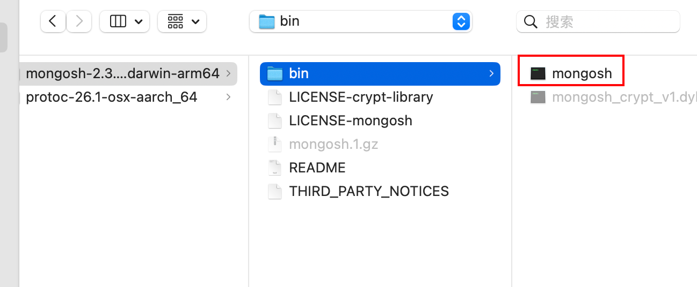
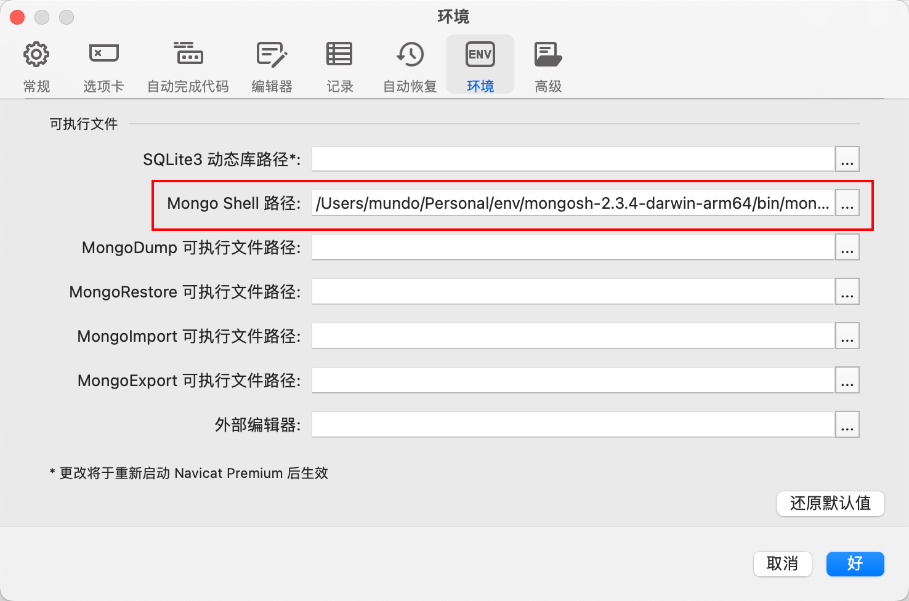
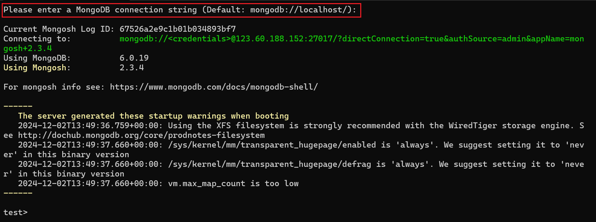

这里我使用`Navicat`连接`MongoDB`服务后，开启其命令列界面：

但是发现它弹出了如下提示：

这里访问该网址：https://www.mongodb.com/try/download/shell，下载`Mongosh`文件夹，并放到适当的目录下：

然后在上一步的“设置路径”中，将下面的可执行文件设置进去：

在`Navicat`的“设置”里可以看到我们设置的`Mongo Shell`路径：

但是我们发现一个问题：该可执行文件默认连接本地（`127.0.0.1`）的`27017`端口，由于`MongoDB`是部署在云服务器上的，所以我们打开“命令列界面”会导致连接超时，且`Navicat`不会有任何提示。

在`Windows`环境的`Navicat`中不会出现上面的问题，它会默认以`Navicat`的连接信息进行`mongosh`的连接：

关于`Mac`的命令列界面问题，后续再想办法进行解决。

这里我们采用`Linux`终端界面来操作命令行，具体操作方式见“`Docker`安装`MongoDB`”一节。