`2025-02-25`更新，建议直接执行下面命令，使用阿里云镜像进行安装，可以避免出现一系列问题：

```sh
sudo yum install -y yum-utils device-mapper-persistent-data lvm2
sudo yum-config-manager --add-repo http://mirrors.aliyun.com/docker-ce/linux/centos/docker-ce.repo
sudo yum makecache fast
sudo yum install -y docker-ce
```

我们基于`CentOS Linux 7 (Core)`来安装`Docker`，逐条执行以下安装命令（已废弃，无需执行，仅留存）：

```sh
sudo yum install -y yum-utils device-mapper-persistent-data lvm2
sudo yum-config-manager --add-repo https://download.docker.com/linux/centos/docker-ce.repo
sudo yum install -y docker-ce
```

在执行上面第二条命令的时候，也许会遇到这样的一条报错：

```sh
Could not fetch/save url https://download.docker.com/linux/centos/docker-ce.repo to file /etc/yum.repos.d/docker-ce.repo: [Errno 14] curl#7 - "Failed to connect to 2600:9000:215a:ae00:3:db06:4200:93a1: 网络不可达"
```

这表示尝试通过网络获取资源时，连接失败了。这是因为该`Linux`系统缺少`GPG`密钥，这个密钥用于验证软件包的完整性和来源。我们在这个网站查看对应密钥的地址信息：http://mirrors.163.com/centos/

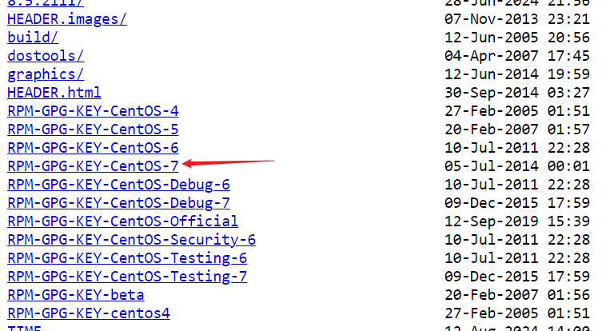

由于我们的`CentOS`版本为`CentOS 7`,所以我们选择上面这一项。光标放上去，右键，点击“复制链接地址”：

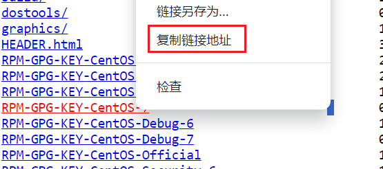

然后使用`rpm --import`后面跟着上面复制的地址，在终端执行：

```sh
rpm --import https://mirrors.163.com/centos/RPM-GPG-KEY-CentOS-7
```

> 参考文章：https://blog.csdn.net/zqq_2016/article/details/121907928、https://blog.csdn.net/zfs_zs/article/details/106957522

安装完成后，使用`docker -v`命令进行验证：

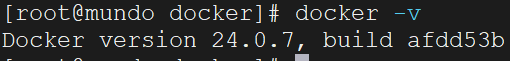

安装完`Docker`后，我们需要配置`Docker`镜像加速器。原因：从`DockerHub`（https://hub.docker.com/）上下载镜像太慢。

这里我们配置阿里云镜像加速器，先登录阿里云（https://www.aliyun.com/），点击左上角“控制台”：

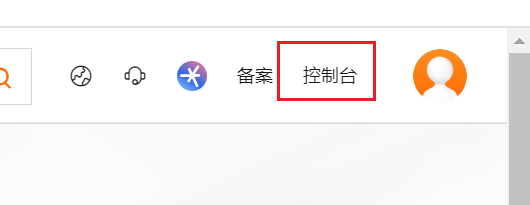

搜索“镜像”，找到“容器镜像服务”：

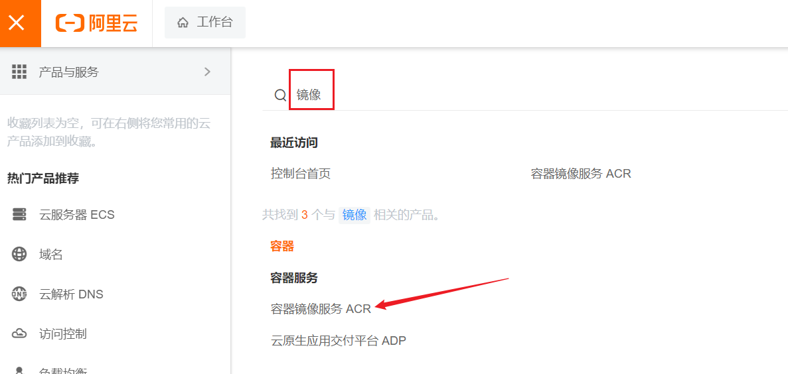

在侧边列表找到“镜像加速器”：

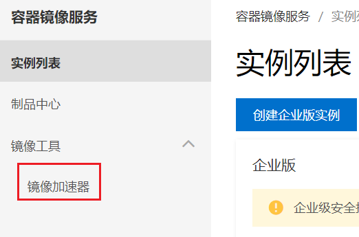

这里就可以根据不同的操作系统环境，来运行使用加速器了。选择`Centos`，复制指令在`Linux`终端执行即可：

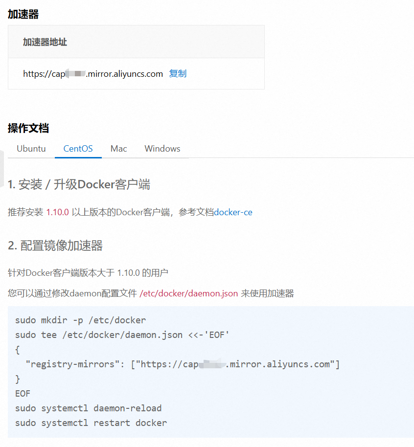

`2024-8-12`注，由于一些特殊的原因，即使配置了上方的`Docker`镜像加速器，在使用`docker pull`命令时，还是有可能会报错：

```sh
error pulling image configuration: download failed after attempts=6: dial tcp 31.13.81.4:443: connect: connection refused
```

遇到这种情况，只能配置其他的镜像加速器。首先编辑下面这个文件：

```sh
vim /etc/docker/daemon.json
```

> 参考文档：https://status.anye.xyz、https://github.com/dongyubin/DockerHub、https://mirror.kentxxq.com/image

将上方参考文档内的镜像网站配置到该文件中，如下所示：

```json
{
  "registry-mirrors": [
    "https://docker-0.unsee.tech",
    "https://docker-registry.nmqu.com",
    "https://docker.1ms.run",
    "https://docker.apiba.cn",
    "https://docker.cattt.net",
    "https://docker.etcd.fun",
  ]
}
```

> 上述镜像加速网站可能随时失效，应以参考文档中提供的最新可用地址为准，并将其替换到上面配置中。

修改完镜像加速器的配置后，需要执行下面命令重新加载`systemd`管理器配置，并重启`Docker`服务：

```sh
sudo systemctl daemon-reload
sudo systemctl restart docker
```

使用以下命令查看是否配置成功：

```sh
cat /etc/docker/daemon.json
```

查看结果如下所示：

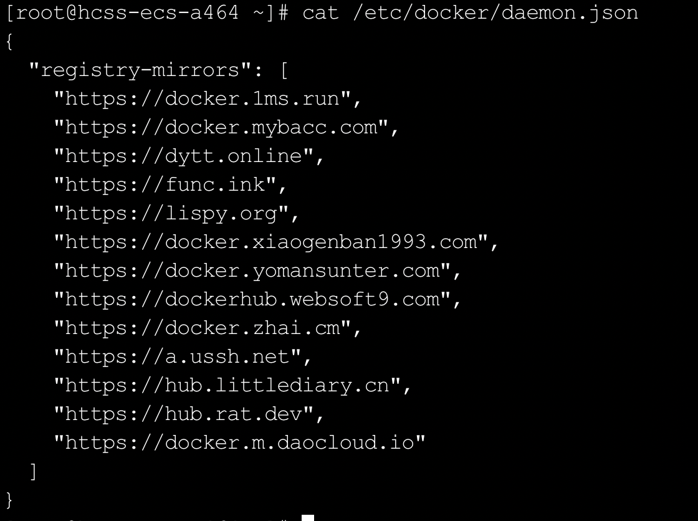

> 如果希望优先从企业私有仓库拉取镜像，未命中时再访问`DockerHub`或其他镜像站点，需要将企业私有仓库配置在列表第一行。

配置完上面内容后，还需要设置`Docker`的开机自启动：

```bash
systemctl enable docker
```

`Docker`的手动启动：

```sh
systemctl start docker
```

查看`Docker`启动状态：

```sh
systemctl status docker
```

查看到`active（running）`，则表示启动成功：

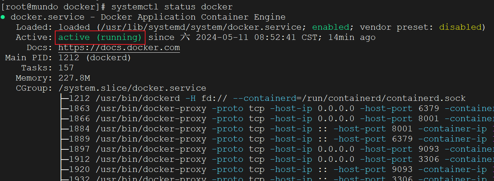

我们在使用`docker pull`命令拉取镜像时，如果遇到这样的问题：

```sh
Error response from daemon: Get "https://registry-1.docker.io/v2/": dial tcp: lookup registry-1.docker.io on 10.40.18.2:53: server misbehaving
```

这是`DNS`服务器的配置问题，解决方案是修改本机的网络配置文件（在云服务器上可能是其他文件名）：

```bash
vim /etc/sysconfig/network-scripts/ifcfg-ens33
```

有这样一条`DNS1`的话，我们把它改成`223.5.5.5`（阿里巴巴的公用`DNS`地址）：

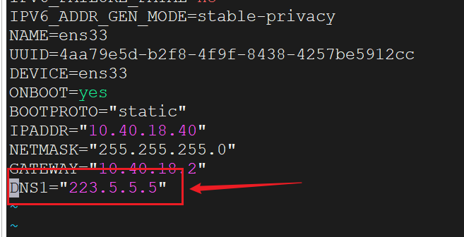

保存，重启`Docker`，这样`docker pull`就没问题了。

我们可以在下面这个文件看本机`Linux`的`DNS`配置：

```bash
vim /etc/resolv.conf
```

查看到如下结果，表示修改成功：

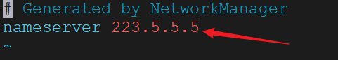

