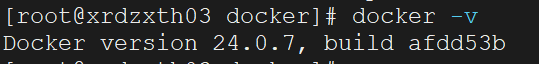

上一节讲了如何安装`Docker`，但是那种安装方式需要`Linux`服务器能连通网络。有些情况下，服务器不能和外界网络连通，这种情况使用以下方式来安装`Docker`（前提需要保证这个服务器可以进行文件传输）。

> 参考文章：https://blog.csdn.net/lingfeian/article/details/125482271

首先做一下环境检查，要求`Centos`在`7.x`版本以上，系统为`64`位，系统内核版本为`3.10`以上。

使用`uname -r`查看当前服务器的`Centos`内核：


再使用`cat /etc/redhat-release`查看版本信息：


在这个网站下载`Docker`的资源包（https://download.docker.com/linux/static/stable/x86_64/），这里我下载的是`24.0.7`版本：


下载之后传输到这台`Linux`服务器的指定目录下，再执行以下操作，下面操作需要在`root`用户下执行。

首先解压这个资源包：

```sh
tar -zxvf docker-24.0.7.tgz
```

将解压后生成的`docker`目录下的所有文件复制到`/usr/bin`目录下：

```sh
cp docker/* /usr/bin
```

在`/etc/systemd/system`目录下创建一个`docker.service`文件，用于注册`docker`服务和开机启动：

```sh
vi /etc/systemd/system/docker.service
```

文件内容如下：

```sh
[Unit]
Description=Docker Application Container Engine
Documentation=https://docs.docker.com
After=network-online.target firewalld.service
Wants=network-online.target
[Service]
Type=notify
ExecStart=/usr/bin/dockerd --selinux-enabled=false --insecure-registry=127.0.0.1
ExecReload=/bin/kill -s HUP $MAINPID
LimitNOFILE=infinity
LimitNPROC=infinity
LimitCORE=infinity
TimeoutStartSec=0
Delegate=yes
KillMode=process
Restart=on-failure
StartLimitBurst=3
StartLimitInterval=60s
[Install]
WantedBy=multi-user.target
```

给此文件设置权限：

```sh
chmod 777 /etc/systemd/system/docker.service
```

使用下面命令重新加载配置：

```sh
systemctl daemon-reload
```

设置`Docker`为开机启动，并启动`Docker`，然后查看容器状态。依次执行以下命令：

```sh
systemctl enable docker.service
systemctl start docker
systemctl status docker
```


然后使用`docker -v`命令查看安装的`Docker`版本：



由于这台`Linux`服务器是无网的，所以它不能使用`docker pull`拉取镜像，也就不用设置镜像加速器了。这样的服务器只能通过解压外界传入的`tar`包来生成镜像、创建容器了。
