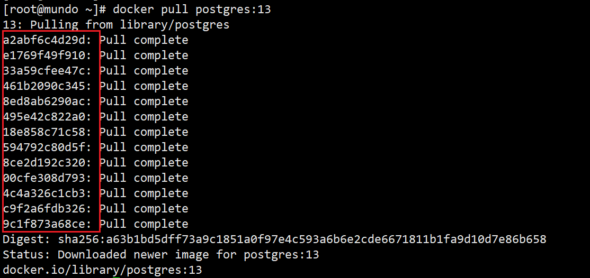

### `bootfs`和`rootfs`

在`Linux`文件系统中，主要有两个组成部分：`bootfs`和`rootfs`。

- **`bootfs`**（`Boot File System`）：包含了`bootloader`（引导加载程序）和内核映像。`bootfs`在系统引导时被加载到内存中，由`bootloader`用于引导操作系统，并完成系统的初始化。
- **`rootfs`**（`Root File System`）：是`Linux`的根文件系统，包含操作系统的基本文件和目录结构。`rootfs`提供了系统启动后的最初文件系统环境，即我们在操作`Linux`时所见到的文件结构。

不同的`Linux`发行版（如`CentOS`、`Ubuntu`）的`bootfs`基本相同，而`rootfs`则根据发行版的不同而有所差异。

### `docker`镜像原理

镜像是一种轻量级、可执行的独立软件包，核心概念是将软件运行所需的一切打包在一起，形成一个封闭的环境，包含运行某个软件所需要的内容，包括代码、运行时、库、环境变量、配置文件等。

`docker`使用一种名为`UnionFS`（联合文件系统）的技术实现镜像的加载原理。这是一种文件系统层叠技术，允许将多个文件系统合并到单一的文件系统中，提供文件系统的联合视图，使用户能够同时访问多个不同的文件系统层次结构，而用户看起来就像在访问一个文件系统。`docker`镜像实际上就是一层一层的文件系统叠加组成：

1. 最底层是`bootfs`，并且使用宿主机的`bootfs`。
2. 第二层是`rootfs`，由宿主机的`Linux`版本决定，也叫文件系统层。
3. 然后往上叠加其他的镜像文件。一个镜像可以放在另一个镜像的上面，位于下面的叫做父镜像。
4. 当从一个镜像启动容器时，`docker`会在最顶层加载一个读写文件系统作为容器层。

`docker`采用分层结构的最大好处是资源共享。分层结构在拉取镜像时表现得尤为明显：如果本地已经存在某个镜像的某一层，再次拉取另一个镜像时，这一层会被直接复用，不需要重新下载。大大提高了效率并节省了存储空间。

例如我们拉取下面的镜像，就可以直观地看到分层结构：

