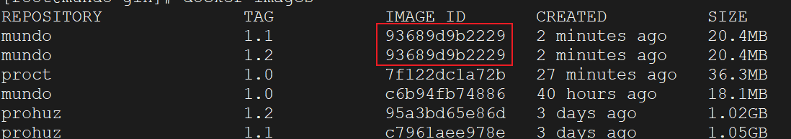

我们如何自己制作`Docker`镜像呢？第一种是用容器转为镜像（少用），第二种就是使用`Dockerfile`了。

`Dockerfile`是一个文本文件（没有文件后缀），其中包含一系列用于构建`Docker`镜像的指令。这些指令描述了镜像的基础结构、环境设置、应用程序的安装和配置等。通过执行`Dockerfile`，可以自动化地构建出一个可复制的、可移植的`Docker`镜像。

`Dockerfile`文件中，一个关键字组成一行指令。重点的关键字有这些（关键字必须为全大写字母）：

| 指令        | 描述               | 详细说明                                                     |
| ----------- | ------------------ | ------------------------------------------------------------ |
| `FROM`  | 指定基础镜像       | 指定当前镜像基于哪个镜像构建，必须为文件第一行               |
| `ENV`   | 环境变量           | 设置镜像的环境变量，启动容器时可通过`-e`选项覆盖               |
| `SHELL` | 指定指令`shell`    | 指定`RUN`、`CMD`、`ENTRYPOINT`执行命令时使用的`shell`        |
| `WORKDIR` | 工作目录           | 指定容器内的工作目录，使用绝对路径                           |
| `COPY` |复制文件|将文件或目录从构建环境复制到`Docker`镜像中|
| `ADD`   | 添加文件           | 相比`COPY`命令，它还会自动解压缩或下载`URL` |
| `RUN` |执行命令|按照指定的`shell`，执行一些脚本命令|
| `CMD`  | 容器启动命令       | 指定容器启动后执行的命令                                     |

下面是`Dockerfile`中其他不常用的指令关键字：

| 指令          | 描述               | 详细说明                                                     |
| ------------- | ------------------ | ------------------------------------------------------------ |
| `MAINTAINER`  | 作者信息           | 标明`Dockerfile`作者信息（姓名、邮箱等）                     |
| `LABEL`       | 标签               | 为`Docker`镜像添加元数据，可通过`docker inspect`查看         |
| `ENTRYPOINT`  | 入口               | 在制作一些执行后就关闭的容器中使用                           |
| `EXPOSE`      | 声明端口           | 声明服务可用的端口，但不会直接暴露端口，只是一个指示         |
| `ARG`         | 构建参数           | 只在构建时使用的参数，若有`ENV`，`ENV`的同名值覆盖`ARG`      |
| `VOLUME`      | 定义可挂载的数据卷 | 指定`build`的`image`哪些目录可在启动时挂载到文件系统，使用 `-v`绑定 |
| `USER`        | 指定执行用户       | 指定`build`或启动时的用户，在`RUN`、`CMD`、`ENTRYPOINT`执行时使用 |
| `HEALTHCHECK` | 健康检查           | 指定监测容器健康的命令，应用本身有监测机制时用处不大         |
| `ONBUILD`     | 触发器             | `ONBUILD`关键字的镜像作为基础镜像时，执行`FROM`后会执行`ONBUILD`的命令 |
| `STOPSIGNAL`  | 发送信号到宿主机   | 设置发送到容器的系统调用信号以退出                           |

执行`Dockerfile`的大致流程如下：

1. 准备基础镜像：包括`bootfs`（引导文件系统）和`rootfs`（根文件系统）。
2. 逐条执行`Dockerfile`指令：每执行一条指令，就生成一个新的镜像层，并作为缓存保存在`Linux`的`/var/lib/docker`目录下。
3. 使用`UnionFS`技术：将新的镜像层叠加到已有的镜像层上。
4. 缓存机制：如果某条指令之前已经执行过且没有变化，`Docker`会使用缓存中的结果，而不是重新执行该指令。
5. 组合最终镜像：执行完所有指令后，`Docker`将所有的镜像层合并，生成最终的镜像。

怎么执行`Dockerfile`文件？首先，将文件命名为`Dockerfile`（无后缀），因为`Docker`默认会在构建时查找名为`Dockerfile`的文件，这样就不需要使用`-f`参数指定路径和名称。

然后，进入包含`Dockerfile`的目录，在终端中运行以下命令。注意不要忽略命令末尾的点号，它表示`Dockerfile`文件位于当前目录。这里的`-t`是`tag`的缩写，用于指定镜像标签。如果不指定`tag`，`Docker`会默认设置为`latest`。

```shell
docker build -t your-image-name:tag .
```

如果文件名不叫`Dockerfile` ，那么命令如下（假如文件名叫`MyDockerfile`）：

```shell
docker build -t your-image-name:tag -f MyDockerfile .
```

需要关注到的一点是，如果项目内容（包括`Dockerfile`文件）没有改动，而镜像名和标签名不同，再次执行`Dockerfile`打镜像，它和上一次打的镜像版本的镜像`ID`是相同的，就像这样：



这种情况，我们就不能使用镜像`ID`来删除镜像，只能通过`<REPOSITORY:TAG>`来删除了。
