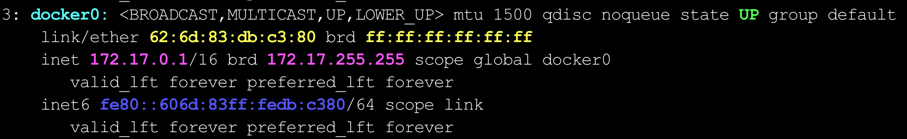

`Docker`的网络模式是用来解决容器之间以及容器与外部世界之间的网络通信和隔离问题，不同的网络模式提供不同程度的隔离和连接性，以适用各种应用场景。`Docker`提供了几种常见的网络模式，包括桥接模式、主机模式和自定义网络。

### 一、桥接模式

桥接模式是`Docker`的默认网络模式。每个容器都会连接到本地的虚拟桥接网络，其核心机制如下：

1. 宿主机会自动创建名为`docker0`的虚拟网络接口（网桥）。该网桥本质上是基于`Linux bridge`实现的二层交换设备，用于在宿主机内部转发不同容器之间的网络报文。每个容器通过一对`veth`设备与该网桥连接，其中一端位于容器的网络命名空间，另一端挂载在`docker0`上，从而实现容器与宿主网络之间的连通。

2. 容器启动时，`Docker`会从`docker0`所属子网的地址池中为其分配一个独立的私有`IP`地址。该地址通常由内置的`IPAM`机制自动分配，以保证同一网桥下地址不发生冲突。容器的默认网关即为`docker0`在该子网中的地址。

3. 由于所有容器都接入同一个二层网桥，数据报文在`docker0`上基于`MAC`地址进行转发。因此，容器之间可以通过各自的`IP`地址直接通信，而无需经过宿主机的三层路由。其通信路径等价于处于同一交换网络中的多台主机。

使用`ip a`命令即可查看到名为`docker0`的虚拟网桥：



每个容器都有唯一的`IP`地址。但当宿主机运行一个容器并暴露端口后，外部可以通过宿主机的`IP`和暴露的端口访问该容器的服务，这是因为`Docker`会将宿主机上所有容器连接到`docker0`网桥。

当容器暴露端口时，`Docker`会在宿主机上添加`NAT`（`Network Address Translation`，网络地址转换）规则，将宿主机的`IP:Port`映射到容器的`IP:Port`。因此，外部请求会通过宿主机端口转发到容器内部端口，从而实现对容器服务的访问。

使用`ip a`命令同样可以查看到连接宿主机与`Docker`容器的虚拟网线端点：


在`Docker`默认的`bridge`网络模式下，容器的网络通信依赖于`Linux`内核提供的`veth pair`机制。该机制用于在不同的`network namespace`之间建立二层直连通道。当一个容器启动时，系统会自动创建一对`veth`接口：

- 一端保留在宿主机的网络命名空间中，通常命名为类似`vethxxxx`；
- 另一端被移动到容器的网络命名空间中，并重命名为容器内的`eth0`。

容器内部进程产生的网络流量首先从`eth0`发出，通过`veth pair`传输到宿主机端的对应接口。宿主机随后将该接口挂载到`docker0`网桥上。因此，`veth pair`承担的是“点对点链路”的角色，而`docker0`负责“交换与转发”。两者配合，使每个容器既拥有独立的网络命名空间，又能够通过网桥与宿主机及其他容器实现互通。

从结构上看，其数据流路径可以抽象为以下表示：

容器进程 → 容器内`eth0` → `veth pair` → 宿主机侧`vethxxxx` → `docker0`网桥 → 其他容器或外部网络

### 二、主机模式

容器直接使用宿主机的网络命名空间，和宿主机共享网络。这意味着容器不会有自己的网络隔离，直接使用宿主机的`IP`和端口。

1. 无端口映射：由于容器和宿主机共享同一套网络，因此无需进行端口映射。
2. 共享网络：容器和宿主机的网络完全一致，容器可以直接使用宿主机的`IP`地址和端口。

使用主机模式时，需要用额外的参数配置`--network host`，如下：

```shell
docker run -d --name mycontainer --network host myimage
```

这种模式通常用于对网络延迟非常敏感的应用场景，因为它减少了一层网络转发，提高了性能。但需要注意，使用主机模式会带来安全隐患，因为容器和宿主机共享网络，缺乏网络隔离。

### 三、自定义网络

除了默认的桥接网络和主机网络，`Docker`还允许创建自定义网络。自定义网络提供了更高的灵活性和控制，适用于复杂的应用场景。

既然`Docker`已经有了这两种模式，为什么还需要创建自定义网络？主要基于以下原因：

1. 增强容器间通信：默认的桥接网络不支持容器名称解析，这意味着容器必须通过`IP`地址来互相通信，这不便于维护和扩展。而使用自定义桥接网络，`Docker`会自动设置`DNS`，使容器可以通过名称互相访问，提高了容器间通信的便捷性和可维护性。
2. 网络隔离：自定义网络允许创建隔离的网络环境，这对于多租户应用、开发、测试和生产环境的隔离非常重要。不同的容器可以分配到不同的自定义网络，确保它们之间的通信受限，从而提高安全性。
3. 自定义网络配置：通过自定义网络，用户可以更灵活地配置网络设置，例如子网和网关，满足特定应用场景的需求。这种灵活性在需要特定网络拓扑或高级网络配置的场景下尤为重要。

具体的创建自定义网络的命令，看`Docker`操作部分。