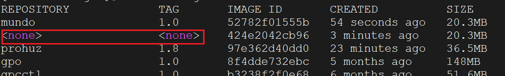

#### 1. 查看现有的镜像

```sh
docker images
```

#### 2. 删除指定的镜像（如果使用镜像`ID`，需要保证其唯一）

```sh
docker rmi <IMAGE_ID> / <REPOSITORY>:<TAG>
```

#### 3. 删除指定`REPOSITORY`的所有版本的镜像

```sh
docker rmi $(docker images -q <REPOSITORY>)
```

> **注意：**删除镜像前必须删除镜像关联的所有容器，否则无法删除镜像。

#### 4. 删除所有未使用的`Docker`对象和数据

```sh
docker system prune -a
```

这个命令会清除的内容包括：

- `all stopped containers`：所有已停止的容器。
- `all networks not used by at least one container`：所有未被至少一个容器使用的网络。
- `all images without at least one container associated to them`：所有没有与至少一个容器关联的镜像。
- `all build cache`：所有构建缓存。

`-a`参数是`--all`的缩写，表示删除所有未被使用的镜像，包括悬空镜像和那些虽然有标签但未被容器引用的镜像。如果不使用`-a`参数，默认只会删除没有标签且未被任何容器引用的悬空镜像。

#### 5. 列出所有悬空镜像

悬空镜像（`Dangling Images`）指的是没有任何标签的镜像，例如，使用相同的标签重新构建一个镜像时，旧的镜像会失去其标签并成为悬空镜像。可以使用以下命令来列出所有悬空镜像：

```sh
docker images -f dangling=true
```

展示出的悬空镜像如下所示：

```sh
REPOSITORY          TAG                 IMAGE ID            CREATED             SIZE
<none>              <none>              d1e017099d17        2 weeks ago         183MB
<none>              <none>              e1ae5103dd73        3 weeks ago         182MB
```

例如先构建了一个镜像并命名为`mundo:1.0`，然后修改程序，再次用相同的标签`mundo:1.0`重新构建镜像，这样，旧的镜像就失去了它的标签，成为了一个悬空镜像：

