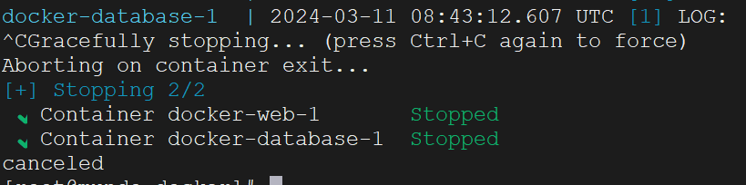

`Docker Compose`是一个用于定义和运行多容器`Docker`应用程序的工具。通过编写一个简洁的`yaml`文件，可以配置应用的服务、网络和卷。使用`Docker Compose`，只需执行一条命令即可轻松启动整个应用程序。

以下是一个`docker-compose`文件示例：

```yaml
version: '3'
services:
  web:
    image: nginx:1.24
    ports:
      - "8080:80"
    restart: always
  database:
    image: postgres:13
    environment:
      POSTGRES_PASSWORD: 123456
```

在这个配置中，定义了两个服务：

1. `web`服务，使用`nginx:1.24`镜像，并将容器的`80`端口映射到宿主机的`8080`端口。服务配置为`always`重启策略。
2. `database`服务，使用`postgres:13`镜像，并通过环境变量`POSTGRES_PASSWORD`设置数据库的密码。

> **注意：**建议将此文件命名为`docker-compose.yml`。在编辑`YAML`文件时，请确保使用空格进行缩进，`YAML`规范不允许使用制表符（`tab`字符）进行缩进。（在编辑器如`Goland`中会自动把`Tab`转换为空格，但如果使用文本编辑，需要关注这一点）。

`docker-compose`命令需要下载后使用，我们这里使用国内镜像源下载：

```bash
curl -SL https://get.daocloud.io/docker/compose/releases/download/latest/docker-compose-linux-x86_64 -o /usr/local/bin/docker-compose
```

赋予执行权限：

```bash
chmod +x /usr/local/bin/docker-compose
```

查看其版本：

```bash
docker compose version
```


> **注意**：也有一些版本，查看版本的命令是`docker-compose --version`，执行命令也是`docker-compose`，而我们下载的版本的执行命令是`docker compose`，下同。

使用`docker compose`启动应用非常简单，我们切换到`docker-compose.yml`文件的目录下，运行以下命令：

```shell
docker compose up
```

如果文件名不叫`docker-compose.yml`，也可以通过`-f`来指定文件名：

```shell
docker compose -f my-compose-file.yml up
```

如果不加`-d`参数，容器的启动日志会占据整个终端。使用`ctrl + C`退出时，所有容器都会停止：




如果想在后台运行，加上`-d`选项，我们通常都使用这种方式：

```shell
docker compose up -d
```


想停止并移除所有容器，可以运行以下命令：

```bash
docker compose down
```


同理，这两条命令也可以通过`-f`选项来指定文件名（如果文件名不叫`docker-compose.yml`）。