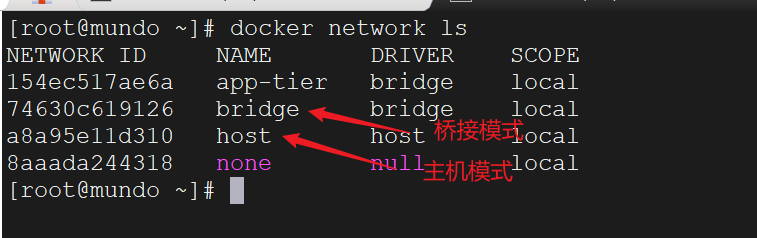

在创建容器时，默认使用的是桥接模式，也可以使用参数`--network host`设置其为主机模式，但是当这两种网络模式无法满足技术和业务的需求时，就需要我们自定义`Docker`网络，自定义`Docker`网络的命令如下所示：

#### 1. 查看当前系统的所有`docker`网络

```bash
docker network ls
```

我们可以看到系统默认的桥接模式和主机模式的网络：



#### 2. 创建一个新的网络（默认为桥接模式`bridge`）

```bash
docker network create <network_name>
```

> **注意：**`Docker`无法创建一个自定义的主机网络，因为主机模式是一种特殊的网络模式，不需要单独创建或配置。当使用主机模式时，容器共享宿主机的网络栈。

可以通过添加相关参数来指定网络的驱动程序、子网、网关等选项：

```bash
docker network create \
    --driver bridge \
    --subnet 192.168.0.0/24 \
    --gateway 192.168.0.1 \
    --ip-range 192.168.0.128/25 \
    <network_name>
```

#### 3. 查看网络的详细信息

```bash
docker network inspect <network_name>
```

#### 4. 将容器连接到网络

```bash
docker network connect <network_name> <container_name>
```

我们也可以在`docker run`创建容器时，使用`--network <network_name>`指定连接哪个网络。

#### 5. 将容器从网络中断开

```bash
docker network disconnect <network_name> <container_name>
```

#### 6. 删除一个网络

```bash
docker network rm <network_name>
```

#### 7. 删除所有未使用的网络（`prune`译为修剪）

```bash
docker network prune
```
