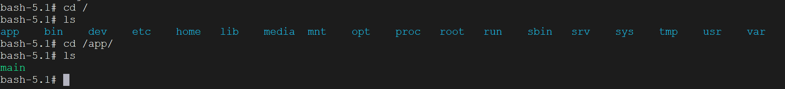

上一节中我们对`Dockerfile`文件做了一个简单的实操，但是我们发现，仅仅是写了一个简单的`Gin`接口，打印出的镜像的体积就高达`1.19GB`，有点过大了，显然我们需要对`Dockerfile`文件进行优化。

在上一节中，我们只给出了一个`main.go`文件，也就是它还没有被`GoModules`管理，而真实的项目肯定是要先交给`GoModules`管理，有了`go.mod`和`go.sum`文件之后，才能上线进行打镜像操作。我们先在`main.go`所在目录下执行以下命令：

```sh
go mod init github.com/mundo/hello
go mod tidy
```

也就是说，我们把这两个步骤从`Dockerfile`文件中移除，作为前置工作。

然后使用以下这个优化后的`Dockerfile`文件：

```dockerfile
# 第一阶段：构建应用程序
# 操作 load metadata for docker.io/library/golang:1.21 步骤时，可能会产生500服务器错误，这里给版本改为1.20
FROM golang:1.20 AS build-stage

SHELL ["/bin/bash", "-c"]

WORKDIR /build

COPY go.mod go.sum ./

ENV GOPROXY=https://goproxy.cn,direct

RUN go mod download

COPY . .

RUN CGO_ENABLED=0 GOOS=linux go build -o main .

# 第二阶段：构建最终镜像
FROM alpine:latest AS run-stage

WORKDIR /app

# 把第一阶段镜像工作目录 /build 下面的可执行文件 main 复制到第二阶段镜像的当前目录，也就是工作目录 /app
COPY --from=build-stage /build/main .

ENV TZ=Asia/Shanghai

# 替换成阿里云镜像，大幅提升下载速度，并下载 bash
# alpine:latest 默认时区为 UTC，这里更改成 CST(Asia/Shanghai)
RUN sed -i 's/dl-cdn.alpinelinux.org/mirrors.aliyun.com/g' /etc/apk/repositories \
    && apk add --no-cache bash tzdata \
    && ln -sf /usr/share/zoneinfo/Asia/Shanghai /etc/localtime \
    && echo "Asia/Shanghai" > /etc/timezone

CMD ["./main"]
```

执行以下命令构建新的镜像：

```sh
docker build -t mundo:2.0 .
```

打出的镜像的体积只有`21.7MB`，优化结果非常显著，体积缩小了`(1.19 × 1024) / 21.7 = 56.15`倍。


创建这个镜像的容器后，使用`docker exec`进入该容器，看看容器内的目录结构：



可以看到，在我们设置的工作目录`/app`下，只有编译后的`main`这个可执行文件。而用优化前的`Dockerfile`打出的镜像所创建的容器，工作目录`/app`下的文件内容是这样的：


我们来对上面优化后的`Dockerfile`进行对比分析，看一下它都做了哪些优化：

#### 1. 多阶段构建

上面的`Dockerfile`使用了分阶段构建，将构建阶段和运行阶段分离。这有助于减小最终镜像的体积。因为在运行阶段不需要使用构建所需的所有依赖项和工具。将构建过程分为`build-stage`和`run-stage`两个阶段，第一个阶段使用`golang:1.20`镜像来编译代码，第二个阶段使用`alpine:latest`镜像来运行编译后的二进制文件。

这样做的好处是避免了将整个构建环境和依赖项带入最终镜像中，可以大大减小镜像的体积，并且提高了镜像的安全性。

#### 2. 缓存依赖

通过使用`COPY go.mod go.sum .`和`RUN go mod download`两条指令，可以缓存依赖，这样如果依赖没有变化，构建将从缓存中获取依赖，而不是重新下载。

#### 3. 合并`RUN`指令，减少中间层

在第二个阶段的`Dockerfile`中，使用单个`RUN`指令合并了四条指令，这减少了镜像层的数量，提高了构建效率并减少了镜像体积。

#### 4. 安装运行时依赖

首先把`Alpine Linux`的默认镜像源替换为阿里云镜像源，加快构建过程的包安装速度。然后安装`bash`，因为`Dockerfile`中使用了`/bin/bash`作为`SHELL`。又安装了`tzdata`，并设置了时区为`Asia/Shanghai`，保证容器的时间显示准确。