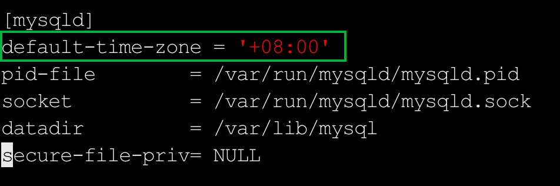
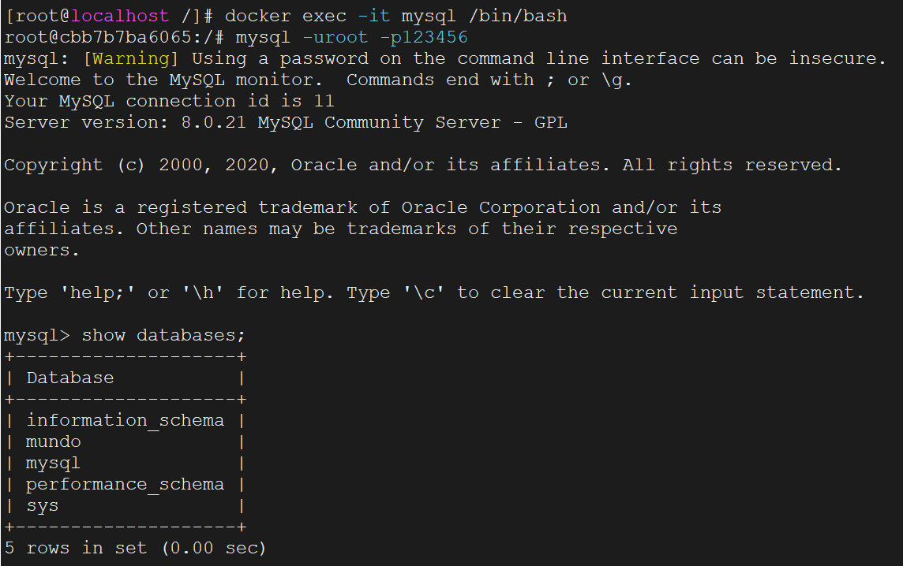

这里我们安装`MySQL8.0`，首先拉取`MySQL8.0`镜像：

```bash
docker pull mysql:8.0.21
```

创建`mysql`的`docker`容器：

```bash
docker run -d --name mysql \
    -e MYSQL_ROOT_PASSWORD=123456 \
    -p 3306:3306 \
    --restart always \
    mysql:8.0.21
```

使用`docker ps`查看容器是否启动成功。

然后要把`MySQL`容器的几个配置文件复制到宿主机，这里我们复制到`/srv/docker/mysql/conf`文件夹下。

先把这个目录创建出来，因为`docker cp`命令不会自动在宿主机创建目录：

```bash
mkdir -p /srv/docker/mysql/conf
```

然后执行下面命令：

```bash
docker cp mysql:/etc/mysql/. /srv/docker/mysql/conf
```

复制完文件后我们需要修改时区配置。编辑`my.cnf`文件，在`[mysqld]`下面添加如下配置：

```sh
default-time-zone = '+08:00'
```

如下所示：



停止并删除掉原容器，使用数据卷挂载新创建一个容器：

```bash
docker run -d --name mysql \
    -e MYSQL_ROOT_PASSWORD=123456 \
    -p 3306:3306 \
    -v /srv/docker/mysql/conf:/etc/mysql \
    -v /srv/docker/mysql/data:/var/lib/mysql \
    -v /srv/docker/mysql/log:/var/log/mysql \
    --restart always \
    mysql:8.0.21
```

> **注意：** 为了简化安装流程，这里使用了简单的密码。如果是在云服务器上进行安装，需设置一个复杂且安全的密码。密码中不要包含美元符`$`，若密码中包含`#`等特殊符号，需使用单引号将密码括起来以避免解析错误。

如果需要修改密码，请避免直接停止并删除上面的容器，然后更改`-e`参数后重新启动，因为这可能会引发一些问题。建议使用以下命令进行密码重置，这样可以在不停止`MySQL`的情况下动态更新密码：

```sql
ALTER USER 'root'@'%' IDENTIFIED BY '<new_password>';
```

进入容器内部：

```bash
docker exec -it mysql /bin/bash
```

使用下面命令登录：

```sh
mysql -uroot -p123456
```

显示如下内容，表示登录成功：



然后再试试使用`Navicat`连接是否成功。
