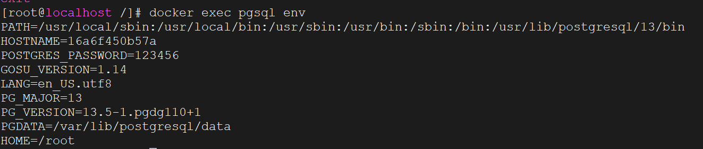
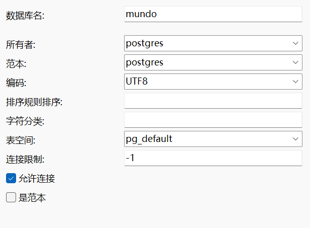

和安装`MySQL`一样的操作，先拉取镜像：

```bash
docker pull postgres:13
```

创建`pgsql`的`docker`容器：

```bash
docker run -d --name pgsql \
    -e POSTGRES_PASSWORD=123456 \
    -p 5432:5432 \
    --restart always \
    postgres:13
```

使用`docker ps`查看容器是否启动成功。

进入容器内部：

```bash
docker exec -it pgsql /bin/bash
```

使用下面命令查看`pgsql`环境信息：

```bash
docker exec pgsql env
```



`pgsql`的默认用户名名称为`postgres`，且`pgsql`有一个默认的初始数据库也叫`postgres`。

使用`Navicat`连接上`pgsql`，密码为上面设置的`123456`。

`pgsql`创建一个数据库挺费劲，跟着下图填就好：



