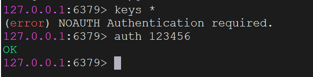

拉取`redis`镜像：

```bash
docker pull redis:7.0.13
```

创建挂载的目录结构：
```sh
mkdir -p /srv/docker/redis/data
mkdir -p /srv/docker/redis/conf
```

创建并编辑`redis.conf`文件：

```sh
cat > /srv/docker/redis/conf/redis.conf <<EOF
bind 0.0.0.0
port 6379
requirepass <password>
appendonly yes
dir /data
EOF
```

- `appendonly yes`：开启`Redis`的持久化。
- `dir /data`：设置数据持久化文件存储路径，是容器内部的路径。

创建`redis`容器：

```bash
docker run -d \
    --name redis \
    -p 6379:6379 \
    -v /srv/docker/redis/data:/data \
    -v /srv/docker/redis/conf/redis.conf:/usr/local/etc/redis/redis.conf \
    --restart always \
    redis:7.0.13 \
    redis-server /usr/local/etc/redis/redis.conf
```

`redis-server /usr/local/etc/redis/redis.conf`表示启动`Redis`时加载配置文件。

> **注意：**这里同理，如果是在云服务器上进行安装，需设置一个复杂且安全的密码。

进入`redis`容器：

```bash
docker exec -it redis /bin/bash
```

使用下面命令进入到`redis`客户端：

```
redis-cli
```

在执行命令时，系统要求输入密码，输入`auth <password>`以进行身份验证：



如果想要动态修改`Redis`的密码，可以在`Redis`客户端使用下面命令来操作：

```sh
CONFIG SET requirepass "<new_password>"
```

再试试使用`Redis Desktop Manager`（`RDM`）能不能连上。

`Redis6.0`之前，不涉及用户名的概念，仅仅通过密码来进行身份验证。在`Redis6.0`以后，引入了`ACL`（访问控制列表）功能，支持多用户模式，可以通过配置文件或命令来为`Redis`设置用户名和权限。这里我们不做讲解。

上面是`Redis`服务端的镜像拉取和容器创建方式，如果想在`Linux`上直接访问`Redis`服务端，就需要我们安装一个`Redis`客户端与服务端进行交互，执行`Redis`命令。首先我们拉取其镜像：

```sh
docker pull goodsmileduck/redis-cli:6.0.4
```

使用这个镜像非常简单，按照下面命令的格式输入要连接的`Redis`服务端信息即可：

```sh
docker run -it --rm goodsmileduck/redis-cli:6.0.4 redis-cli -h <host> -p <port> -a <password>
```

