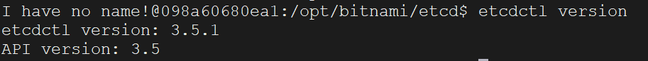

首先拉取`Etcd`镜像：

```sh
docker pull bitnami/etcd:3.5.17
```

启动`Etcd`服务器实例：

```sh
docker run -d --name etcd \
    -p 2379:2379 \
    -p 2380:2380 \
    -e ALLOW_NONE_AUTHENTICATION=yes \
    --restart always \
    bitnami/etcd:3.5.17
```

- `2379`端口是`Etcd`的客户端通信端口，客户端通过这个端口与集群节点交互，比如进行键值的增删改查操作。常用的工具和库（比如`etcdctl`或各种`Etcd`客户端`SDK`）默认会连接这个端口来发送请求。

- `2380`端口是`Etcd`集群内部通信的端口。当`Etcd`运行在集群模式下，各节点通过这个端口进行数据同步、选举处理和一致性维护。如果是单节点模式，`2380`端口一般不会对外使用。

启动容器后，我们进入容器：

```sh
docker exec -it etcd /bin/bash
```

在容器内控制台设置这个变量，以便让`etcdctl`可以连接上`Etcd`服务器：

```sh
export ETCDCTL_API=3
```

然后查看`etcdctl`的版本信息：

```sh
etcdctl version
```

查看到下图结果，代表`Etcd`启动成功：



`I have no name!`这个提示意味着在`Docker`容器中找不到一个有效的用户名。可能是因为容器内部的用户和宿主机的用户不匹配，或者没有设置正确的用户身份。虽然这个提示会显示出来，但通常不会影响容器的正常运行。