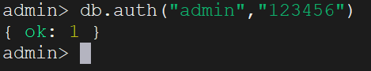
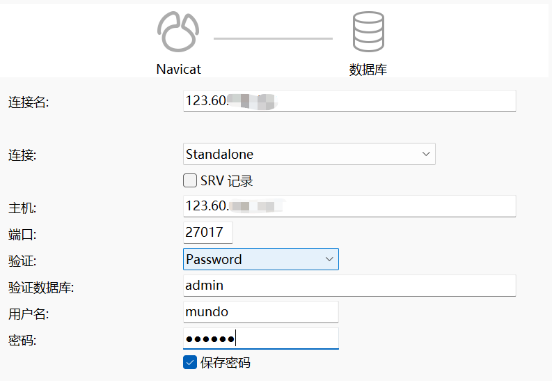

首先拉取`MongoDB`的稳定版本镜像：

```sh
docker pull mongo:6.0
```

镜像拉取完成后，我们创建外部挂载目录，依次执行以下命令：

```sh
mkdir -p /srv/docker/mongo/config
mkdir -p /srv/docker/mongo/data
mkdir -p /srv/docker/mongo/logs
```

创建并编辑`mongod.conf`文件（可选项，若不需要额外配置可忽略）：

```sh
vim /srv/docker/mongo/config/mongod.conf
```

在文件中添加以下内容（根据自己需求进行调整）：

```properties
# 数据库文件存储位置
dbpath = /data/db
# log文件存储位置
logpath = /var/log/mongodb/mongod.log
# MongoDB服务监听的端口号
port=27017
# 绑定的IP地址（0.0.0.0表示接受所有外部连接）
bind_ip=0.0.0.0
# 是否启用写操作日志（推荐开启以提高数据安全性）
journal=true
# 是否以守护进程方式运行（后台运行）
fork=true
# 是否启用身份认证
auth=true
```

接着，使用下面的命令，创建一个`MongoDB`的容器：

```sh
docker run -d \
	--name mongo \
    -p 27017:27017 \
    -v /srv/docker/mongo/config/mongod.conf:/etc/mongod.conf \
    -v /srv/docker/mongo/data:/data/db \
    -v /srv/docker/mongo/logs:/var/log/mongodb \
    -e MONGO_INITDB_ROOT_USERNAME=admin \
    -e MONGO_INITDB_ROOT_PASSWORD=123456 \
    --restart always \
    mongo:6.0
```

接着我们使用下面的命令进入容器内部：

```sh
docker exec -it mongo /bin/mongosh # MongoDB 6.0以上版本使用
docker exec -it mongo /bin/mongo   # MongoDB 6.0以下版本使用（不包括6.0）
```

执行上面命令后，出现下方的命令栏：


我们使用`use admin`，切换到`admin`库：


使用下面命令，执行数据库登录：

```sh
db.auth("admin","123456")
```



登录成功后，创建新用户，这里我取名为`mundo`：

```sh
db.createUser({
    user: "mundo",
    pwd: "123456",
    roles: [
        { role: "root", db: "admin" }
    ]
})
```

创建完成后尝试使用该账号进行登录：

```sh
db.auth("mundo","123456")
```


接着，在`Navicat`上尝试连接该`MongoDB`数据库：



连接成功后，我们发现该连接下未显示任何数据库：


但在“查询”页面中，我们可以看到系统默认的三个数据库：


如果是在云服务器上进行安装，需给用户设置一个复杂且安全的密码。可以使用下面命令更改密码：

```sh
db.updateUser(
  "admin",
  {
    pwd: "<new_password1>",
    roles: [
      { role: "root", db: "admin" }
    ]
  }
)
```

用户`mundo`的密码也可以使用该命令修改：

```sh
db.updateUser(
  "mundo",
  {
    pwd: "<new_password2>",
    roles: [
      { role: "root", db: "admin" }
    ]
  }
)
```

修改后，使用下面命令查看是否修改成功：

```sh
db.auth("admin", "<new_password1>")
db.auth("mundo", "<new_password2>")
```


