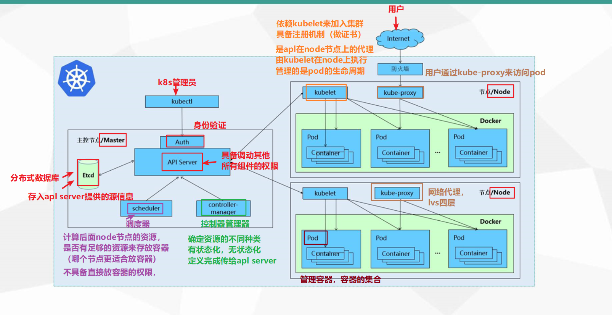

应用的部署经历了三个重要的发展阶段：

1. 传统部署：应用程序直接部署在物理服务器上，每个应用通常独占一台服务器。部署过程需要手动在每个物理机上安装和配置应用程序及其依赖环境。扩展性差，部署过程复杂且耗时，资源利用率低，因为应用可能无法充分使用整个服务器的计算资源。
2. 虚拟化部署：使用虚拟化技术（如`VMware`、`Hyper-V`），将单台物理服务器划分为多个虚拟机，每个虚拟机运行独立的操作系统和应用程序。虚拟化大大提高了资源利用率，通过创建虚拟机镜像简化了应用的迁移、复制和扩展。同时，虚拟机之间的隔离性增强，提升了应用部署的灵活性与安全性。
3. 容器化部署：容器化技术（如`Docker`）将应用程序及其所有依赖打包在容器中。容器共享主机操作系统的内核，因此相比虚拟机更加轻量，启动更快。容器的隔离性与可移植性更强，能够在任意支持容器的平台上运行。容器化部署大幅提高了资源利用率，简化了应用的扩展、管理，并支持微服务架构等现代开发模式，使得部署过程更加快速高效。

`Kubernetes`，简称为`K8s`，是一个开源的容器编排平台，专门用于自动化容器化应用程序的部署、扩展和管理。它为容器集群提供了一套强大的工具，使得应用管理更加高效和可靠。那么，既然已经有了`Docker`，为什么还需要引入`K8s`呢？

虽然`Docker`解决了应用容器化的问题，但随着系统复杂度和规模的增加，其局限性逐渐显现。在云原生环境中，管理复杂的集群和服务，需要`Kubernetes`来提供全面的自动化编排和管理能力。首先，`Docker`无法跨多个服务器编排和管理容器，而`K8s`具备自动调度、服务发现和负载均衡的功能。其次，`K8s`支持自动扩缩容和自愈能力，可以根据流量动态调整容器数量，并在容器故障时自动重启，确保服务高可用。此外，`K8s`提供灵活的持久化存储和资源隔离机制，支持多租户和复杂的资源管理，而`Docker`在这些方面相对有限。因此，在需要跨服务器、自动扩展和复杂服务管理的场景中，`K8s`是`Docker`无法替代的。

`Docker Compose`可以管理多个容器，但它主要用于单一主机上的容器编排，适合开发和测试环境。在生产环境，特别是在分布式场景下，`Docker Compose`存在以下局限：首先，它无法跨多个节点进行编排，缺乏`Kubernetes`的集群管理能力；其次，它不具备自动扩缩容、自愈功能和复杂的服务发现机制；最后，它在持久化存储方面支持较弱，无法像`Kubernetes`一样灵活管理存储资源。简而言之，`Docker Compose`适合小规模、单节点应用的容器编排，而`Kubernetes`则更适合大规模、分布式和生产环境中的容器管理。

`K8s`主要提供以下关键功能：

- 自我修复：`K8s`能够快速检测并替换崩溃的容器，确保应用的持续可用性。
- 服务发现：应用程序可以通过自动发现机制找到所需服务，简化配置并提高系统的可靠性。
- 弹性伸缩：`K8s`根据负载需求自动调整容器数量，实现高效资源利用和动态扩展。
- 负载均衡：`K8s`自动将请求均衡分配到多个容器实例，优化性能并保证稳定的服务响应。
- 版本回退：支持快速回滚到稳定版本，确保在新版本出现问题时能够及时恢复系统的稳定性。
- 存储编排：`K8s`根据容器需求动态创建和分配存储卷，增强应用数据的持久性。

`K8s`的本质是由一组服务器集群组成的。一个`K8s`集群由一个控制节点（`Master`）和多个工作节点（`Node`）构成。有关`Master`节点和`Node`节点组件的详细说明，请参见后续两个章节。下图介绍了`K8s`集群的工作原理：

在`Kubernetes`系统中部署一个`Nginx`服务时，各组件之间的调用关系如下：

1. `Kubernetes`环境启动后，`Master`和`Node`节点会将自身信息存储到`Etcd`数据库中。
2. 安装`Nginx`的请求首先发送到`Master`节点的`API Server`组件。
3. `API Server`调用`Scheduler`组件，以决定将服务安装到哪个`Node`节点上。`Scheduler`从`Etcd`中读取`Node`节点的信息，按照特定算法选择目标节点，将决策写入`Etcd`并通知`API Server`。
4. `API Server`接着调用目标`Node`节点上的`Kubelet`，指示其在该`Node`上安装`Nginx`服务。
5. `Kubelet`接收到指令后，通知`Docker`启动一个`Nginx`的`Pod`。`Pod`是`Kubernetes`的最小部署单元，容器必须运行在`Pod`中。
6. `Nginx`服务成功运行后，外部用户可以通过`Kube-Proxy`代理访问`Pod`，从而访问集群中的`Nginx`服务。
7. `Controller-Manager`负责监控集群状态，并确保系统达到预期状态。它包含不同的控制器，保证`Node`节点的状态符合预期，维护`Pod`的数量等。

