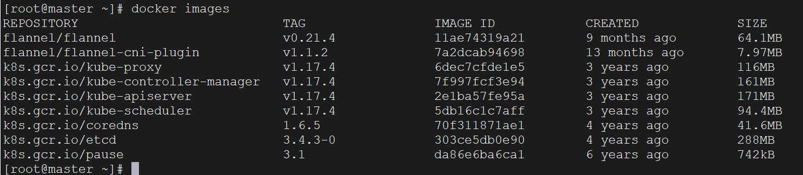
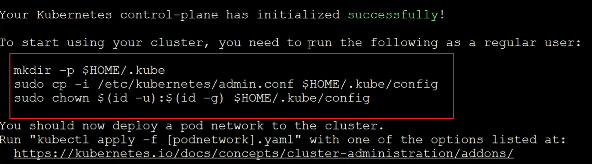
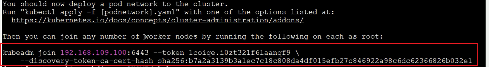
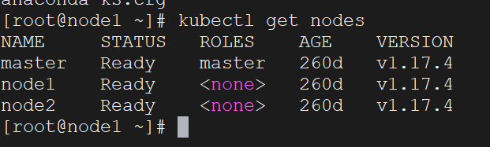
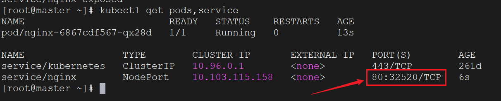
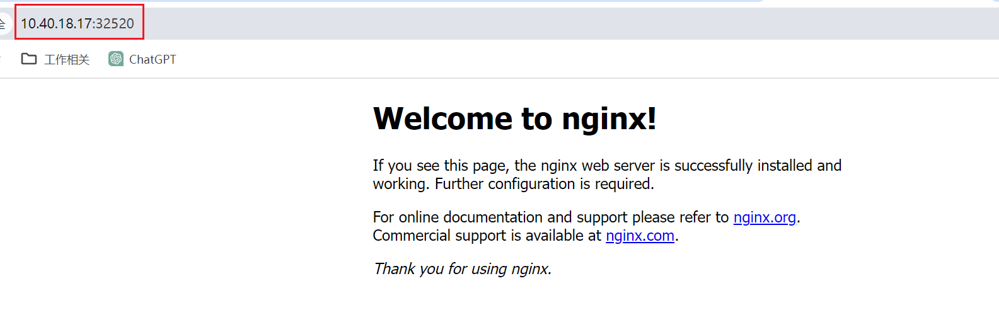

`Kubernetes`集群架构主要分为一主多从和多主多从两种类型：


在测试环境或中小型应用中，一主多从架构已能满足需求，而在大规模生产环境中，为了提高可用性和容错性，通常采用多主多从架构。

对于个人学习而言，搭建一主多从架构已足够。接下来，我们将构建一个一主二从的集群结构。

首先我们准备三台服务器：

| 身份     | `IP`地址      | 操作系统                      | 配置                             |
| -------- | ------------- | ----------------------------- | -------------------------------- |
| `Master` | `10.40.18.16` | `Centos7.5`    基础设施服务器 | `2`颗`CPU`  `8G`内存   `50G`硬盘 |
| `Node1`  | `10.40.18.17` | `Centos7.5`    基础设施服务器 | `2`颗`CPU`  `8G`内存   `50G`硬盘 |
| `Node2`  | `10.40.18.18` | `Centos7.5`    基础设施服务器 | `2`颗`CPU`  `8G`内存   `50G`硬盘 |

首先我们检查操作系统版本，必须是`Centos7.5`以上才行：

```bash
cat /etc/redhat-release
```

### 下面的命令三台服务器都需要执行

首先配置主机名解析，方便集群节点间直接调用。编辑`/etc/hosts`文件，添加以下内容：

```sh
10.40.18.16 master
10.40.18.17 node1
10.40.18.18 node2
```

这里需要参照“安装`Linux`”部分的相关内容，将服务器用户名更改为上方显示的主机名。

在`K8s`中，要求集群内所有节点的时间必须保持精确一致，因此需要配置时间同步：

```bash
systemctl start chronyd
systemctl enable chronyd
```

设置完成后，使用`date`命令验证时间是否一致。

禁用`firewalld`和`iptables`：

```bash
systemctl stop firewalld
systemctl disable firewalld
systemctl stop iptables
systemctl disable iptables
```

在安装`Linux`时，`firewalld`一般已经禁用。而在较新的`CentOS`版本（如`CentOS 7`及以上），默认的防火墙是`firewalld`而不是`iptables`。我们使用下面命令来查看`iptables`的服务状态：

```sh
systemctl status iptables
```

如果查询出以下结果，代表`Linux`系统并没有使用`iptables`，我们可不执行禁用命令：

```
Unit iptables.service could not be found.
```

禁用`selinux`，这是`Linux`系统中的一个安全服务。如果不关闭它，在安装集群时可能会遇到一些意想不到的问题：

```bash
vim /etc/selinux/config
SELINUX=disabled   # 修改这个值
```

禁用`swap`分区（虚拟内存分区）：

```
vim /etc/fstab

# 注释掉下面这一行，然后使用reboot命令，重启Linux服务器
# /dev/mapper/centos-swap swap                      swap    defaults        0 0
```

`swap`的作用是在物理内存耗尽后，将磁盘空间虚拟为内存使用，但这会对系统性能产生负面影响。

修改`linux`的内核参数，添加网桥过滤和地址转发功能：

```bash
# 1.编辑文件
vim /etc/sysctl.d/kubernetes.conf

# 2.添加如下配置
net.bridge.bridge-nf-call-ip6tables = 1
net.bridge.bridge-nf-call-iptables = 1
net.ipv4.ip_forward = 1

# 3.重新加载配置
sysctl -p

# 4.加载网桥过滤模块
modprobe br_netfilter

# 5.查看网桥过滤模块是否加载成功
lsmod | grep br_netfilter
```

配置`ipvs`功能，手动载入`ipvs`模块：

```bash
# 1 安装ipset和ipvsadm
yum install ipset ipvsadmin -y

# 2 添加需要加载的模块写入脚本文件
cat <<EOF >  /etc/sysconfig/modules/ipvs.modules
#!/bin/bash
modprobe -- ip_vs
modprobe -- ip_vs_rr
modprobe -- ip_vs_wrr
modprobe -- ip_vs_sh
modprobe -- nf_conntrack_ipv4
EOF

# 3 为脚本文件添加执行权限
chmod +x /etc/sysconfig/modules/ipvs.modules

# 4 执行脚本文件
/bin/bash /etc/sysconfig/modules/ipvs.modules

# 5 查看对应的模块是否加载成功
lsmod | grep -e ip_vs -e nf_conntrack_ipv4
```

上述安装完成后，需要使用`reboot`命令重启`Linux`系统。

`K8s`依赖于`Docker`，因此需要确保已安装`Docker`。我们使用`docker -v`命令来检查是否已安装。

配置`yum`仓库，以便从阿里云镜像站下载和安装`Kubernetes`相关的软件包：

```bash
vim /etc/yum.repos.d/kubernetes.repo

# 在文件中添加以下配置
[kubernetes]
name=Kubernetes
baseurl=http://mirrors.aliyun.com/kubernetes/yum/repos/kubernetes-el7-x86_64
enabled=1
gpgcheck=0
repo_gpgcheck=0
gpgkey=http://mirrors.aliyun.com/kubernetes/yum/doc/yum-key.gpg
       http://mirrors.aliyun.com/kubernetes/yum/doc/rpm-package-key.gpg
```

安装`K8s`相关组件：

```bash
# 安装kubeadm、kubelet和kubectl
yum install --setopt=obsoletes=0 kubeadm-1.17.4-0 kubelet-1.17.4-0 kubectl-1.17.4-0 -y

# 配置kubelet的cgroup
vim /etc/sysconfig/kubelet

# 添加如下配置
KUBELET_CGROUP_ARGS="--cgroup-driver=systemd"
KUBE_PROXY_MODE="ipvs"

# 设置kubelet开机自启
systemctl enable kubelet
```

安装`kubernetes`集群之前，必须要提前准备好集群需要的镜像，通过下面命令查看：

```bash
kubeadm config images list	
```

使用国内的源，下载对应镜像：

```bash
# 定义要下载的镜像
images=(
    kube-apiserver:v1.17.4
    kube-controller-manager:v1.17.4
    kube-scheduler:v1.17.4
    kube-proxy:v1.17.4
    pause:3.1
    etcd:3.4.3-0
    coredns:1.6.5
)

# 使用for循环，下载这些镜像
for imageName in ${images[@]} ; do
	docker pull registry.cn-hangzhou.aliyuncs.com/google_containers/$imageName
	docker tag registry.cn-hangzhou.aliyuncs.com/google_containers/$imageName 		k8s.gcr.io/$imageName
	docker rmi registry.cn-hangzhou.aliyuncs.com/google_containers/$imageName
done
```

安装完成后，使用`docker images`命令查看到这些镜像：



### 下面的命令只需要在`master`节点执行

对集群进行初始化，创建集群并将`node`节点加入集群：

```bash
# 创建集群（最后的ip信息换成我们自己的master的ip）
kubeadm init \
--kubernetes-version=v1.17.4 \
--pod-network-cidr=10.244.0.0/16 \
--service-cidr=10.96.0.0/12 \
--apiserver-advertise-address=10.40.18.16
```

> `2024-9-25`更新：运行上述命令时，会报超时失败，具体原因未知，解决方案未知。

初始化时间较长。集群创建完后，会弹出这样一些信息，在终端执行它们（按照实际生成的内容来复制执行）：



```bash
mkdir -p $HOME/.kube
sudo cp -i /etc/kubernetes/admin.conf $HOME/.kube/config
sudo chown $(id -u):$(id -g) $HOME/.kube/config
```

为`K8s`安装网络插件时，我们选择`flannel`。首先，需要获取`flannel`的配置文件。

访问`GitHub`链接：https://github.com/flannel-io/flannel/blob/master/Documentation/kube-flannel.yml，下载`kube-flannel.yml`配置文件，并将其放置在`master`服务器上，接着执行以下命令：

```bash
kubectl apply -f kube-flannel.yml
```

### 下面的命令只需要在`node`节点执行

在`master`节点创建集群后，会输出一条命令。我们复制这条命令，并在所有`node`节点上执行：



然后在任意节点，使用下面命令查看集群状态：

```bash
kubectl get nodes
```

出现这样的结果，表示`K8s`的集群搭建成功：




### 使用`K8s`部署`Nginx`程序示例

我们可以尝试部署一个`Nginx`程序来测试集群是否正常工作。在`master`节点上执行以下命令：

```bash
# 部署Nginx
kubectl create deployment nginx --image=nginx:1.14-alpine
# 暴露端口
kubectl expose deployment nginx --port=80 --type=NodePort
```

接下来，检查服务状态，列出`Pod`和`Service`。可以在`master`或`node`节点上运行以下命令：

```bash
kubectl get pods,service
```



部署成功！我们可以看到端口映射为`32520`。使用`master`或`node`节点的`IP:port`进行访问即可。

看到如下结果，表示`Nginx`已部署成功：



要删除之前创建的`Pod`和`Service`，可以使用以下命令：

```bash
kubectl delete deployment nginx
kubectl delete service nginx
```

这里我们删除的资源是`deployment`，而不是`pod`，这是因为我们创建的就是`deployment`，它是一个更高级的抽象，用于管理和维护一组`Pod`。删除`Deployment`将自动删除与之关联的所有`Pod`、`ReplicaSets`和相关资源。
