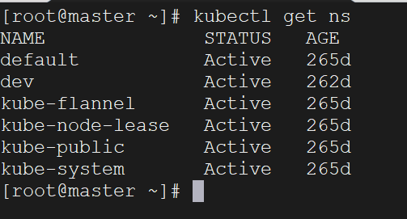
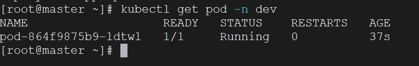

首先，我们要操作`K8s`的资源，就必须使用`kubectl`命令，`kubectl`是`Kubernetes`命令行工具，用于与`Kubernetes`集群进行交互，对集群进行管理。

`kubectl`的语法如下所示：

```bash
kubectl [command] [type] [name] [flags]
```

1. `command`：指定要对资源进行的操作，例如`create`、`get`、`delete`。
2. `type`：指定资源类型，例如`pods`、`service`、`namespaces`。
3. `name`：指定操作的资源对象的名称，名称的大小写敏感。
4. `flags`：可选标志，提供额外的参数或选项。例如`-n`指定命名空间，`-o`指定输出格式。

例如我想要查看所有`Pod`：

```bash
kubectl get pod
```

查看某个`Pod`：

```bash
kubectl get pod <pod_name>
```

查看某个`Pod`，并以`yaml`格式展示结果：

```bash
kubectl get pod <pod_name> -o yaml
```

下面是一些常见的资源类型名称、缩写以及作用：

| 资源名称                | 缩写     | 资源作用                                  |
| ----------------------- | -------- | ----------------------------------------- |
| `Pod`                   | `po`     | 最小的可部署单元，用于托管容器            |
| `Deployment`            | `deploy` | 管理`Pod`副本的控制器，支持滚动升级和回滚 |
| `Service`               | `svc`    | 定义一组`Pod`的访问方式，提供网络服务发现 |
| `Namespace`             | `ns`     | 用于将集群划分成多个虚拟集群              |
| `ConfigMap`             | `cm`     | 存储非敏感的配置数据                      |
| `Secret`                | `secret` | 存储敏感的配置数据，如密码、`API`密钥等   |
| `PersistentVolume`      | `pv`     | 存储集群中持久化数据的抽象层              |
| `PersistentVolumeClaim` | `pvc`    | 用于请求和使用持久存储资源                |
| `ServiceAccount`        | `sa`     | 为`Pod`中的进程提供身份和权限             |
| `Ingress`               | `ing`    | 允许外部流量访问集群中的服务              |
| `StatefulSet`           | `sts`    | 管理有状态应用程序的控制器                |
| `DaemonSet`             | `ds`     | 确保在集群中的每个节点上运行一个`Pod`     |
| `Job`                   | `job`    | 管理一次性任务，可用于批处理工作          |
| `CronJob`               | `cj`     | 基于时间的作业调度，类似于定时任务        |

还有更多的资源类型，可以使用下面的命令查看：

```bash
kubectl api-resources
```

下面是一些常见的操作命令：

| 功能分类       | 命令名称               | 命令作用                         |
| -------------- | ---------------------- | -------------------------------- |
| 资源管理       | `kubectl get`          | 获取资源的信息                   |
|                | `kubectl describe`     | 显示资源的详细信息               |
|                | `kubectl create`       | 创建资源                         |
|                | `kubectl patch`        | 更新资源                         |
|                | `kubectl apply`        | 使用配置文件创建或更新资源       |
|                | `kubectl delete`       | 删除资源                         |
|                | `kubectl edit`         | 编辑资源                         |
| 应用管理       | `kubectl rollout`      | 管理应用的滚动更新               |
|                | `kubectl run`          | 运行指定镜像                     |
|                | `kubectl scale`        | 调整`Deployment`的副本数         |
|                | `kubectl expose`       | 创建`Service`，并暴露应用的服务  |
| 日志和调试     | `kubectl logs`         | 查看`Pod`的日志                  |
|                | `kubectl exec`         | 在`Pod`中执行命令                |
|                | `kubectl attach`       | 连接到正在运行的容器             |
|                | `kubectl cp`           | 在容器和本地文件系统之间复制文件 |
| 集群信息和状态 | `kubectl cluster-info` | 显示集群信息                     |
|                | `kubectl top`          | 显示节点或`Pod`的资源使用情况    |
|                | `kubectl version`      | 显示`K8s`客户端和服务器的版本    |

更多操作命令，可以使用下面的指令查看：

```bash
kubectl --help
```

我们这里创建一个`namespace`，在这个`namespace`下创建一个`pod`，然后删除`pod`和`namespace`。

创建`namespace`，命名为`dev`：

```bash
kubectl create namespace dev
```

查看所有`namespace`：

```bash
kubectl get ns
```



在此`namespace`下创建并运行一个`nginx`的`pod`：

```bash
kubectl run pod --image=nginx -n dev
```

查看对应`namespace`下的所有`pod`：

```bash
kubectl get pod -n dev
```



删除这个`pod`：

```bash
kubectl delete pod <pod-name>
```

这里的`pod-name`就是上面查看`pod`查出来的：`pod-864f9875b9-ldtwl`。

删除指定的`namespace`：

```bash
kubectl delete ns dev
```

