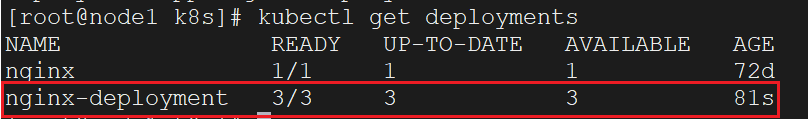
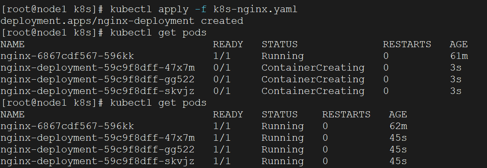
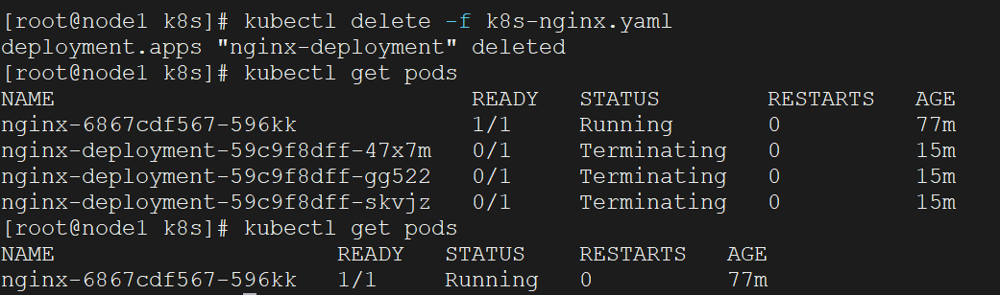
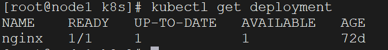

上两节详细讲解了`yaml`语法与`K8s`中`yaml`的结构规范，并定义了一个简易的创建`nginx`的`yaml`文件，接下来讲一下在`K8s`中，怎么去操作这个`yaml`文件，达到对应的效果。

还是以上节那个`yaml`文件为例（具体看“`k8s`的`yaml`文件”），我们给其命名为`k8s-nginx.yaml`。在“直接操作资源”那一节，我们讲了一些常见的资源操作命令。要应用上面的`yaml`文件，创建对应`nginx`的`Pod`，可以使用以下命令操作：

```sh
kubectl apply -f k8s-nginx.yaml
```

操作完成后，我们先查看一下创建的`Deployment`的状态、副本数等信息：



可以使用下面这条命令，查看已经部署资源的`yaml`配置：

```sh
kubectl get deployment nginx-deployment -o yaml
```

然后再查看`Pod`，返回的结果是这样的：



我们看到这些`Pod`是需要一定时间去完成启动的。

那么`kubectl apply`和`kubectl create`的区别在哪？如果`yaml`文件里指定创建的资源不存在，这俩命令没有区别。但是如果指定创建的资源存在，`kubectl create`会报这样的错误：

```sh
Error from server (AlreadyExists): error when creating "k8s-nginx.yaml": deployments.apps "nginx-deployment" already exists
```

而`kubectl apply`则不会报错，会根据`yaml`文件的内容进行更新操作。

`kubectl apply`和`kubectl patch`的区别又在哪？在做更新操作时，`kubectl apply`可以自动根据`yaml`文件的更新信息，对资源做更新操作，而`kubectl patch`一般不对`yaml`文件进行使用，是直接操作资源的。

如果想删除上面根据`yaml`文件创建的资源，可以使用下面的命令：

```sh
kubectl delete -f k8s-nginx.yaml
```

删除成功，再次查看`Deployment`和`Pod`，结果是这样的：





看到了`Deployment`和`Pod`都已经被删除。