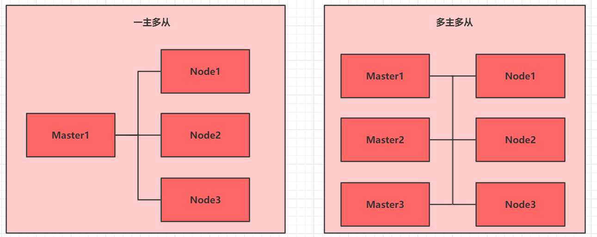
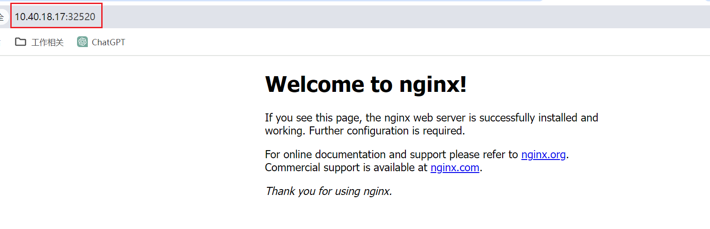

`Kubernetes`集群架构主要分为一主多从和多主多从两种类型：



在测试环境或中小型应用中，一主多从架构已能满足需求，而在大规模生产环境中，为了提高可用性和容错性，通常采用多主多从架构。

对于个人学习而言，搭建一主多从架构已足够。接下来，我们将构建一个一主二从的集群结构。

首先我们准备三台服务器：

| 身份     | `IP`地址      | 操作系统                  | 配置                            |
| -------- | ------------- | ------------------------- | ------------------------------- |
| `Master` | `10.40.18.16` | `Centos7.5`基础设施服务器 | `2`颗`CPU`、`8G`内存、`50G`硬盘 |
| `Node1`  | `10.40.18.17` | `Centos7.5`基础设施服务器 | `2`颗`CPU`、`8G`内存、`50G`硬盘 |
| `Node2`  | `10.40.18.18` | `Centos7.5`基础设施服务器 | `2`颗`CPU`、`8G`内存、`50G`硬盘 |

首先我们检查操作系统版本，必须是`Centos7.5`以上才可以：

```bash
cat /etc/redhat-release
```

> 下面的命令，三台服务器都需要执行。

我们先修改三台机器的用户名信息，分别改为`master`、`node1`、`node2`：

```sh
hostnamectl set-hostname master   # master节点执行
hostnamectl set-hostname node1    # node1执行
hostnamectl set-hostname node2    # node2执行
```

接着配置主机名解析，方便集群节点间直接调用。编辑`/etc/hosts`文件，添加以下内容：

```sh
10.40.18.16 master
10.40.18.17 node1
10.40.18.18 node2
```

在`K8s`中，要求集群内所有节点的时间必须保持精确一致，因此需要配置时间同步：

```bash
systemctl start chronyd
systemctl enable chronyd
```

设置完成后，使用`date`命令验证时间是否准确且一致。如果不一致，首先在`master`机器上执行以下步骤：

```sh
# 1.备份原有配置
cp /etc/chrony.conf /etc/chrony.conf.bak

# 2.写入新的时间源配置（使用阿里云NTP）
cat > /etc/chrony.conf << EOF
server ntp.aliyun.com iburst
server ntp1.aliyun.com iburst
server ntp2.aliyun.com iburst
driftfile /var/lib/chrony/drift
makestep 1.0 3
rtcsync
logdir /var/log/chrony
EOF

# 3.重启chronyd并强制同步
systemctl restart chronyd
chronyc -a makestep
chronyc -a waitsync 5
```

接着再使用`date`命令查看时间是否已经同步。随后，在`node1`和`node2`上分别执行以下步骤：

```sh
# 1.备份原配置
cp /etc/chrony.conf /etc/chrony.conf.bak

# 2.写入新配置（以master为首选时间源）
cat > /etc/chrony.conf << EOF
server 10.40.18.16 iburst
server ntp.aliyun.com iburst
driftfile /var/lib/chrony/drift
makestep 1.0 3
rtcsync
logdir /var/log/chrony
EOF
```

这里需要将上面的`10.40.18.16`替换为我们的`master`节点的实际`IP`地址。

接着重启`chronyd`并强制同步：

```sh
systemctl restart chronyd
chronyc -a makestep
```

操作完成后，使用`date`命令查看时间是否已恢复正常。

在安装`Linux`时，`firewalld`通常已经处于禁用状态，我们可以使用下面命令查看其状态：

```
systemctl status firewalld
```

如果不为`Dead`，使用下面命令，禁用`firewalld`和`iptables`：

```bash
systemctl stop firewalld
systemctl disable firewalld
```

在较旧的`CentOS`版本（如`CentOS 7`以前版本）中，系统默认的防火墙是`iptables`而不是`firewalld`。我们可以使用下面的命令来查看`iptables`服务的状态：

```sh
systemctl status iptables
```

如果查询出以下结果，代表`Linux`系统并没有使用`iptables`：

```sh
Unit iptables.service could not be found.
```

如果`Linux`系统使用了`iptables`，使用下面命令禁用它：

```
systemctl stop iptables
systemctl disable iptables
```

禁用`selinux`，这是`Linux`系统中的一个安全服务。如果不关闭它，在安装集群时可能会遇到一些意想不到的问题：

```bash
vim /etc/selinux/config
SELINUX=disabled   # 修改这一行
```

在`Centos7.5`版本中，禁用`swap`分区的操作步骤如下：

```sh
vim /etc/fstab

# 注释掉下面这一行
# /dev/mapper/centos-swap swap                      swap    defaults        0 0
```

在`CentOS Stream release 9`版本中，需要注释的是下面这一行：

```sh
# /dev/mapper/cs-swap     none                    swap    defaults        0 0
```

`swap`分区（虚拟内存分区）的作用是在物理内存耗尽后，将磁盘空间虚拟为内存使用，但这会对系统性能产生负面影响。注释完成后，需要使用`reboot`命令，重启`Linux`服务器。

修改`Linux`的内核参数，添加网桥过滤和地址转发功能：

```bash
# 1.编辑文件，添加配置
cat > /etc/sysctl.d/kubernetes.conf << 'EOF'
net.bridge.bridge-nf-call-ip6tables = 1
net.bridge.bridge-nf-call-iptables = 1
net.ipv4.ip_forward = 1
EOF

# 2.重新加载配置
sysctl -p

# 3.加载网桥过滤模块
modprobe br_netfilter

# 4.查看网桥过滤模块是否加载成功
lsmod | grep br_netfilter
```

在`Centos7.5`版本中，配置`ipvs`功能，并手动载入`ipvs`模块：

```bash
# 1.安装ipset和ipvsadm
yum install ipset ipvsadmin -y

# 2.添加需要加载的模块写入脚本文件
cat <<EOF >  /etc/sysconfig/modules/ipvs.modules
#!/bin/bash
modprobe -- ip_vs
modprobe -- ip_vs_rr
modprobe -- ip_vs_wrr
modprobe -- ip_vs_sh
modprobe -- nf_conntrack_ipv4
EOF

# 3.为脚本文件添加执行权限
chmod +x /etc/sysconfig/modules/ipvs.modules

# 4.执行脚本文件
/bin/bash /etc/sysconfig/modules/ipvs.modules

# 5.查看对应的模块是否加载成功
lsmod | grep -e ip_vs -e nf_conntrack_ipv4
```

在`CentOS Stream release 9`版本中，配置`ipvs`功能并加载的命令如下所示：

```sh
# 1.安装ipset和ipvsadm
yum install ipset ipvsadm -y

# 2.添加需要加载的模块写入脚本文件
cat <<EOF > /etc/modules-load.d/ipvs.conf
ip_vs
ip_vs_rr
ip_vs_wrr
ip_vs_sh
nf_conntrack
EOF

# 3.手动加载一次，使其立即生效
modprobe ip_vs
modprobe ip_vs_rr
modprobe ip_vs_wrr
modprobe ip_vs_sh
modprobe nf_conntrack

# 4.查看对应的模块是否加载成功
lsmod | grep -e ip_vs -e nf_conntrack
```

上述安装完成后，需要使用`reboot`命令重启`Linux`系统。

`K8s`依赖于`Docker`，因此需要确保机器上的`Docker`已安装，我们使用`docker -v`命令来检查是否已安装。

在`Centos7.5`版本中，配置`yum`仓库，以便从阿里云镜像站下载和安装`Kubernetes`相关的软件包：

```bash
cat >> /etc/yum.repos.d/kubernetes.repo << 'EOF'
[kubernetes]
name=Kubernetes
baseurl=http://mirrors.aliyun.com/kubernetes/yum/repos/kubernetes-el7-x86_64
enabled=1
gpgcheck=0
repo_gpgcheck=0
gpgkey=http://mirrors.aliyun.com/kubernetes/yum/doc/yum-key.gpg
       http://mirrors.aliyun.com/kubernetes/yum/doc/rpm-package-key.gpg
EOF
```

对于`CentOS Stream release 9`版本，配置`yum`仓库的命令如下：

```sh
cat >> /etc/yum.repos.d/kubernetes.repo << 'EOF'
[kubernetes]
name=Kubernetes
baseurl=https://pkgs.k8s.io/core:/stable:/v1.29/rpm/
enabled=1
gpgcheck=1
repo_gpgcheck=1
gpgkey=https://pkgs.k8s.io/core:/stable:/v1.29/rpm/repodata/repomd.xml.key
EOF
```

在`Centos7.5`版本中，安装`K8s`相关组件：

```bash
# 1.安装kubeadm、kubelet和kubectl
yum install --setopt=obsoletes=0 kubeadm-1.17.4-0 kubelet-1.17.4-0 kubectl-1.17.4-0 -y

# 2.配置kubelet的cgroup
cat >> /etc/sysconfig/kubelet << 'EOF'
KUBELET_CGROUP_ARGS="--cgroup-driver=systemd"
KUBE_PROXY_MODE="ipvs"
EOF

# 3.设置kubelet开机自启
systemctl enable kubelet
```

对于`CentOS Stream release 9`版本，安装`K8s`相关组件命令如下：

```sh
# 1.安装kubeadm、kubelet和kubectl
yum install -y kubelet kubeadm kubectl

# 2.配置cgroup
mkdir -p /etc/systemd/system/kubelet.service.d

cat <<EOF > /etc/systemd/system/kubelet.service.d/10-cgroup.conf
[Service]
Environment="KUBELET_EXTRA_ARGS=--cgroup-driver=systemd"
EOF

systemctl daemon-reexec
systemctl daemon-reload

# 3.启动并开机自启
systemctl start kubelet
systemctl enable kubelet
```

安装`kubernetes`集群之前，必须要提前准备好集群需要的镜像。使用下面命令进行下载：

```bash
images=$(kubeadm config images list | awk -F'/' '{print $NF}')

for imageName in $images; do
    docker pull registry.cn-hangzhou.aliyuncs.com/google_containers/$imageName && \
    docker tag registry.cn-hangzhou.aliyuncs.com/google_containers/$imageName registry.k8s.io/$imageName && \
    docker rmi registry.cn-hangzhou.aliyuncs.com/google_containers/$imageName
done
```

安装完成后，使用`docker images`命令即可查看到这些镜像：


> 下面的命令，只需要在`master`节点执行。

在`Centos7.5`版本中，对集群进行初始化，创建集群并将`node`节点加入集群：

```bash
# 创建集群（最后的ip信息换成K8s的master机器的ip）
kubeadm init \
  --pod-network-cidr=10.244.0.0/16 \
  --service-cidr=10.96.0.0/12 \
  --apiserver-advertise-address=10.40.18.16
```

对于`CentOS Stream release 9`版本，初始化集群的命令如下：

```sh
kubeadm init \
  --pod-network-cidr=10.244.0.0/16 \
  --service-cidr=10.96.0.0/12 \
  --image-repository=registry.cn-hangzhou.aliyuncs.com/google_containers \
  --apiserver-advertise-address=192.168.64.8
```

> 执行`kubeadm init`命令时若出现报错，可参考下一节中的解决方案。

初始化时间较长。集群创建完后，会弹出这样一些信息：


我们按照实际生成的内容，复制后在终端进行执行：

```bash
mkdir -p $HOME/.kube
sudo cp -i /etc/kubernetes/admin.conf $HOME/.kube/config
sudo chown $(id -u):$(id -g) $HOME/.kube/config
```

在为`K8s`安装网络插件时，我们选择`flannel`。访问`GitHub`链接：https://github.com/flannel-io/flannel/blob/master/Documentation/kube-flannel.yml，下载`kube-flannel.yml`配置文件，并将其放置到`master`节点上，随后执行以下命令：

```bash
kubectl apply -f kube-flannel.yml
```

> 下面的命令，只需要在`node`节点执行。

在`master`节点创建集群后，会输出如下这样一条命令：


我们复制这条命令，并在所有`node`节点上执行：

```sh
kubeadm join 192.168.64.8:6443 --token 5t6yg9.omvq0sxr8alxliqm \
	--discovery-token-ca-cert-hash sha256:49bd585aadcad0065cad6dbbb776a730ec57a670d55c6084df5e7e42f8b1e8d1
```

> 待办：这里出现报错待解决。

然后在任意节点，使用下面命令查看集群状态：

```bash
kubectl get nodes
```

出现如下的结果，表示`K8s`的集群搭建成功：


`K8s`集群安装完成后，可以尝试部署一个`Nginx`程序来测试集群是否正常工作。在`master`节点上执行以下命令：

```bash
# 部署Nginx
kubectl create deployment nginx --image=nginx:1.14-alpine
# 暴露端口
kubectl expose deployment nginx --port=80 --type=NodePort
```

接下来，检查服务状态，列出`Pod`和`Service`。可以在`master`或`node`节点上运行以下命令：

```bash
kubectl get pods,service
```

展示如下结果，表示部署成功：


我们可以看到端口映射为`32520`。使用`master`或`node`节点的`IP:port`进行访问即可。

看到如下结果，表示`Nginx`已部署成功：



要删除之前创建的`Pod`和`Service`，可以使用以下命令：

```bash
kubectl delete deployment nginx
kubectl delete service nginx
```

这里我们删除的资源是`deployment`，而不是`pod`，这是因为我们创建的就是`deployment`，它是一个更高级的抽象，用于管理和维护一组`Pod`。删除`Deployment`将自动删除与之关联的所有`Pod`、`ReplicaSets`和相关资源。
