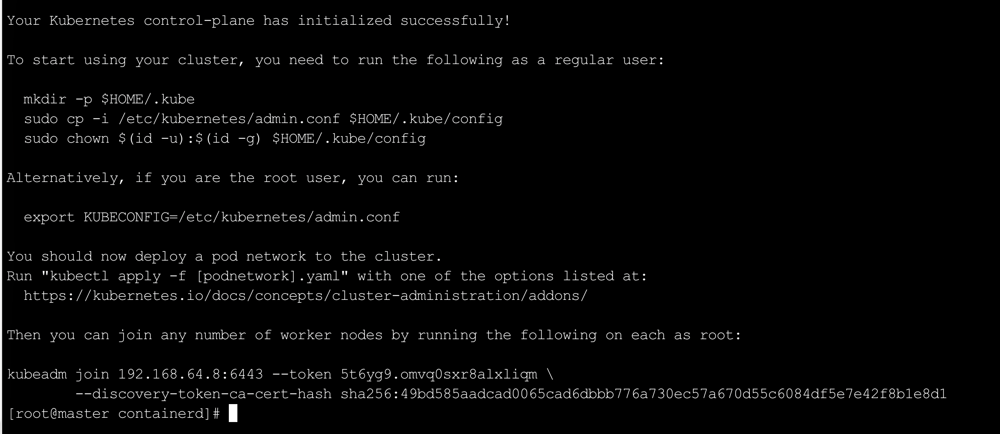

如果在执行`kubeadm init`命令时，遇到如下报错：

```sh
I0325 10:29:28.219156    4850 version.go:256] remote version is much newer: v1.35.3; falling back to: stable-1.29
[init] Using Kubernetes version: v1.29.15
[preflight] Running pre-flight checks
error execution phase preflight: [preflight] Some fatal errors occurred:
	[ERROR CRI]: container runtime is not running: output: time="2026-03-25T10:29:29+08:00" level=fatal msg="validate service connection: validate CRI v1 runtime API for endpoint \"unix:///var/run/containerd/containerd.sock\": rpc error: code = Unimplemented desc = unknown service runtime.v1.RuntimeService"
, error: exit status 1
	[ERROR FileContent--proc-sys-net-bridge-bridge-nf-call-iptables]: /proc/sys/net/bridge/bridge-nf-call-iptables does not exist
[preflight] If you know what you are doing, you can make a check non-fatal with `--ignore-preflight-errors=...`
To see the stack trace of this error execute with --v=5 or higher
```

这说明`kubelet`已经成功连接到`containerd`，但`containerd`的`CRI`接口不可用；同时，由于缺少`bridge-nf-call-iptables`，内核网络相关模块未能正确加载。

首先我们生成默认配置文件：

```sh
containerd config default > /etc/containerd/config.toml
```

接着修改配置，添加国内镜像源：

```sh
sed -i 's|registry.k8s.io|registry.aliyuncs.com/google_containers|g' /etc/containerd/config.toml
```

接着配置`pause`镜像使用阿里云镜像：

```sh
cat >> /etc/containerd/config.toml << 'EOF'

[plugins."io.containerd.grpc.v1.cri".registry.mirrors]
  [plugins."io.containerd.grpc.v1.cri".registry.mirrors."docker.io"]
    endpoint = ["https://docker.mirrors.ustc.edu.cn", "https://hub-mirror.c.163.com"]
  [plugins."io.containerd.grpc.v1.cri".registry.mirrors."registry.k8s.io"]
    endpoint = ["https://registry.aliyuncs.com/google_containers"]
EOF
```

然后重启`containerd`，并验证其状态：

```sh
systemctl restart containerd
systemctl status containerd --no-pager
```

验证成功后，清理之前的`kubeadm`初始化残留，并删除残留目录：

```sh
kubeadm reset -f

rm -rf /etc/kubernetes/manifests
rm -rf /etc/kubernetes/pki
rm -rf /etc/kubernetes
rm -rf /var/lib/kubelet
rm -rf /var/lib/etcd
rm -rf /etc/cni/net.d
```

接着，重新执行`kubeadm init`命令，看到如下结果表示初始化成功：



> 注：上述步骤已在`CentOS 9`环境中验证可解决问题，但可能并非完整流程，因为在此之前还执行过其他操作，这些操作也可能对结果产生影响。后续再次安装环境时以实际情况为准。
