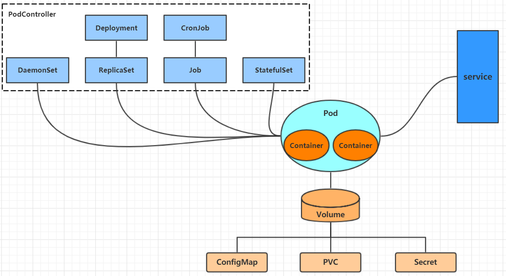

在`Kubernetes`中，所有操作均围绕资源展开，用户通过管理这些资源来控制整个集群。`Kubernetes`的核心是一套集群化的调度与编排系统，用户只需声明期望状态，集群便会自动完成容器的部署与运行，从而使各类服务得以稳定交付。

`Kubernetes`以`Pod`作为最小的调度与管理单元，而非直接操作单个容器。`Pod`本质上是一组紧密协作的容器集合，这些容器共享网络命名空间与存储资源，可通过`localhost`加端口的方式高效交互。

在实际运行中，`Kubernetes`并不直接维护单个`Pod`的生命周期，而是通过各类`Pod Controller`对其进行统一管理。这些控制器基于声明式配置，持续比对当前状态与期望状态，并通过创建、删除或重建`Pod`来驱动自动收敛，确保系统始终处于预期状态。

为了提供稳定的网络标识和访问方式，`Kubernetes`引入了`Service`资源。`Service`作为一个抽象层，为一组`Pod`提供统一的访问入口，并通过`ClusterIP`、`NodePort`、`LoadBalancer`等方式将流量引导至相应的`Pod`。

`Kubernetes`还提供了`PV`/`PVC`/`StorageClass`用于持久化存储抽象，以及`ConfigMap`/`Secret`用于配置与敏感数据管理。这种高度抽象与自动化的架构设计，使`Kubernetes`成为一个强大而灵活的容器编排平台，显著简化了复杂应用的部署与维护流程。

`Kubernetes`的核心架构组件关系图如下所示：



学习`Kubernetes`的核心，就是掌握如何在集群上操作`Pod`、`Pod`控制器、`Service`、存储等各种资源。

在操作`Kubernetes`资源时，通常有以下两类管理方式：

一、直接通过命令操作资源。

类似于`Docker`中使用`docker run`启动容器，在`Kubernetes`中同样可以通过命令行直接操作资源，例如：

```bash
kubectl run nginx-pod --image=nginx:1.17.1 --port=80
```

二、通过命令操作`YAML`文件来管理资源。

类似于`Docker`中使用`docker-compose.yaml`进行容器编排，在`Kubernetes`中可以定义`YAML`文件来描述资源，再通过命令操作这些文件以管理资源。根据所用命令的语义，又可细分为两种方式：

命令式对象配置，使用`create`、`delete`等命令直接指示系统执行具体操作，例如：

```bash
kubectl create -f nginx-pod.yaml
```

声明式对象配置，使用`apply`命令描述资源的期望状态，由`Kubernetes`自动完成状态收敛，支持增量更新且具有幂等性，例如：

```bash
kubectl apply -f nginx-pod.yaml
```

三种管理方式各自的适用场景与优缺点如下所示：

| 类型           | 适用场景   | 优点                     | 缺点                                   |
| -------------- | ---------- | ------------------------ | -------------------------------------- |
| 命令式对象管理 | 测试       | 简单直观，操作迅速       | 仅适用于管理活动对象，难以审计和跟踪   |
| 命令式对象配置 | 开发       | 易于审计和跟踪，操作灵活 | 随项目规模增大，配置文件增多，操作繁琐 |
| 声明式对象配置 | 开发和生产 | 支持批量操作，易于扩展   | 调试困难，配置复杂度较高               |

在实际使用中，测试与调试阶段通常直接用命令行操作，开发和生产环境则以`YAML`文件配合`kubectl apply`为主流实践。掌握这些资源管理方式，是后续深入理解`Kubernetes`工作负载调度、服务治理与存储编排的基础。
