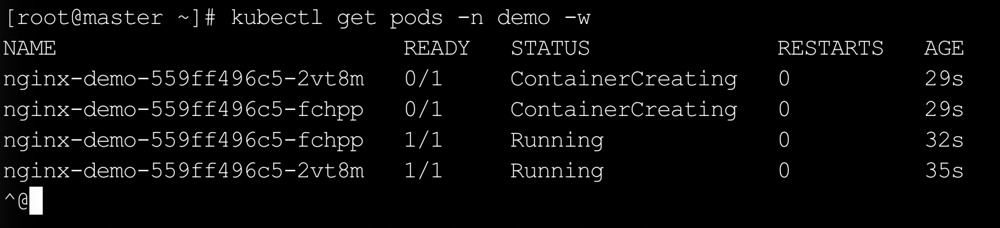
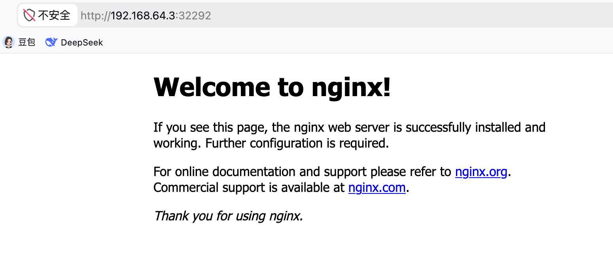

`kubectl`是`Kubernetes`的命令行工具，用于与集群交互并管理集群资源，基本语法格式如下：

```bash
kubectl [command] [type] [name] [flags]
```

各字段含义如下：

1. `command`：对资源执行的操作，例如`create`、`get`、`delete`。
2. `type`：资源类型，例如`pods`、`service`、`namespaces`。
3. `name`：资源对象的名称，大小写敏感。
4. `flags`：可选参数，例如`-n`指定命名空间，`-o`指定输出格式。

### 一、操作命令速查

命令式对象管理直接通过命令行操作资源，无需依赖`yaml`文件，适合测试与临时调试场景，不建议用于生产环境。

常用命令如下所示：

| 命令               | 作用                             |
| ------------------ | -------------------------------- |
| `kubectl get`      | 查看资源状态                     |
| `kubectl describe` | 查看资源详细信息，排查问题的首选 |
| `kubectl logs`     | 查看`Pod`日志                    |
| `kubectl exec`     | 进入容器执行命令                 |
| `kubectl delete`   | 删除资源                         |
| `kubectl rollout`  | 管理滚动发布，支持查看状态和回滚 |
| `kubectl top`      | 查看节点或`Pod`的资源使用情况    |
| `kubectl create`   | 命令式创建资源                   |
| `kubectl run`      | 直接运行指定镜像                 |
| `kubectl scale`    | 调整`Deployment`副本数           |
| `kubectl expose`   | 创建`Service`并暴露服务          |
| `kubectl edit`     | 在线编辑资源配置                 |
| `kubectl patch`    | 局部更新资源字段                 |

查看全部命令：

```bash
kubectl --help
```

### 二、资源类型速查

常见资源类型及缩写如下所示：

| 资源名称                | 缩写     | 作用                                  |
| ----------------------- | -------- | ------------------------------------- |
| `Pod`                   | `po`     | 最小的可部署单元，用于托管容器        |
| `Deployment`            | `deploy` | 管理`Pod`副本，支持滚动升级和回滚     |
| `Service`               | `svc`    | 定义一组`Pod`的访问方式，提供服务发现 |
| `Namespace`             | `ns`     | 将集群划分成多个虚拟集群              |
| `ConfigMap`             | `cm`     | 存储非敏感的配置数据                  |
| `Secret`                | `secret` | 存储敏感数据，如密码、`API`密钥等     |
| `PersistentVolume`      | `pv`     | 集群持久化存储的抽象层                |
| `PersistentVolumeClaim` | `pvc`    | 申请和使用持久存储资源                |
| `ServiceAccount`        | `sa`     | 为`Pod`中的进程提供身份和权限         |
| `Ingress`               | `ing`    | 允许外部流量访问集群内的服务          |
| `StatefulSet`           | `sts`    | 管理有状态应用的控制器                |
| `DaemonSet`             | `ds`     | 确保每个节点上都运行一个`Pod`         |
| `Job`                   | `job`    | 管理一次性任务                        |
| `CronJob`               | `cj`     | 基于时间的定时任务调度                |

查看全部资源类型：

```bash
kubectl api-resources
```

### 三、常用操作示例

以下操作基于一台全新的一主二从`Kubernetes`集群，三台虚拟机均已完成节点初始化与集群搭建，尚未部署任何业务资源。

本节通过连续的命令行操作，从熟悉集群环境开始，依次完成应用部署、服务暴露、日志调试、扩缩容、滚动更新等常见操作，适合在新集群上做初次上手练习。

首先确认集群节点状态，确保三台节点全部就绪：

```bash
kubectl get nodes
kubectl get nodes -o wide
```

查看集群的基本信息：

```bash
kubectl cluster-info
```

查看所有命名空间及其状态：

```bash
kubectl get ns
```

查看`kube-system`命名空间中的系统组件，了解集群基础服务是否正常运行：

```bash
kubectl get pods -n kube-system
```

为后续练习资源创建一个独立的命名空间，避免污染`default`：

```bash
kubectl create ns demo
kubectl get ns demo
```

以`nginx`为例，使用命令式方式创建一个`Deployment`，指定`2`个副本：

```bash
kubectl create deployment nginx-demo --image=nginx:1.25 --replicas=2 -n demo
```

加`-w`参数持续监听`Pod`的创建过程：

```bash
kubectl get pods -n demo -w
```

等待`STATUS`变为`Running`后按`Ctrl+C`退出：



查看`Deployment`详情：

```bash
kubectl get deploy -n demo
kubectl describe deploy nginx-demo -n demo
```

将`Deployment`暴露为`NodePort`类型的`Service`，使集群外部可以访问：

```bash
kubectl expose deployment nginx-demo --port=80 --target-port=80 --type=NodePort -n demo
kubectl get svc -n demo
```

输出中`PORT(S)`列会显示类似`80:3XXXX/TCP`的格式，其中`3XXXX`为实际分配的端口，可在浏览器中访问任意一台虚拟机`IP`加该端口验证`nginx`是否响应，如下所示：



先获取`Pod`名称，再查看日志：

```bash
kubectl get pods -n demo
kubectl logs <pod-name> -n demo
kubectl logs -f <pod-name> -n demo
```

进入容器内部，可执行`nginx -v`、`curl localhost`等命令验证状态，输入`exit`退出：

```bash
kubectl exec -it <pod-name> -n demo -- /bin/bash
```

将副本数从`2`扩容至`4`，观察新`Pod`被调度到不同节点的过程：

```bash
kubectl scale deployment nginx-demo --replicas=4 -n demo
kubectl get pods -n demo -o wide -w
```

确认全部`Running`后再缩回`2`个：

```bash
kubectl scale deployment nginx-demo --replicas=2 -n demo
```

将镜像更新至`nginx:1.26`，触发滚动发布并观察过程：

```bash
kubectl set image deployment/nginx-demo nginx=nginx:1.26 -n demo
kubectl rollout status deployment/nginx-demo -n demo
```

查看发布历史，并尝试回滚至上一个版本：

```bash
kubectl rollout history deployment/nginx-demo -n demo
kubectl rollout undo deployment/nginx-demo -n demo
```

创建一个`ConfigMap`存储简单的键值配置，并查看其内容：

```bash
kubectl create configmap app-config --from-literal=APP_ENV=production --from-literal=LOG_LEVEL=info -n demo
kubectl get cm app-config -n demo -o yaml
```

查看各节点及`Pod`的资源占用情况（需集群已部署`metrics-server`，否则会报错）：

```bash
kubectl top nodes
kubectl top pods -n demo
```

练习结束后删除整个命名空间，其中所有资源会一并清理：

```bash
kubectl delete ns demo
kubectl get ns
```
