> 参考文档：https://www.cnblogs.com/zengqinglei/p/17131046.html。
>

`Kubernetes`集群架构主要分为一主多从和多主多从两种类型：


在测试环境或中小型应用中，一主多从架构已能满足需求；而在大规模生产环境中，为保障高可用性与容错能力，通常采用多主多从架构。对于个人学习而言，搭建一主多从架构已绰绰有余。接下来，我们将构建一个一主二从的集群结构。

现在已经安装好了三台`Linux`服务器，它们的信息如下所示：

| 身份      | `IP`地址       | 操作系统          |
| --------- | -------------- | ----------------- |
| `Master`  | `192.168.64.2` | `CentOS Stream 9` |
| `Worker1` | `192.168.64.3` | `CentOS Stream 9` |
| `Worker2` | `192.168.64.4` | `CentOS Stream 9` |

下面的步骤中，`Worker`节点的主机名沿用`node1`、`node2`，后续重新搭建时也可改为`worker1`、`worker2`。

> 下面的命令，三台服务器都需要执行。

首先我们使用下面命令，安装一些基础工具：

```sh
yum install -y wget vim net-tools telnet
```

关闭防火墙：

```sh
# 临时关闭
systemctl stop firewalld
# 永久关闭
systemctl disable firewalld
```

关闭`SELinux`内核模块：

```sh
# 临时关闭
setenforce 0
# 永久关闭
sed -i '/selinux/s/enforcing/disabled/' /etc/selinux/config
```

关闭`swap`交换空间：

```sh
# 临时关闭
swapoff -a
# 永久关闭
sed -ri 's/.*swap.*/#&/' /etc/fstab
```

> 临时关闭只修改内核运行时状态，不涉及任何配置文件，重启后自动恢复。
>永久关闭修改的是配置文件，通常需要重启后才能完全生效，当前会话中原有状态依然保持。
> 若希望立即生效且永久关闭，则需两条命令都执行：临时关闭让其当下立刻停止工作，永久关闭确保重启后不再启用。

将桥接的`IPv4`流量传递到`iptables`的链：

```sh
# 启用overlay和br_netfilter模块
modprobe overlay
modprobe br_netfilter

# 写入开机自动加载模块的配置
cat <<EOF | tee /etc/modules-load.d/containerd.conf
overlay
br_netfilter
EOF

# 写入桥接流量转发至iptables的内核参数配置
cat <<EOF | tee /etc/sysctl.d/99-kubernetes-cri.conf
net.bridge.bridge-nf-call-iptables = 1
net.ipv4.ip_forward = 1
net.bridge.bridge-nf-call-ip6tables = 1
EOF

# 使内核参数配置立即生效
sysctl --system
```

安装`containerd`作为`k8s`依赖容器运行时，我们这里直接使用`containerd`：

```sh
dnf config-manager --add-repo=https://download.docker.com/linux/centos/docker-ce.repo
dnf update
dnf install -y containerd
mkdir -p /etc/containerd
containerd config default | tee /etc/containerd/config.toml
```

接下来修改`containerd`配置：

```sh
# 将SystemdCgroup改为true
sed -i 's/SystemdCgroup = false/SystemdCgroup = true/' /etc/containerd/config.toml

# 替换sandbox_image镜像地址
sed -i "s|sandbox = 'registry.k8s.io/pause:\([^']*\)'|sandbox = 'registry.aliyuncs.com/google_containers/pause:\1'|" /etc/containerd/config.toml
```

在有些版本中，待替换的文本可能为`sandbox_image = "k8s.gcr.io/pause:xxx"`，而不是`sandbox = 'registry.k8s.io/pause:xxx'`，所以执行完上面命令后，务必用以下命令确认是否已生效：

```sh
grep -E 'SystemdCgroup|sandbox' /etc/containerd/config.toml
```

成功替换的展示效果如下所示：

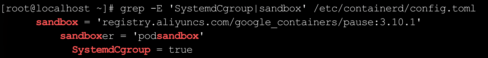

修改完成后重启`containerd`使配置生效，并添加开机启动：

```sh
systemctl restart containerd
systemctl enable containerd
```

在`/etc/hosts`中配置主机名与`IP`地址的映射，避免将来`IP`变更时需要对`k8s`集群做大量适配工作：

```sh
192.168.64.2 master
192.168.64.3 node1
192.168.64.4 node2
```

同时，建议在三台机器上分别执行`hostnamectl set-hostname`，将主机名持久化写入`/etc/hostname`，确保`kubelet`在开机自启时能读取到正确的主机名，避免节点注册失败：

```sh
# 在master上执行
hostnamectl set-hostname master
# 在node1上执行
hostnamectl set-hostname node1
# 在node2上执行
hostnamectl set-hostname node2
```

> 如果跳过这一配置步骤，便可能触发文章末尾所示的报错，所以务必要进行此配置。

添加`kubernetes`仓库信息，需要按照对应环境执行相应命令：

```sh
# x86_64环境执行
cat <<EOF > /etc/yum.repos.d/kubernetes.repo
[kubernetes]
name=Kubernetes
baseurl=https://mirrors.aliyun.com/kubernetes/yum/repos/kubernetes-el7-x86_64/
enabled=1
gpgcheck=0
repo_gpgcheck=0
gpgkey=https://mirrors.aliyun.com/kubernetes/yum/doc/yum-key.gpg https://mirrors.aliyun.com/kubernetes/yum/doc/rpm-package-key.gpg
EOF

# aarch64环境执行
cat <<EOF > /etc/yum.repos.d/kubernetes.repo
[kubernetes]
name=Kubernetes
baseurl=https://mirrors.aliyun.com/kubernetes-new/core/stable/v1.28/rpm/
enabled=1
gpgcheck=1
gpgkey=https://mirrors.aliyun.com/kubernetes-new/core/stable/v1.28/rpm/repodata/repomd.xml.key
repo_gpgcheck=0
EOF
```

安装`Kubernetes modules`服务：

```sh
dnf install -y kubelet kubeadm kubectl
# 加入开机启动
systemctl enable kubelet
```

> 下面的命令，只需在`Master`服务器上执行。

在`master`节点上初始化`K8s`集群：

```sh
kubeadm init \
  --apiserver-advertise-address=192.168.64.2 \
  --image-repository registry.aliyuncs.com/google_containers \
  --pod-network-cidr=10.244.0.0/16 \
  --control-plane-endpoint=master
```

执行成功内容如下所示：

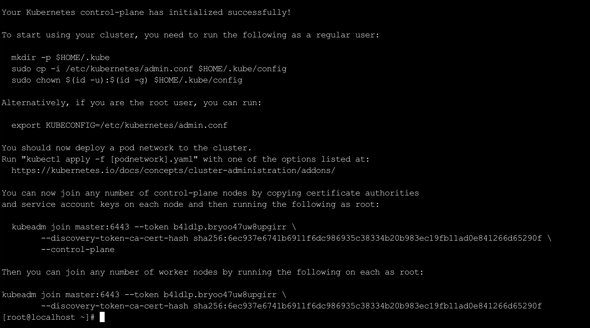

其中，下面两个部分的命令非常重要，需要复制并将其保存下来：

```sh
# 配置kubectl访问凭证
mkdir -p $HOME/.kube
sudo cp -i /etc/kubernetes/admin.conf $HOME/.kube/config
sudo chown $(id -u):$(id -g) $HOME/.kube/config
  
# 加入工作节点（worker节点），由其他node节点执行
kubeadm join master:6443 --token b4ldlp.bryoo47uw8upgirr \
  --discovery-token-ca-cert-hash sha256:6ec937e6741b6911f6dc986935c38334b20b983ec19fb11ad0e841266d65290f
```

如果要配置多主多从结构，也需要保存如下命令，在其他`master`节点上执行：

```sh
# 加入控制平面节点（master节点）
kubeadm join master:6443 --token b4ldlp.bryoo47uw8upgirr \
  --discovery-token-ca-cert-hash sha256:6ec937e6741b6911f6dc986935c38334b20b983ec19fb11ad0e841266d65290f \
  --control-plane
```

`token`默认`24`小时后过期，过期后可在`master`上执行下面命令重新生成：

```sh
kubeadm token create --print-join-command
```

接着，我们执行配置`kubectl`访问凭证的命令：

```sh
mkdir -p $HOME/.kube
sudo cp -i /etc/kubernetes/admin.conf $HOME/.kube/config
sudo chown $(id -u):$(id -g) $HOME/.kube/config
```

为集群安装`Flannel`网络插件：

```
kubectl apply -f https://raw.githubusercontent.com/coreos/flannel/master/Documentation/kube-flannel.yml
```

该命令执行时间在`3`到`5`分钟左右，需要耐心等待。执行成功内容如下所示：

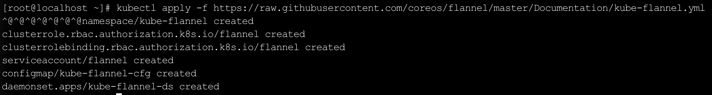

该步骤运行成功后，使用下面命令观察`Flannel`的`Pod`状态：

```sh
kubectl get pods -n kube-flannel -w
```

等到显示如下内容，说明`Flannel`已正常启动：

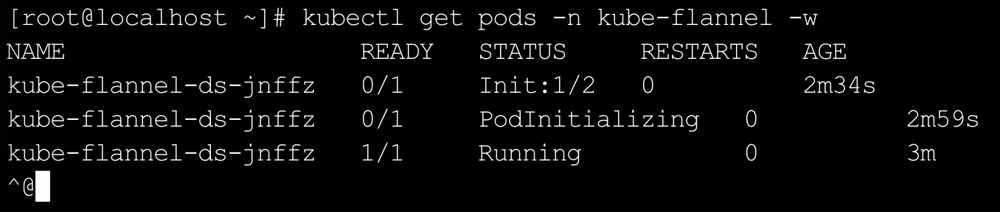

使用下面命令查看`master`节点的状态：

```sh
kubectl get nodes
```

可以看到`master`节点的状态已经变成`Ready`：

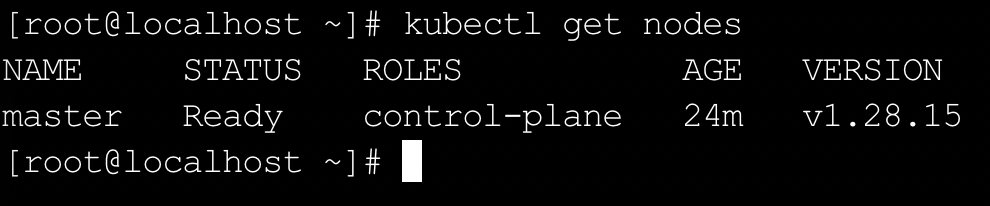

使用以下命令，检查所有`Pod`是否正常运行：

```sh
kubectl get pods --all-namespaces
```

执行成功内容如下所示：

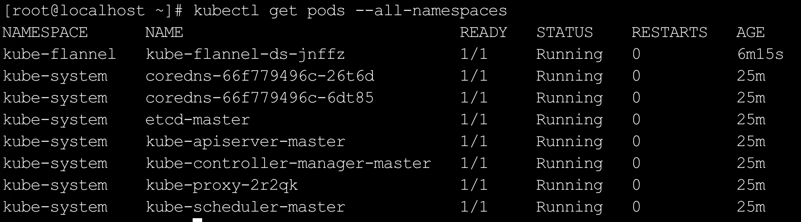

> 下面的命令，只需在两台`Worker`服务器上执行。

在两台`node`节点上，执行上面复制的加入工作节点（`worker`节点）的命令：

```sh
kubeadm join master:6443 --token b4ldlp.bryoo47uw8upgirr \
  --discovery-token-ca-cert-hash sha256:6ec937e6741b6911f6dc986935c38334b20b983ec19fb11ad0e841266d65290f
```

执行成功内容如下所示：

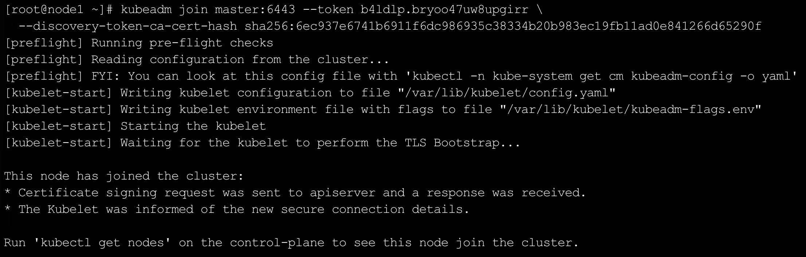

> 下面的命令，只需在`Master`服务器上执行。

上面步骤成功后需要等待三分钟，在`master`机器执行`kubectl get nodes`，即可看到两台`node`节点处于`Ready`状态：

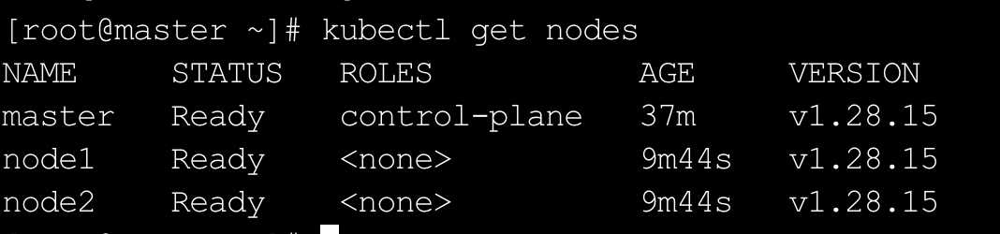

如果长时间没有`Ready`，可以在`master`上执行以下命令观察`node`节点的`Flannel Pod`状态：

```sh
kubectl get pods -n kube-flannel -o wide -w
```

加了`-o wide`可以看到每个`Pod`运行在哪个节点上，等`node`对应的`Pod`变为`Running`后，就会自动变为`Ready`：

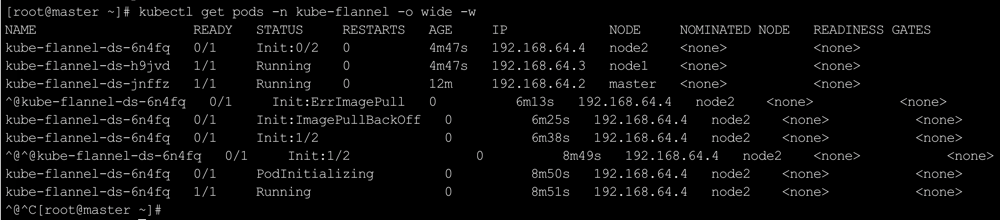

将两个`node`节点设置为`worker`角色：

```sh
kubectl label node node1 node-role.kubernetes.io/worker=worker
kubectl label node node2 node-role.kubernetes.io/worker=worker
```

再执行`kubectl get nodes`命令，即可查看到两台`node`节点的`ROLES`变为`worker`：

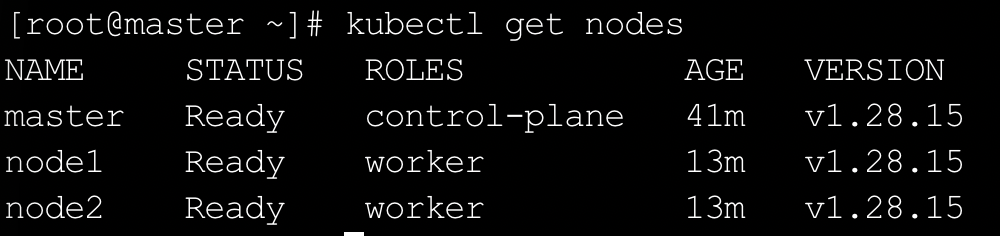

把`kubectl`的使用能力复制给`worker`节点，让`worker`节点也能执行`kubectl`命令。

```sh
# 在node1、node2两个节点分别执行
mkdir -p ~/.kube

# 在master节点上将配置文件推送过去
scp $HOME/.kube/config root@node1:~/.kube/config
scp $HOME/.kube/config root@node2:~/.kube/config
```

这一过程需要输入两台`node`节点的密码：

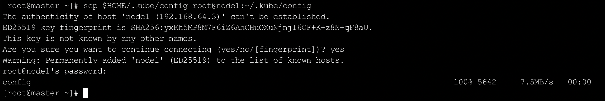

操作完成后，即可在`worker`节点执行`kubectl get nodes`命令查看节点信息：

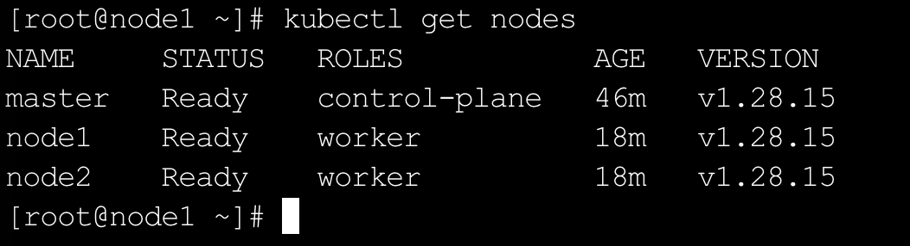

这一步并非必须，日常管理集群在`Master`节点上操作即可，如果无需在`Worker`节点上执行`kubectl`命令，上述步骤可跳过。

这样，一主二从的`K8s`集群即搭建完毕。接下来我们为`containerd`配置`docker.io`的镜像加速。

> 下面的命令，三台服务器都需要执行。

在`/etc/containerd/certs.d/docker.io/`目录下创建`hosts.toml`文件，写入镜像加速地址，`containerd`会按照文件中的顺序依次尝试，直到某个地址拉取成功为止：

```sh
mkdir -p /etc/containerd/certs.d/docker.io && cat > /etc/containerd/certs.d/docker.io/hosts.toml << 'EOF'
server = "https://registry-1.docker.io"

[host."https://docker-0.unsee.tech"]
  capabilities = ["pull", "resolve"]

[host."https://docker-registry.nmqu.com"]
  capabilities = ["pull", "resolve"]

[host."https://docker.1ms.run"]
  capabilities = ["pull", "resolve"]

[host."https://docker.apiba.cn"]
  capabilities = ["pull", "resolve"]

[host."https://docker.cattt.net"]
  capabilities = ["pull", "resolve"]

[host."https://docker.etcd.fun"]
  capabilities = ["pull", "resolve"]
EOF
echo "配置完成"
```

> 上述镜像加速网站可能随时失效，应以参考文档中提供的最新可用地址为准，并将其替换到上面配置中。
>
> 参考文档：https://status.anye.xyz、https://github.com/dongyubin/DockerHub、https://mirror.kentxxq.com/image

在`config.toml`中，`[plugins.'io.containerd.cri.v1.images'.registry]`段下有一个`config_path`配置项，默认为空，需要将其指向上一步创建的目录，`containerd`才能识别并加载`certs.d`下的加速配置：

```sh
sed -i "/plugins\.'io\.containerd\.cri\.v1\.images'\.registry\]/,/config_path/ s|config_path = ''|config_path = '/etc/containerd/certs.d'|" /etc/containerd/config.toml
```

确认`config_path`已正确写入，同时验证文件中其他段落的`config_path`未被误修改：

```sh
grep -B 3 'config_path' /etc/containerd/config.toml
```

查看到`[plugins.'io.containerd.cri.v1.images'.registry]`下的`config_path`变为`/etc/containerd/certs.d`：

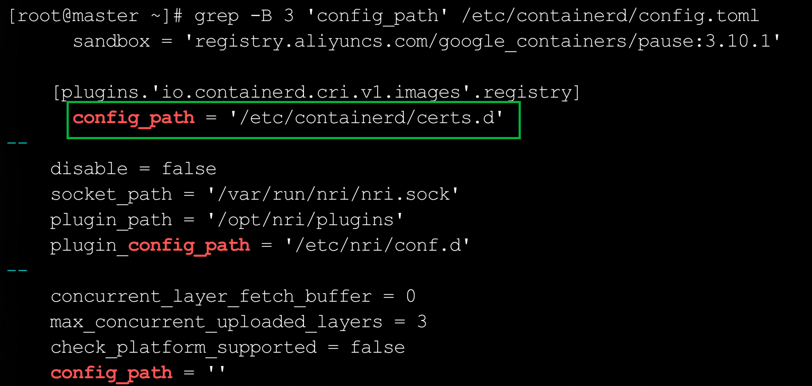

重启`containerd`使配置生效：

```sh
systemctl restart containerd && echo "containerd 已重启"
```

