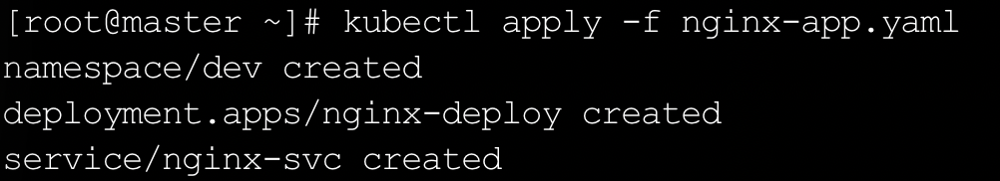
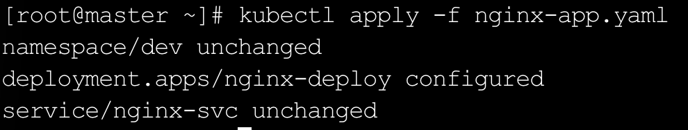
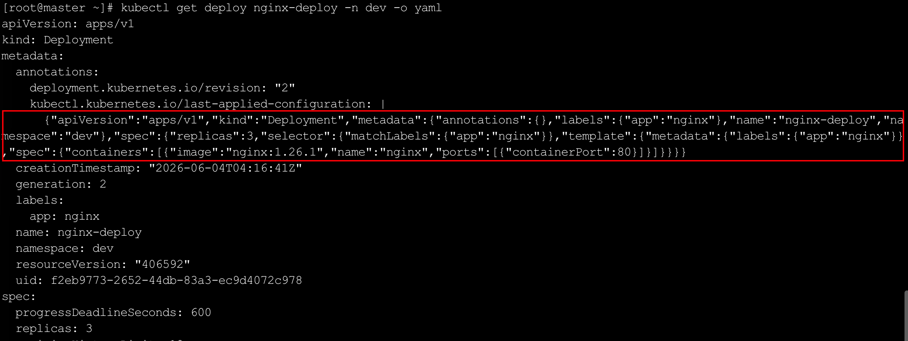
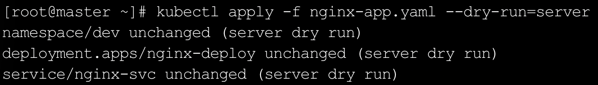

声明式对象配置使用`apply`命令描述资源的期望状态，由`Kubernetes`自动完成状态收敛。

与命令式对象配置最本质的区别在于，用户不再显式指示「创建」或「替换」，而是表达「我希望集群达到这个状态」，至于当前是否已存在、需要做什么操作，全部交给`Kubernetes`判断。

### 一、核心机制

执行`kubectl apply`命令时，`Kubernetes`会在资源的`metadata.annotations`中写入一个名为`kubectl.kubernetes.io/last-applied-configuration`的注解，记录本次`apply`传入的完整配置内容。下次再执行`apply`时，`Kubernetes`会以这份注解作为上一次的配置基线，与当前`YAML`文件进行三方对比，三方分别是上次应用的配置、集群中资源的实际状态、本次传入的新配置，并在此基础上计算差异，执行最小化变更。

这一机制带来两个重要特性。其一是幂等性，同一份`YAML`无论执行多少次`apply`，只要内容不变，集群状态就不会发生变化，不会像`create`那样因资源已存在而报错。其二是增量更新，`apply`只变更存在差异的字段，未出现在`YAML`中但已存在于集群的字段（例如通过命令行手动添加的注解）默认会被保留。

需要特别注意，若某个字段曾通过命令行手动修改，但该字段同时出现在`YAML`文件中，再次`apply`时`YAML`中的值会覆盖手动修改的值。在命令行与`apply`混用的场景下，以`YAML`文件作为最终权威是更安全的做法。

### 二、基本用法

`apply`的命令格式与`create`基本一致，支持指定单个文件、多个文件或整个目录：

```bash
# 创建或更新单个资源文件
kubectl apply -f pod.yaml

# 同时操作多个文件
kubectl apply -f pod.yaml -f service.yaml

# 操作整个目录下的所有资源文件
kubectl apply -f manifests/
```

资源不存在时`apply`自动创建，已存在时按差异增量更新，无需人工判断当前集群状态。

### 三、常用操作示例

准备一份包含`Namespace`、`Deployment`和`Service`的`YAML`文件：

```yaml
# nginx-app.yaml
apiVersion: v1
kind: Namespace
metadata:
  name: dev
---
apiVersion: apps/v1
kind: Deployment
metadata:
  name: nginx-deploy
  namespace: dev
  labels:
    app: nginx
spec:
  replicas: 2
  selector:
    matchLabels:
      app: nginx
  template:
    metadata:
      labels:
        app: nginx
    spec:
      containers:
        - name: nginx
          image: nginx:1.25.1
          ports:
            - containerPort: 80
---
apiVersion: v1
kind: Service
metadata:
  name: nginx-svc
  namespace: dev
spec:
  selector:
    app: nginx
  ports:
    - port: 80
      targetPort: 80
      nodePort: 30080
  type: NodePort
```

首次执行`apply`，三个资源均不存在，`Kubernetes`会依次创建：

```bash
kubectl apply -f nginx-app.yaml
```

输出中每行末尾会标注操作类型，首次创建时显示`created`，后续无变更时显示`unchanged`，有变更时显示`configured`：



查看资源是否正常运行：

```bash
kubectl get all -n dev
```

现在将`nginx-app.yaml`中`Deployment`的镜像修改为`nginx:1.26.1`，副本数调整为`3`，再次执行`apply`：

```bash
kubectl apply -f nginx-app.yaml
```

输出中可以看到只有`Deployment`发生了变更，`Namespace`和`Service`未受影响：



查看滚动更新的过程与最终状态：

```bash
kubectl rollout status deploy/nginx-deploy -n dev
kubectl get pods -n dev -o wide
```

查看资源上记录的`last-applied-configuration`注解，可以看到上一次`apply`时传入的完整配置内容：

```bash
kubectl get deploy nginx-deploy -n dev -o yaml
```

在输出的`metadata.annotations`部分可以找到该注解，其值就是上次`apply`时的`JSON`格式配置快照：



若要查看本次`apply`实际会产生哪些变更而不真正执行，可以结合`--dry-run=server`预演：

```bash
kubectl apply -f nginx-app.yaml --dry-run=server
```

执行效果如下所示：



`--dry-run=server`会将请求发送至`API Server`做完整校验，包括字段合法性与权限检查，但不持久化到`etcd`，其校验严格程度高于`--dry-run=client`，适合在正式变更前做确认。

删除资源同样可以通过文件指定：

```bash
kubectl delete -f nginx-app.yaml
```

### 四、`apply`与`create`、`replace`的对比

| 维度       | `create`             | `replace`                | `apply`                      |
| ---------- | -------------------- | ------------------------ | ---------------------------- |
| 操作语义   | 命令式，明确指示创建 | 命令式，明确指示全量替换 | 声明式，描述期望状态         |
| 资源已存在 | 直接报错             | 全量替换                 | 按差异增量更新               |
| 资源不存在 | 正常创建             | 报错                     | 正常创建                     |
| 幂等性     | 否                   | 否                       | 是                           |
| 适用场景   | 一次性创建、测试调试 | 需要全量覆盖的场景       | 开发与生产环境的日常资源管理 |

在实际使用中，测试与调试阶段通常直接用命令行或`create`快速操作，开发和生产环境则以`YAML`文件配合`kubectl apply`为主流实践，这也是`GitOps`工作流的基础，将`YAML`文件纳入`Git`仓库，通过`apply`驱动集群状态与代码仓库保持一致。