在`Mac`上，可以使用`UTM`软件创建`Linux`虚拟机，其官方下载地址为：https://mac.getutm.app/。

我们安装`CentOS-Stream-9-latest-aarch64-boot.iso`这个镜像，其下载地址如下：https://mirrors.tuna.tsinghua.edu.cn/centos-stream/9-stream/BaseOS/aarch64/iso/CentOS-Stream-9-latest-aarch64-boot.iso。

如果`boot.iso`镜像有问题，可以选择使用`DVD`镜像，其下载地址如下：https://mirrors.tuna.tsinghua.edu.cn/centos-stream/9-stream/BaseOS/aarch64/iso/CentOS-Stream-9-latest-aarch64-dvd1.iso

下载完成后，打开`UTM`软件，选择“创建一个新虚拟机”，在如下页面选择“虚拟化”：


在如下界面中，内存和`CPU`选用合理即可：

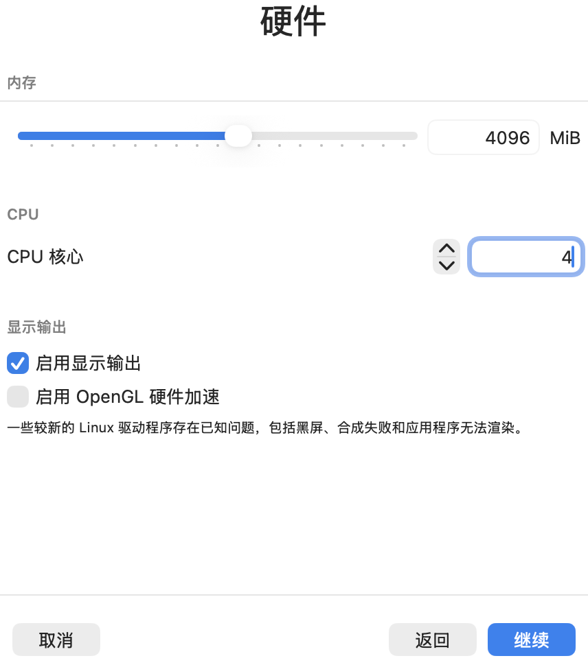

在如下的界面中，按照下面步骤选择上面下载好的镜像：

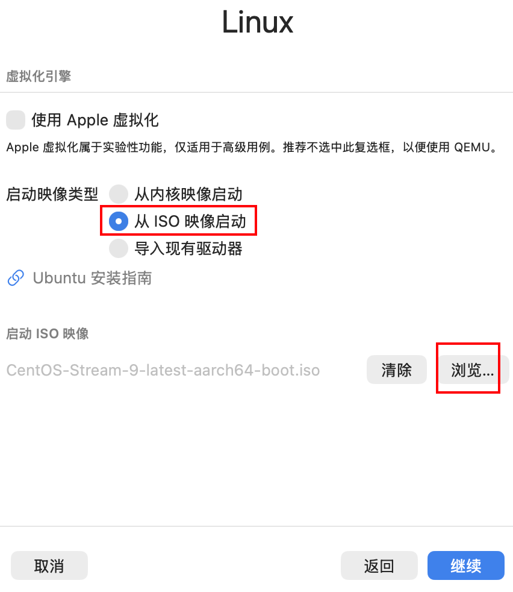

在这里给我们的`Linux`虚拟机服务器取名：

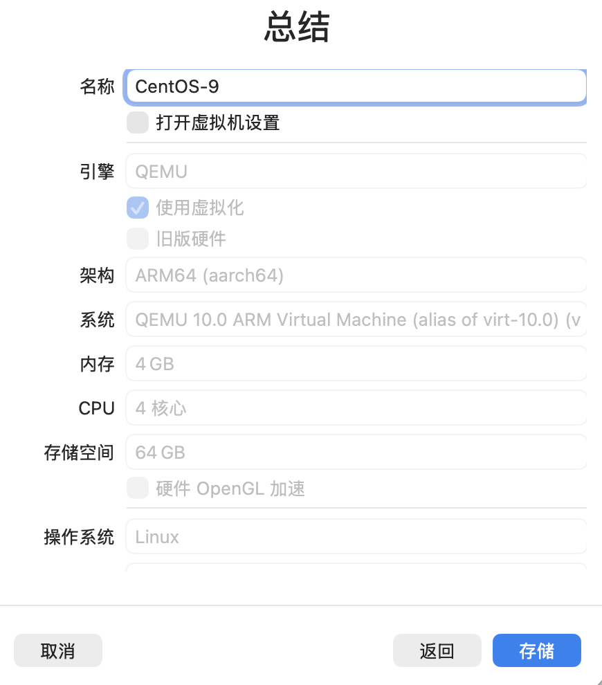

接着进入到如下界面，点击三角形的播放按钮，开始安装服务器：

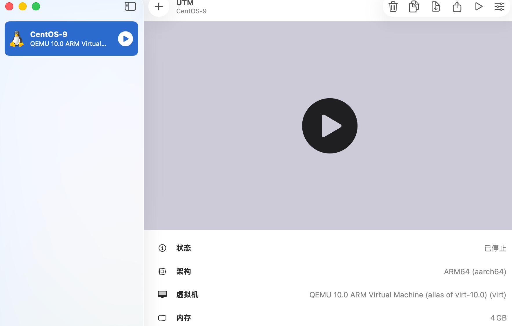

这里选择第一项，然后按`e`键，进入当前选中项的启动参数编辑模式：

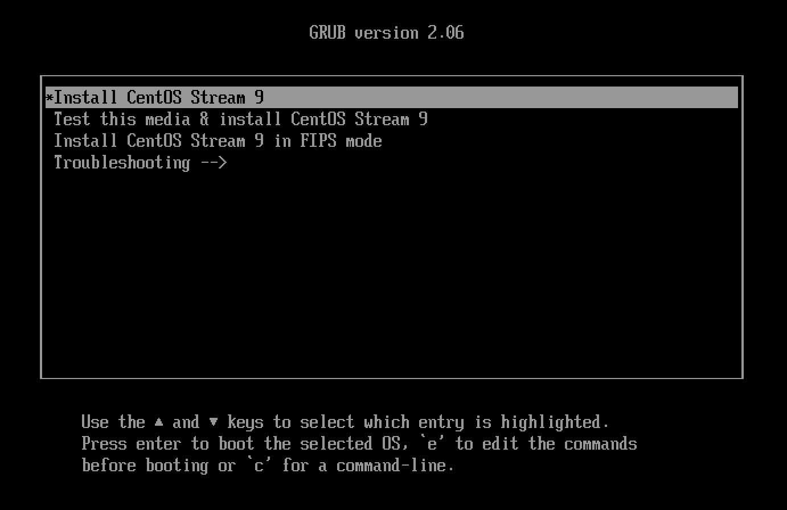

在下面的页面中的`linux`开头的行，结尾添加`inst.text console=tty0`这段内容：

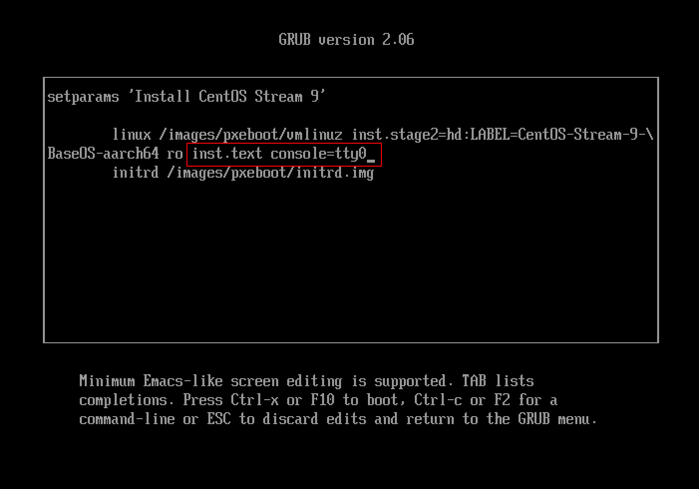

之所以需要执行这一步，是因为前面下载的镜像属于`boot`类型，而不是完整的`DVD`镜像。该镜像仅包含启动程序和基础安装环境，在安装过程中默认不会提供图形化界面。因此，需要手动指定`CentOS Stream 9`安装程序以文本模式运行，并将系统控制台输出重定向到第一个虚拟终端`tty0`，也就是物理显示器所在的终端设备。

修改完成后，按下`control + X`组合键，使系统按照当前已编辑的启动参数继续引导，并进入安装流程。

在如下界面中，选择`2`然后按回车，表示使用文本模式：

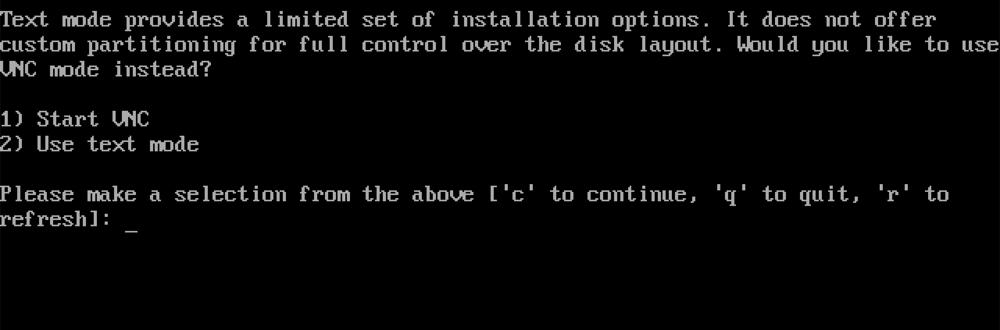

进入到如下页面后，带`[!]`的项是必须完成的配置，我们需要配置它们，将它们都变成`[x]`：

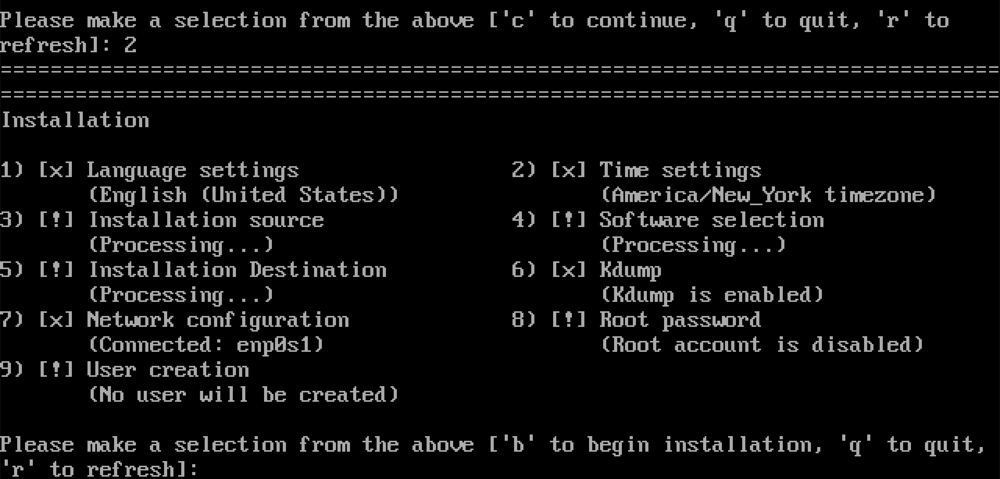

> 如上使用`boot.iso`镜像安装的方式会导致报错`g-io-error-quark: The connection is closed (18)`，这可能是`M`芯片的`MacBook`与`boot`镜像的兼容性问题，后续步骤将替换成使用`DVD`镜像操作。

此处改为使用`DVD`镜像。前面在选择镜像时应当选择`DVD`版本，因此安装程序会默认以图形化界面启动。

在这种情况下，无需在启动参数末尾追加`inst.text console=tty0`，系统会自动进入图形化安装界面。安装程序启动后，按照界面提示先选择安装语言，然后继续后续安装流程：

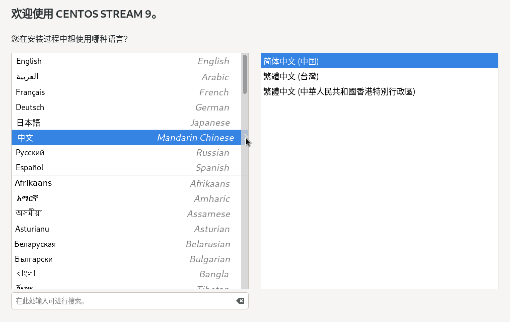

首先先点击“安装目标位置”，进入页面后无需更改设置，点击“完成”即可：

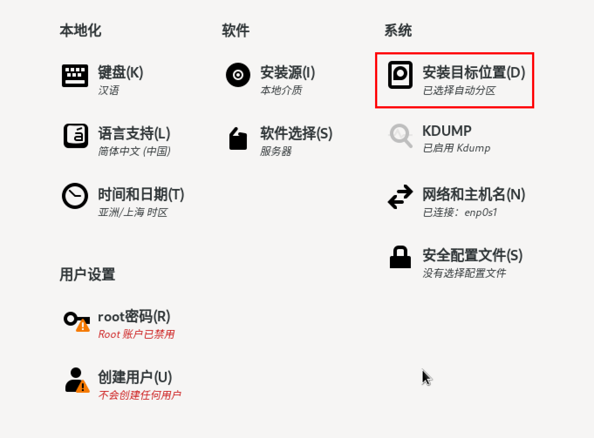

接下来选择“软件选择”项：

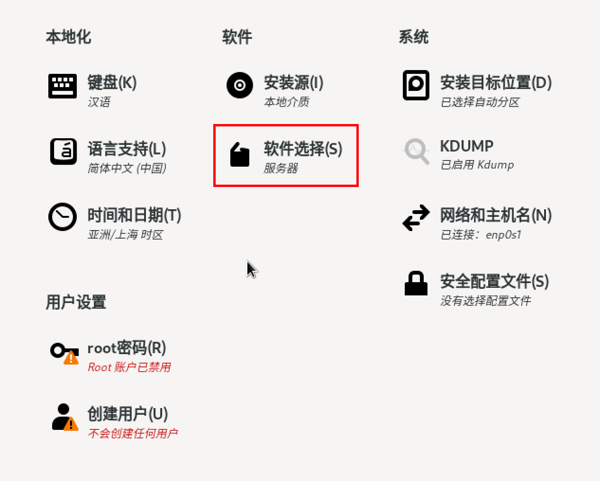

在出现的页面中，选择“服务器”，并在附加软件中选择`Linux`的远程管理、控制台互联网工具、开发工具和系统工具：

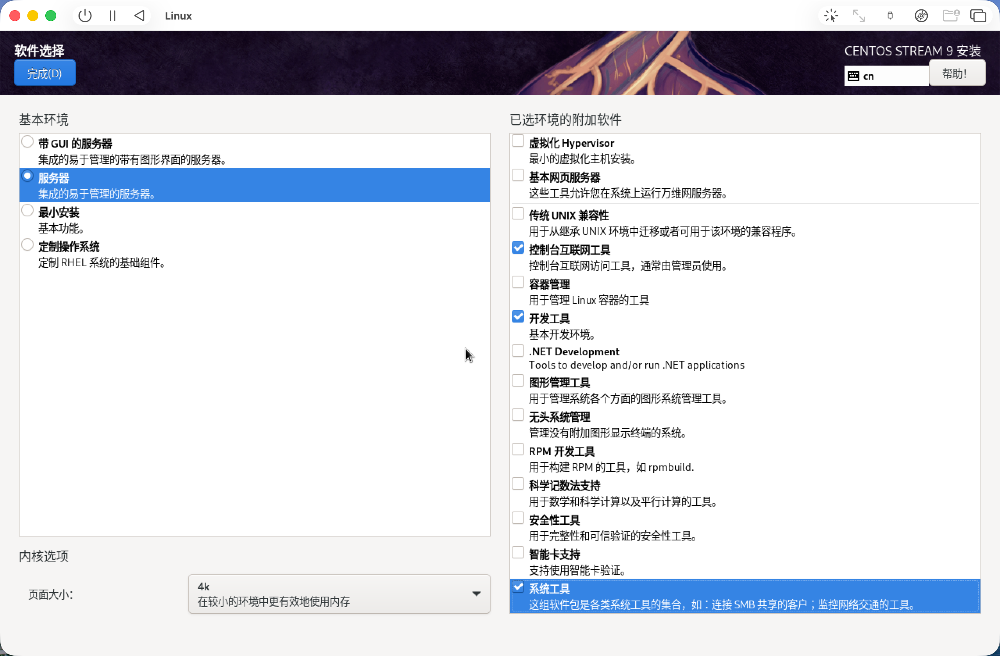

接着，我们点击`root`密码，进行`root`用户的密码设置：

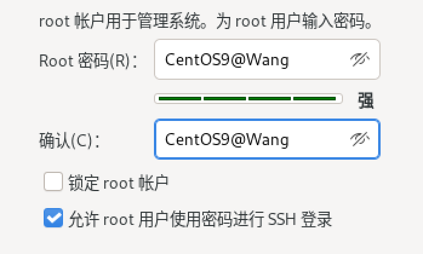

设置完以上的内容，就可以点击“开始安装”进行安装步骤了。

安装完成的界面如下所示，在这里我们点击“重启系统”：

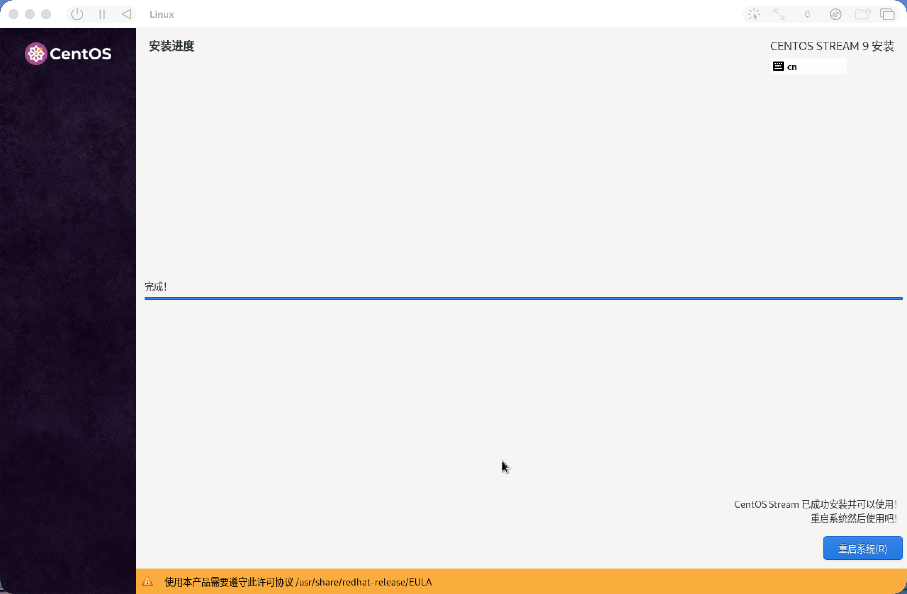

需要注意的是，在重启系统之前，我们需要将该虚拟机的`CD/DVD`移除，否则重启后它还是会进入到装系统界面：

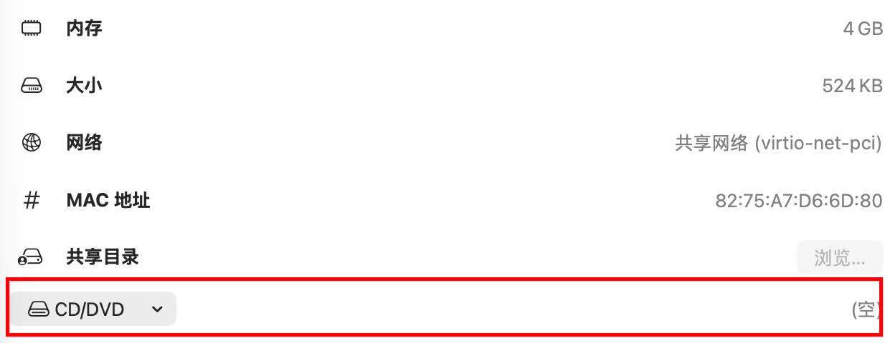

重启后能进入终端界面，可通过上面设置的密码登录，表示系统已安装成功：

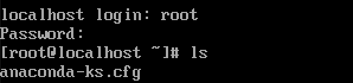

接着使用`ip -4 a`命令，即可查看到本机的`IP`以及对应的网口：

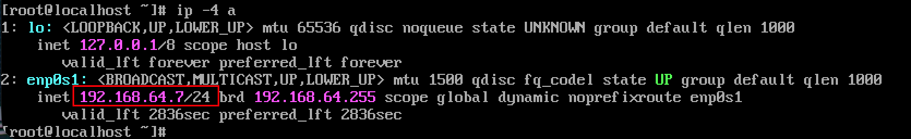

该系统基于`CentOS 8`或`RHEL 8`及以上版本，已不再采用传统的`network.service`进行网络管理，而是默认由`NetworkManager`统一接管。因此，系统中不存在`network.service`，也无需再通过`/etc/sysconfig/network-scripts`目录下以`ifcfg-`开头的配置文件来管理网络接口。在这里我们直接使用外部`SSH`工具连接上面查询到的`IP`地址即可。

使用`Royal TSX`连接该服务器，如下所示：

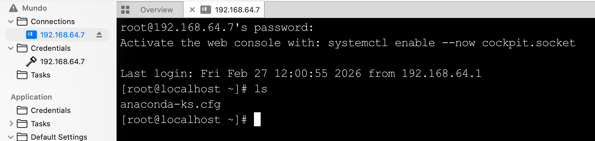

在这里我们配置一下`DNS`为公共`DNS`，执行以下命令：

```sh
sudo cp /etc/resolv.conf /etc/resolv.conf.bak
echo -e "nameserver 8.8.8.8\nnameserver 1.1.1.1" | sudo tee /etc/resolv.conf
```

接着我们执行以下命令，看是否可解析为公网`IP`，网络连通正常：

```sh
ping -c 4 mirrors.centos.org
```

出现如下结果，表示`DNS`服务器已配置成功：

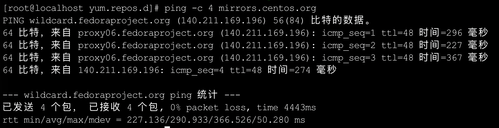

但是，`/etc/resolv.conf`是由`NetworkManager`生成的，重启网络或系统后会被覆盖，所以我们要做长期配置。

首先确认该服务器的网络连接名称，执行如下命令：

```sh
nmcli connection show
```

命令执行输出如下所示：

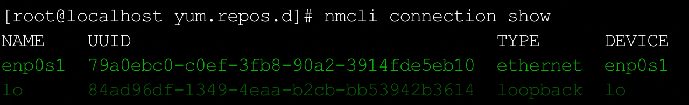

这表示当前使用的连接名是`enp0s1`，下面做持久化配置，让`NetworkManager`不再自动获取`DNS`，固定使用`8.8.8.8`和`1.1.1.1`。我们按顺序执行以下命令：

```sh
nmcli connection modify enp0s1 ipv4.ignore-auto-dns yes
nmcli connection modify enp0s1 ipv4.dns "8.8.8.8 1.1.1.1"
nmcli connection down enp0s1 && nmcli connection up enp0s1
```

执行完成后，再执行一下下面的命令，验证持久化是否正确：

```sh
cat /etc/resolv.conf
nmcli device show enp0s1 | grep IP4.DNS
```

展示出如下结果，表示已配置成功：

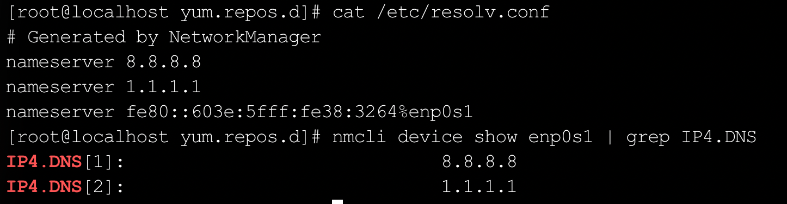

后续可以使用`reboot`命令重启机器，再执行上面的验证命令，看看是否为公共`DNS`。