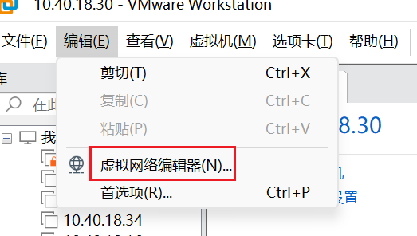
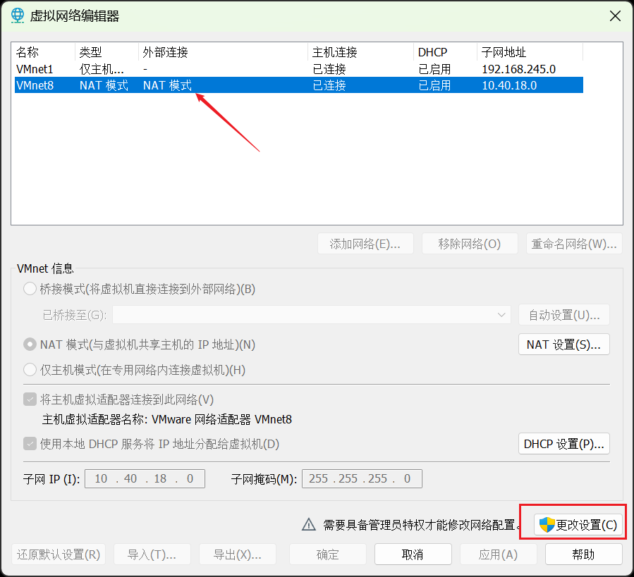
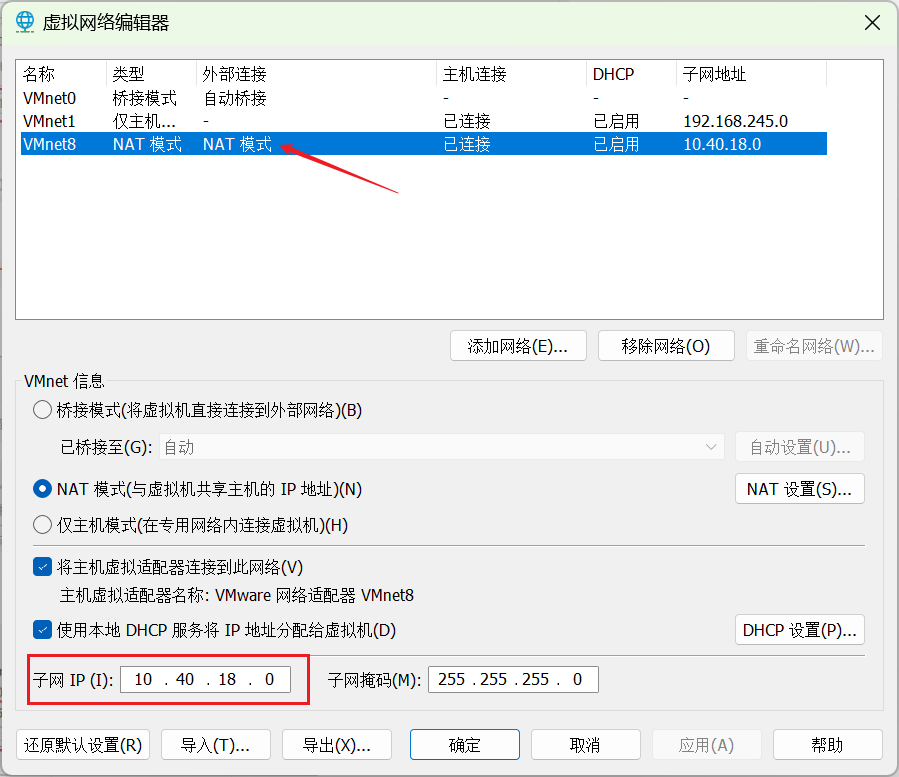
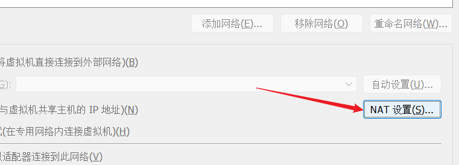
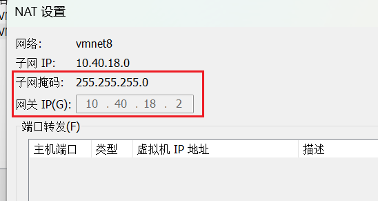

在使用`VMware`安装的`Linux`系统中，每次重启后`IP`地址都会变化。为了避免这种情况，可以为`CentOS`设置一个静态`IP`地址。首先，需要修改`VMware`的网段配置。打开`VMware`，进入“虚拟网络编辑器”，按照以下步骤操作：

在弹出的界面中，选择`NAT`模式，点击“更改设置”：

在弹出的页面中，选择`NAT`模式，然后可以对子网`IP`进行修改，子网前缀可自定义，最后一部分为`0`，例如`10.40.18.0`：

点击“`NAT`设置”，可以查看到对应的网关地址等信息，不可对其进行修改：

配置后，在这台虚拟机上安装的所有`Linux`服务器的`IP`地址将以`10.40.18`开头。

