在使用`VMware`安装的`Linux`系统中，每次重启后`IP`地址都会变化。为了避免这种情况，可以为`CentOS`设置一个静态`IP`地址。首先，需要修改`VMware`的网段配置。打开`VMware`，进入「虚拟网络编辑器」，按照以下步骤操作：

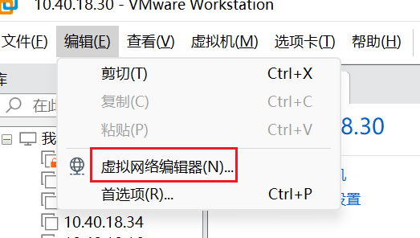

在弹出的界面中，选择`NAT`模式，点击「更改设置」：

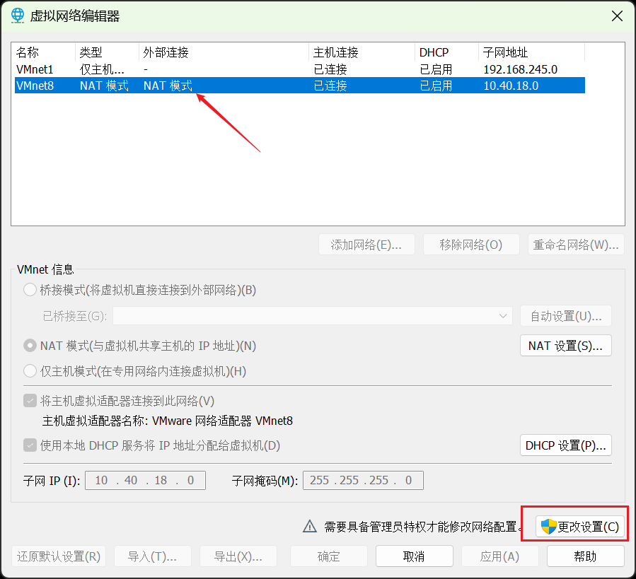

在弹出的页面中，选择`NAT`模式，然后可以对子网`IP`进行修改，子网前缀可自定义，最后一部分为`0`，例如`10.40.18.0`：

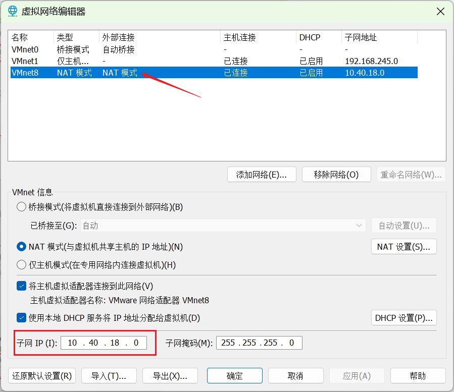

点击「`NAT`设置」，可以查看到对应的网关地址等信息：

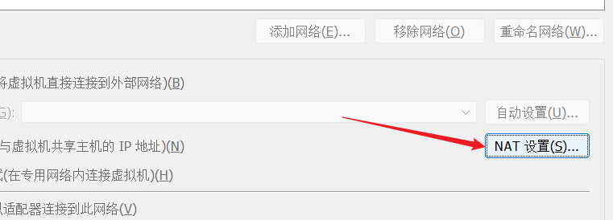

在这里我们不可对其进行修改，只需看一下之前的步骤是否修改成功即可：

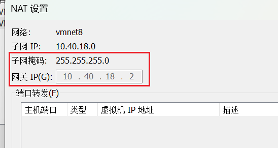

配置后，在这台虚拟机上安装的所有`Linux`服务器的`IP`地址都将以`10.40.18`开头。

接着我们安装`CentOS`系统，具体版本如下所示：

| 项目           | 内容                           |
| -------------- | ------------------------------ |
| 操作系统镜像   | `CentOS 7`                     |
| 镜像文件       | `CentOS-7-x86_64-DVD-1804.iso` |
| 虚拟机软件     | `VMware Workstation 16 Pro`    |
| 虚拟机版本号   | `16.2.4 build-20089737`        |
| 规划`IP`地址   | `10.40.18.40`                  |

首先我们打开`WMware`，选择「新建虚拟机」：

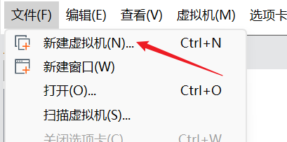

选择「典型」：

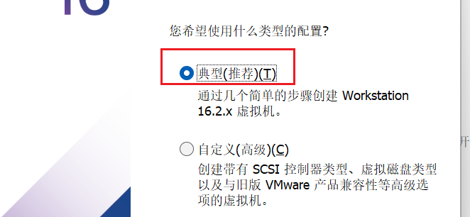

这里可以先选择「稍后安装操作系统」

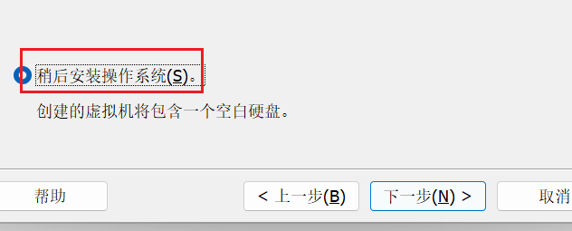

按照图示选择`Linux`和`CentOS 7`：

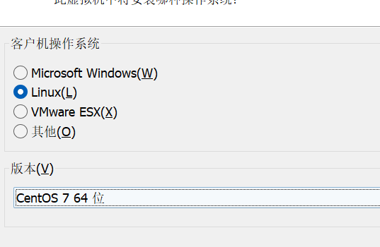

设置一下虚拟机名称与安装目录，我这里设置名称为其`IP`地址：

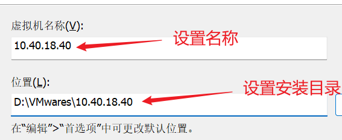

设置最大磁盘大小，如果有需要可以设置大一些，例如`40GB`：

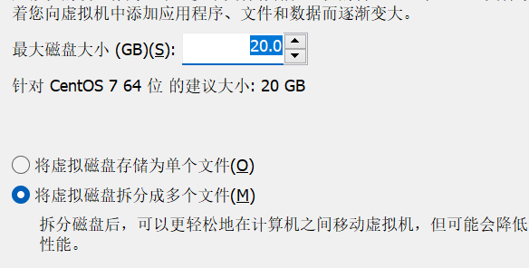

如果追求简单管理和较高的读写性能，建议选择「将虚拟磁盘存储为单个文件」，这样便于管理和备份，且性能更高；如果需要更高的容错性和灵活的扩展性，建议选择「将虚拟磁盘拆分为多个文件」，这样可以分散风险，便于调整磁盘大小。

点击「自定义硬件」：

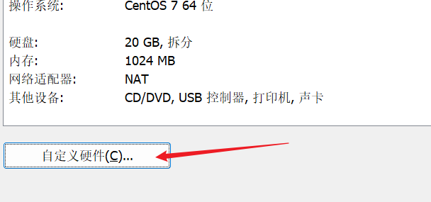

根据下面图片来操作即可，镜像选择本地的`CentOS-7-x86_64-DVD-1804.iso`文件：

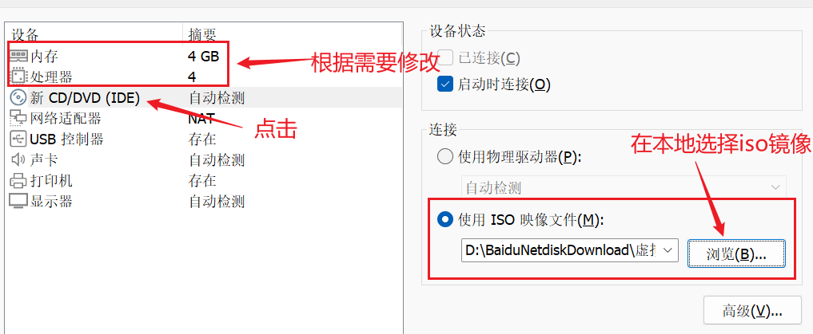

配置完成后，点击「关闭」：

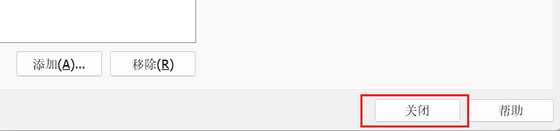

点击「完成」：

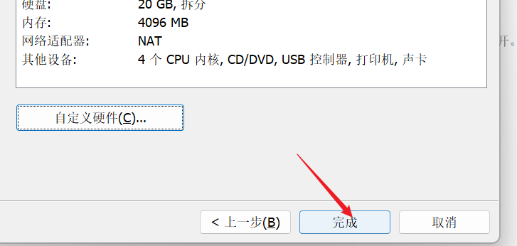

这里就出现了我们刚才安装的`Centos`服务器，点击它：

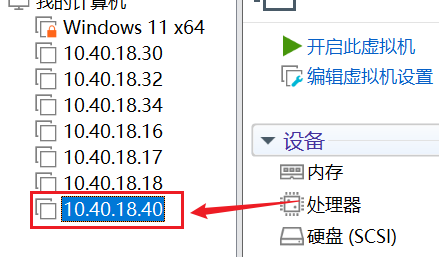

点击「开启此虚拟机」：

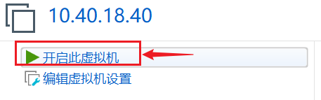

定位到如下这一项的时候，按回车：

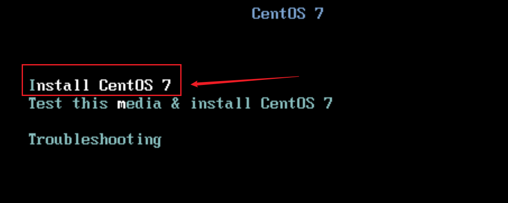

之后是`Centos7`的安装过程，耗时较长，需要耐心等待一会。

出现此界面，选择简体中文：

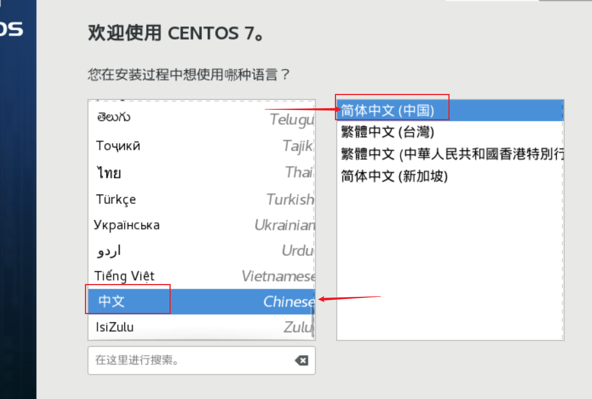

需要对安装位置进行选择确认，点击：

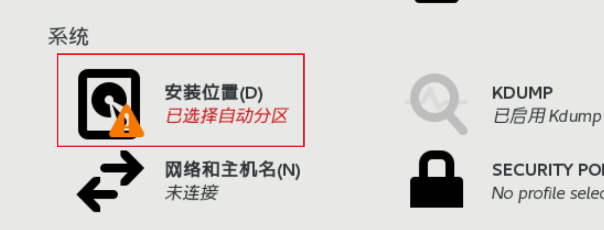

保留默认配置，点击完成即可：

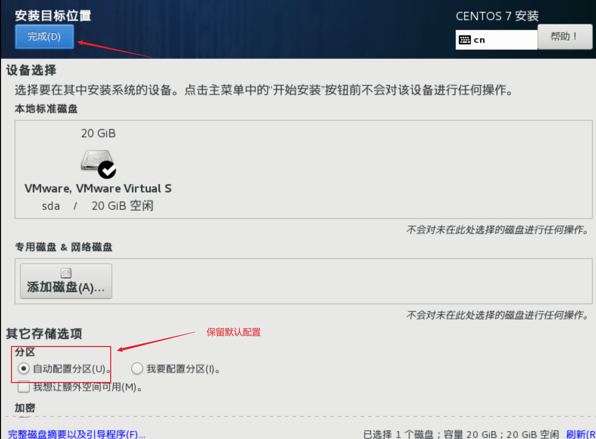

点击「软件选择」，选择「基础设施服务器」：

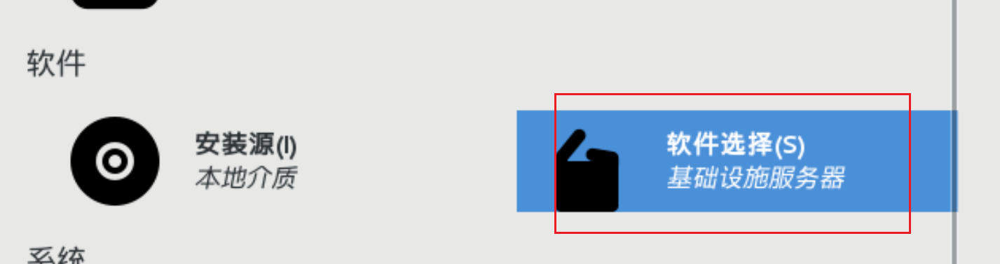

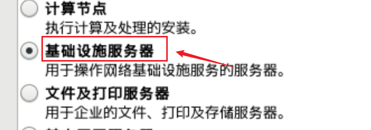

然后点击「开始安装」：

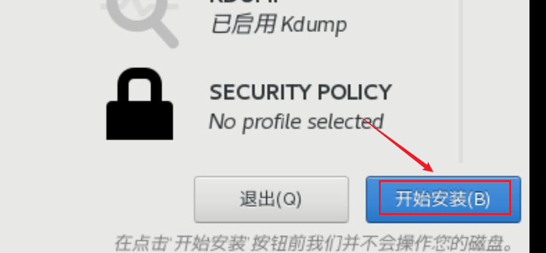

接下来的界面中，我们设置一下`root`用户的密码，这里我们设置为`root123456`：

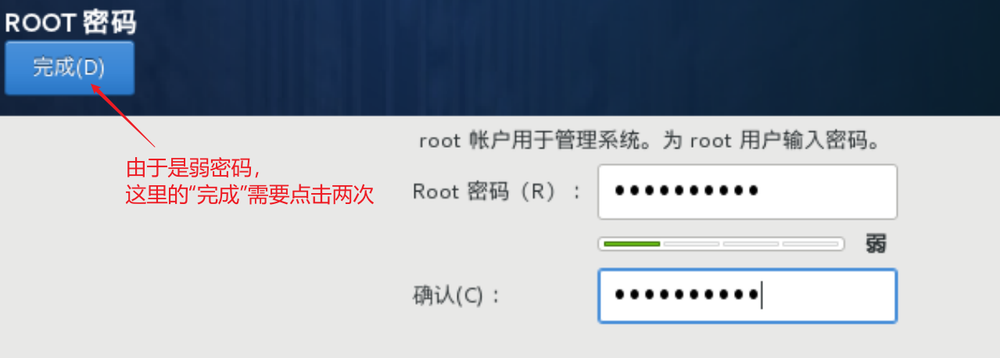

等待其安装，这一步骤花费时间较长，耐心等待。

安装好后重启，在终端输入用户名和密码，出现如图所示代表安装成功：

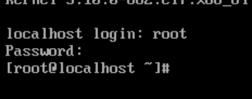

安装完`Centos`后，使用终端连接软件是连接不上的，需要在`VMware`的`Linux`终端页面进行以下操作。

操作以下命令，编辑该文件：

```bash
vim /etc/sysconfig/network-scripts/ifcfg-ens33
```

修改或添加以下这几行配置：

```sh
ONBOOT=yes               # 系统启动时启用该网络接口
BOOTPROTO=static         # 使用静态IP地址
IPADDR=10.40.18.40       # 设置静态IP地址
NETMASK=255.255.255.0    # 设置子网掩码
GATEWAY=10.40.18.2       # 设置默认网关
DNS1=223.5.5.5           # 设置DNS服务器地址
```

保存后，重启网络服务：

```bash
systemctl restart network
```

接下来，我们关闭这台`Linux`的防火墙，不然终端连接工具无法连接它。

查看防火墙状态：

```bash
systemctl status firewalld
```

关闭防火墙：

```bash
systemctl stop firewalld
```

禁用防火墙开机自启：

```bash
systemctl disable firewalld
```

再次查看防火墙状态：

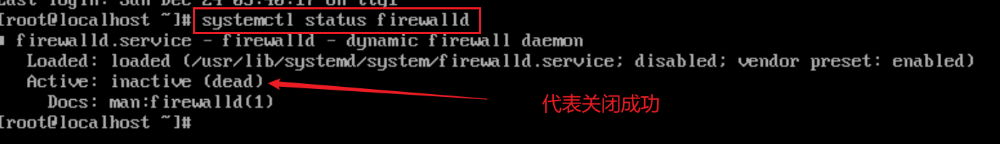

完成上面操作后，才可以使用终端连接软件连接`Linux`。我们发现每个`Centos`安装完默认的用户名都是`localhost`：

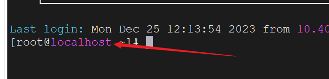

如果想修改这个名字，先使用`hostnamectl`这个命令，查看当前用户名信息：

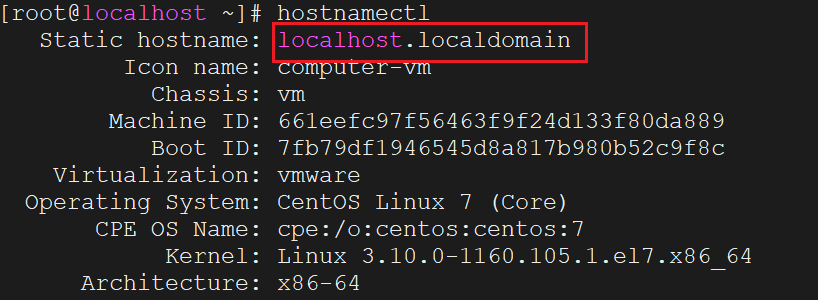

接下来使用下面命令设置新的用户名，比如我们设置为`mundo`：

```bash
hostnamectl set-hostname mundo
```

然后再查看用户名信息：

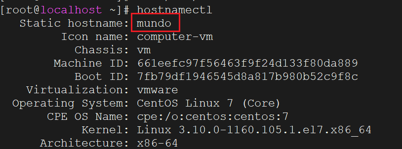

也可以查看`/etc/hostname`文件内容：

```sh
vim /etc/hostname
```

查看到的内容如下所示，表示名字修改成功：

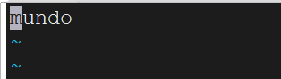

重启`Linux`，再次打开终端，看到用户名已经更改：

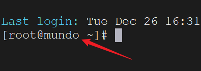

在`Centos`安装完成后，使用`yum`安装软件包时可能会出现各种错误，可按以下顺序执行命令进行解决：

```sh
cd /etc/yum.repos.d/
sed -i 's/mirrorlist/#mirrorlist/g' /etc/yum.repos.d/CentOS-*
sed -i 's|#baseurl=http://mirror.centos.org|baseurl=http://vault.centos.org|g' /etc/yum.repos.d/CentOS-*
yum makecache
yum update -y
```

这些命令的作用是将`CentOS`的`yum`仓库切换到归档仓库，以应对原有镜像可能已停止更新或不可用的情况，从而保证系统能够持续获取软件包更新。
