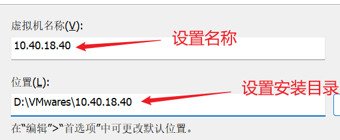

我们使用的`CentOS`镜像版本为：`CentOS-7-x86_64-DVD-1804.iso`。

`VMware`版本为：`VMware® Workstation 16 Pro`，版本号：`16.2.4 build-20089737`。

我们要在`VMware`中创建一个新的`CentOS`虚拟机，并为其分配`IP`地址：`10.40.18.40`。

打开`WMware`，选择“新建虚拟机”：

选择“典型”：

这里可以先选择“稍后安装操作系统”

按照图示选择`Linux`和`CentOS 7`：

设置一下虚拟机名称与安装目录，我这里设置名称为其`IP`地址：

设置最大磁盘大小，如果有需要可以设置大一些，例如`40GB`：

如果追求简单管理和较高的读写性能，建议选择“将虚拟磁盘存储为单个文件”，这样便于管理和备份，且性能更高；如果需要更高的容错性和灵活的扩展性，建议选择“将虚拟磁盘拆分为多个文件”，这样可以分散风险，便于调整磁盘大小。

点击“自定义硬件”：

根据下面图片来操作即可，镜像选择`CentOS-7-x86_64-DVD-1804.iso`：

配置完成后，点击“关闭”：

点击“完成”：

这里就出现了我们刚才安装的`centos`，点击它：

点击“开启此虚拟机”：

定位到如下这一项的时候，按回车：

之后是`Centos7`的安装过程，耗时较长，需要耐心等待一会。

出现此界面，选择简体中文：

需要对安装位置进行选择确认，点击：

保留默认配置，点击完成即可：

点击“软件选择”，选择“基础设施服务器”：

然后点击“开始安装”：

接下来的界面中，我们设置一下`root`用户的密码，这里我们设置为：`root123456`：

等待其安装，这一步骤花费时间较长，耐心等待。

安装好后重启，在终端输入用户名和密码，出现如图所示代表安装成功：

