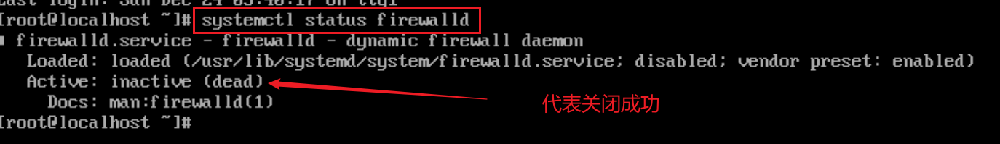
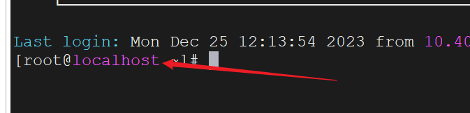
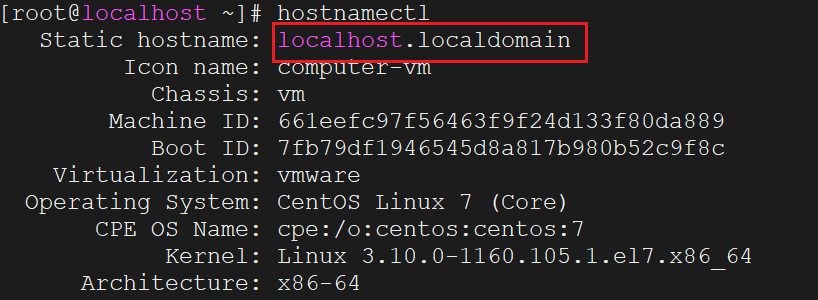
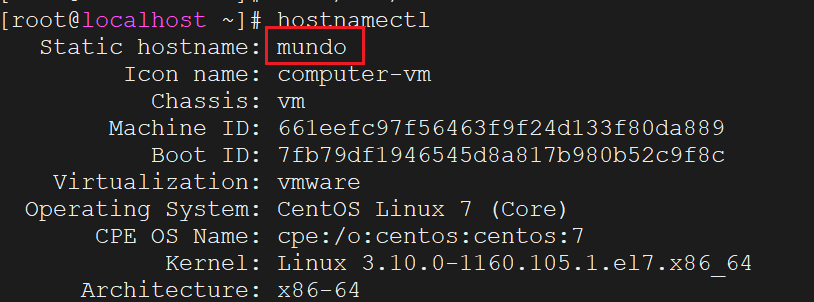
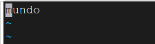
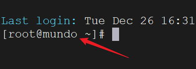

安装完`Centos`后，使用终端连接软件是连接不上的，需要在`VMware`的`Linux`终端页面进行以下操作。

操作以下命令，编辑该文件：

```bash
vim /etc/sysconfig/network-scripts/ifcfg-ens33
```

修改或添加以下这几行配置：

```sh
ONBOOT=yes               # 系统启动时启用该网络接口
BOOTPROTO=static         # 使用静态IP地址
IPADDR=10.40.18.40       # 设置静态IP地址
NETMASK=255.255.255.0    # 设置子网掩码
GATEWAY=10.40.18.2       # 设置默认网关
DNS1=223.5.5.5           # 设置DNS服务器地址
```

保存后，重启网络服务：

```bash
systemctl restart network
```

接下来，我们关闭这台`Linux`的防火墙，不然终端连接工具无法连接它。

查看防火墙状态：

```bash
systemctl status firewalld
```

关闭防火墙：

```bash
systemctl stop firewalld
```

禁用防火墙开机自启：

```bash
systemctl disable firewalld
```

再次查看防火墙状态：



完成上面操作后，才可以使用终端连接软件连接`Linux`。我们发现每个`Centos`安装完默认的用户名都是`localhost`：



怎么修改这个名字？我们先使用`hostnamectl`这个命令，查看当前用户名信息：



接下来使用下面命令设置新的用户名，比如我们设置为`mundo`：

```bash
hostnamectl set-hostname mundo
```

然后再查看用户名信息：



也可以查看`/etc/hostname`文件内容：

```sh
vim /etc/hostname
```

查看到的内容如下所示，表示名字修改成功：



重启`Linux`，再次打开终端，看到用户名已经更改：



在`Centos`安装完成后，使用`yum`安装软件包时可能会出现各种错误，可按以下顺序执行命令进行解决：

```sh
cd /etc/yum.repos.d/
sed -i 's/mirrorlist/#mirrorlist/g' /etc/yum.repos.d/CentOS-*
sed -i 's|#baseurl=http://mirror.centos.org|baseurl=http://vault.centos.org|g' /etc/yum.repos.d/CentOS-*
yum makecache
yum update -y
```

这些命令的作用是将`CentOS`的`yum`仓库切换到归档仓库，以应对原有镜像可能已停止更新或不可用的情况，从而保证系统能够持续获取软件包更新。
