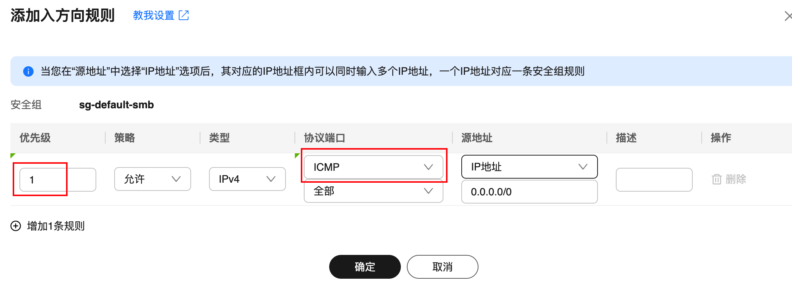

> 参考官方文档：https://support.huaweicloud.com/usermanual-flexusl/security_admin_0002.html

我们购买了一台华为云的`CentOS`云服务器，在本地使用`ping`命令测试服务器的公网地址时，发现请求超时：


在云服务器上成功安装了`MySQL`服务，但使用`Navicat`连接时无法成功。通过以下命令测试`3306`端口的连通性：

```sh
nc -vz 123.60.188.152 3306
```

发现这个命令也出现了连接超时的现象：

```sh
nc: connectx to 123.60.188.152 port 3306 (tcp) failed: Operation timed out
```

> 华为云控制台网址：https://console.huaweicloud.com/console/?region=cn-east-3#/home

以上两个问题与安全组规则配置有关。我们进入华为云控制台，点击“华为云`Flexus`云服务”：


找到目标服务器实例，并点击进入实例详情页面：


点击进去后，我们可以直接点击“更改安全组”，也可以点击“更多”下拉列表的“查看详情”：


点击“安全组”，进入对应页面：


我们可以看到有以下基本信息：


关于已绑定的安全组的新增和修改部分，我们暂时不需要处理，可以先放一放，重点来看下面的配置规则部分。

在这部分，我们需要选择一个安全组，以及“入方向规则”还是“出方向规则”。这里的安全组下拉框会列出之前绑定的所有安全组。因为我们需要从本机连接服务器，所以应该选择“入方向规则”。

系统默认已经为我们开放了`TCP`协议的`3389`端口（远程桌面）和`22`端口（`SSH`）。不过需要注意的是，默认并没有开放`3306`端口（`MySQL`数据库使用的端口），也没有开通`ICMP`协议（我们常说的`ping`功能）。

因此，如果需要使用`3306`端口或`ping`服务，还需要手动添加相关规则。首先是开通`ICMP`协议，我们点击“添加规则”，优先级设置为`1`，协议端口改为`ICMP`，其余配置暂不需要改动：



配置完成后点击确定，就能在列表上看到我们配置的这条规则：


为了简化配置，可以直接开放所有`TCP`端口。添加规则的页面，优先级设置为`1`，协议端口选择“全部`TCP`”，端口号留空：


不过，在实际的生产环境中，不建议直接开放所有端口。更好的做法是指定具体的`IP`地址，并按需开放特定端口。

操作时，可以在协议端口选择“自定义`TCP`”，然后手动填写端口号。如果需要开放多个端口，可以用逗号分隔，也可以用短横线表示范围。我们将`3306`端口与系统默认开放的`22`和`3389`端口一并写入同一条规则中，以便管理更清晰：


接着我们删除系统默认创建的两条规则。直接点击对应的“删除”按钮，然后点击确定即可：


这样一来，当我们再次尝试`ping`云服务器的公网地址时，就可以成功`ping`通了：


测试端口连通性也可测试通过：

```sh
Connection to 123.60.xxx.xxx port 3306 [tcp/mysql] succeeded!
```

在以上操作中，我们并未指定具体的入方向地址，而是使用了`0.0.0.0`，表示允许所有`IP`地址连接。这种配置虽然方便，但安全性较低。如果需要更严格的权限控制，可以在“添加入方向规则”界面的“源地址”区域进行具体设置：


这里需要设置为本机的公网`IP`地址，在`Linux`或`MacOS`环境下（测试`PowerShell`也可以），使用以下命令：

```sh
curl -4 ifconfig.me
```

或者以下命令：

```sh
curl ipinfo.io/ip
```

也可以打开浏览器访问https://ip.cn/、https://whatismyipaddress.com，页面会显示本机的公网`IP`。但是如果挂了代理，页面显示的可能会是代理`IP`，所以记得提前关掉代理。

华为云同样支持以安全组或`IP`地址组的方式来配置源地址：


对于`IP`地址组，我们在控制台页面点击“虚拟私有云`VPC`”：


在左边侧边栏的“访问控制”下，选择“`IP`地址组”：


在这个页面下，就可以做`IP`地址组的创建、修改、删除操作了：


创建完成后，即可在安全组中配置源地址为我们创建的`IP`地址组：


> `2026-01-08`更新：该华为云服务器已过期，后续再次购买云服务器，相关步骤大同小异，对照着操作即可。