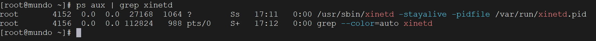
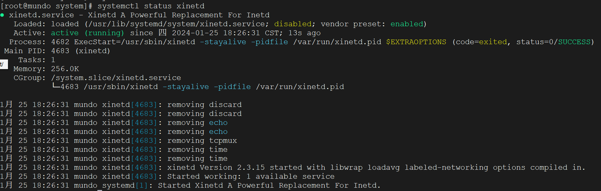
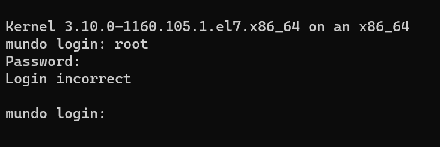
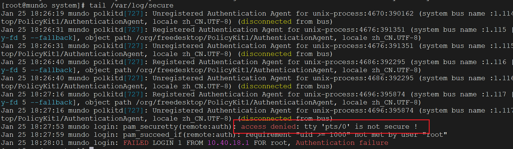
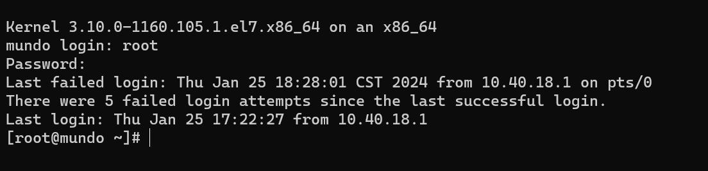

默认情况下，`CentOS 7`系统未安装`Telnet`，因此需要手动安装。首先，检查是否已安装`Telnet`及其依赖项`xinetd`：

```bash
rpm -qa | grep telnet
```

使用下面命令安装`Telnet`的服务端、客户端、`xinetd`：

```bash
yum install -y xinetd
yum install -y telnet
yum install -y telnet-server
```

`xinetd`的全称是`extended Internet services daemon`，它是一个运行在`Unix`系统上的守护进程，负责管理网络服务的启动和停止。在`Telnet`服务的启动过程中，`xinetd`扮演了重要角色。当系统需要提供`Telnet`服务时，`xinetd`会监听指定端口的连接请求，并在有连接时启动`Telnet`服务器以处理这些请求。

简而言之，`xinetd`通过按需启动服务来节省系统资源，并提升系统的安全性与管理灵活性，常用于`Telnet`等网络服务的管理。

`telnet`默认不开启，我们修改下面文件来开启服务：

```bash
vim /etc/xinetd.d/telnet
```

修改文件中`disable = yes`为` disable = no`。

如果显示为“新文件”，说明此文件不存在，我们在文件中添加以下内容：

```
service telnet
{
  flags = REUSE
  socket_type = stream
  wait = no
  user = root
  server =/usr/sbin/in.telnetd
  log_on_failure += USERID
  disable = no
}
```

启动`xinetd`：

```bash
systemctl start xinetd.service
```

安装后使用下面命令查看是否启动：

```
ps aux | grep xinetd
```



或者使用下面命令查看`xinetd`运行状态：

```bash
systemctl status xinetd
```



设置`xinetd`为开机自启动：

```bash
systemctl enable xinetd.service
```

使用`Windows`的`powershell`终端访问`Centos`的`IP`地址：

```bash
telnet 10.40.18.40
```

输入正确的用户名和密码，登录却失败了：



我们查看`Centos`上的安全日志：

```bash
tail /var/log/secure
```



看到了这一行，它说`pts/0`这个`tty`是不安全的，我们给它设置到安全`tty`里。在`/etc/securetty`文件中列出的`TTY`设备：

```
vim /etc/securetty
```

只有通过指定设备登录的用户才能成为`root`用户。这有助于增强系统安全性，限制`root`用户登录的物理位置。只需在文件末尾添加`pts/0`并保存，随后可以使用`PowerShell`再次进行操作：



这样就可以在`Windows`上对`Linux`服务器进行操作了。