> 参考文章：https://blog.csdn.net/u013481793/article/details/128313054

在`Windows`上，我习惯用`Xshell`或者`MobaXterm`来连接远程服务器的终端。不过，这两款软件在`Mac`环境下都没有对应的版本。而虽然`FinalShell`支持`Mac`，但我个人对它的体验不太满意。这里推荐一款更适合`Mac`用户的工具`Royal TSX`。

### `Royal TSX`下载安装

`Royal TSX`的官网下载地址：https://www.royalapps.com/ts/mac/download。

我们点击这个`macOS`版本进行下载即可：

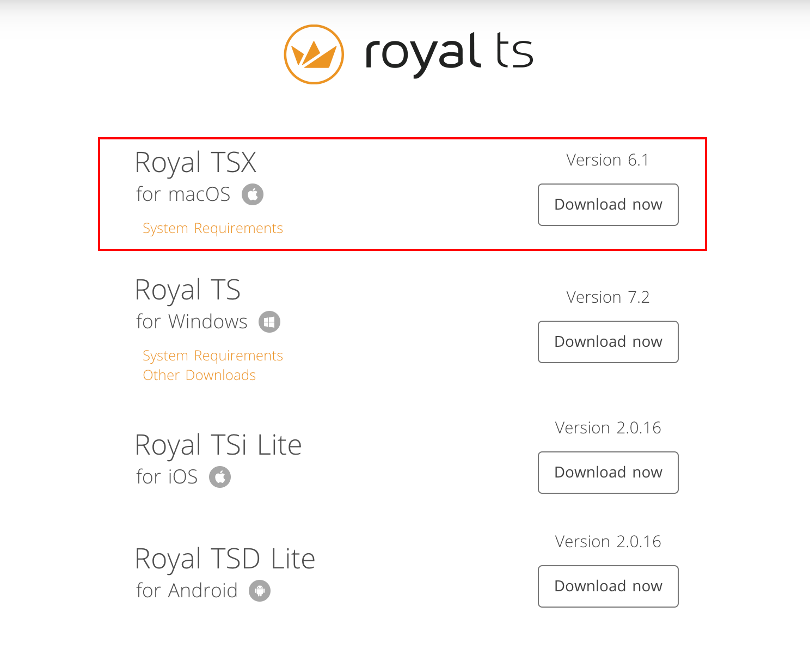

`Royal TSX`可以免费使用，虽然免费版最多支持`10`个连接，但是对一般人来说已经足够使用了。

### 基础插件安装

依次点击菜单栏的`Royal TSX`、`Plugins`选项：

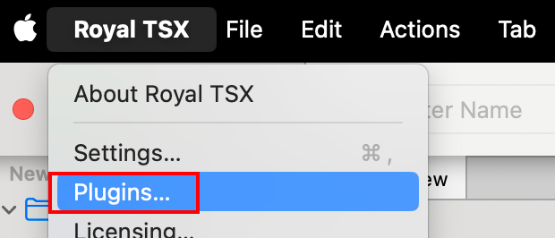

在弹出的窗口中，选择`Avaliable Plugins`，并安装如下所示这两个插件：

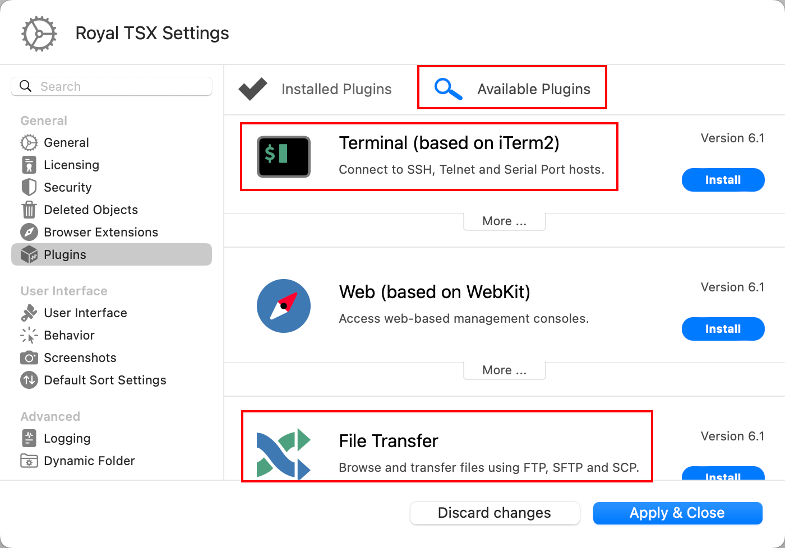

安装完成后点击`Apply & Close`，并重启软件让插件生效。

### 一些基础配置

按照下方的操作路径，打开终端默认设置：

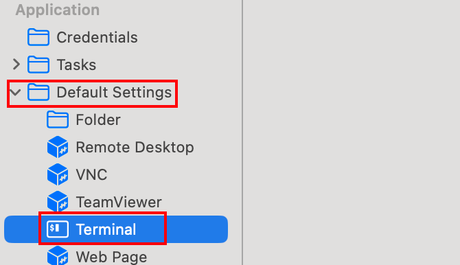

在如下选项页面里，可以设置字体、字体大小、字符间距、行间距等：

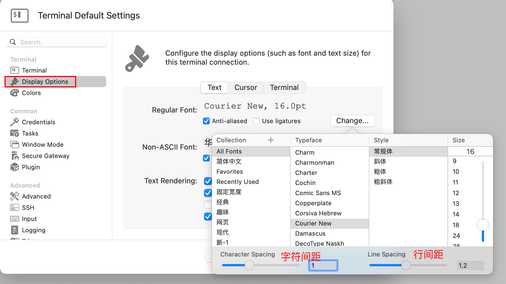

这里建议设置字体为`Courier New`，字号大小为`16`，字符间距为`0.9`，行间距为`1.05`。

在`Terminal`中操作时，还可以使用`[Cmd +]`和`[Cmd -]`快捷键来动态调整字体大小。

在如下选项页面里，可以选择喜欢的主题，也可以自己进行导入：

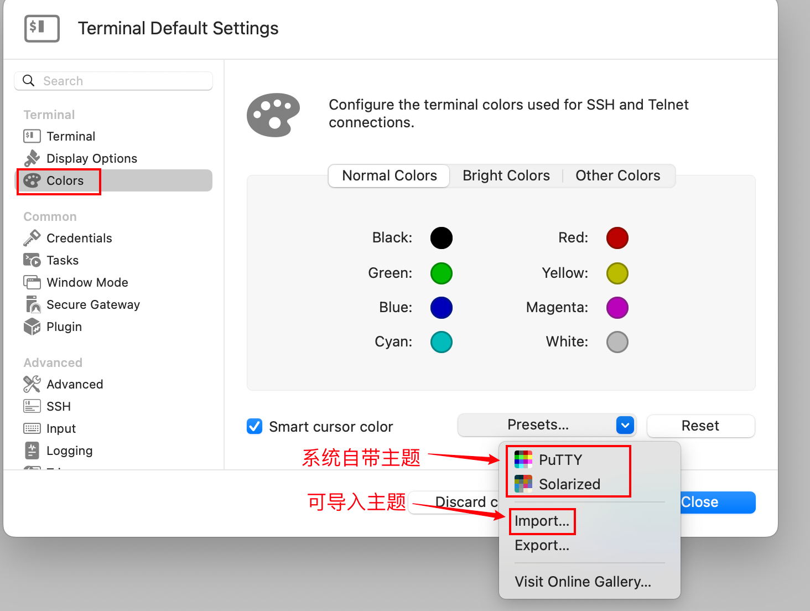

这里建议将`Normal Colors`的白色调整得更白一些（默认的颜色偏灰）：

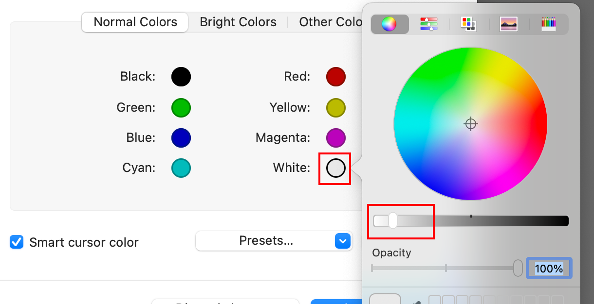

> 在修改页面配置之前已经创建的终端连接不会应用新的配置。若需使调整生效，需要先删除旧终端，再重新创建。

在如下选项页面里，在右侧选中`Session`，进行如下设置，防止自动断开：

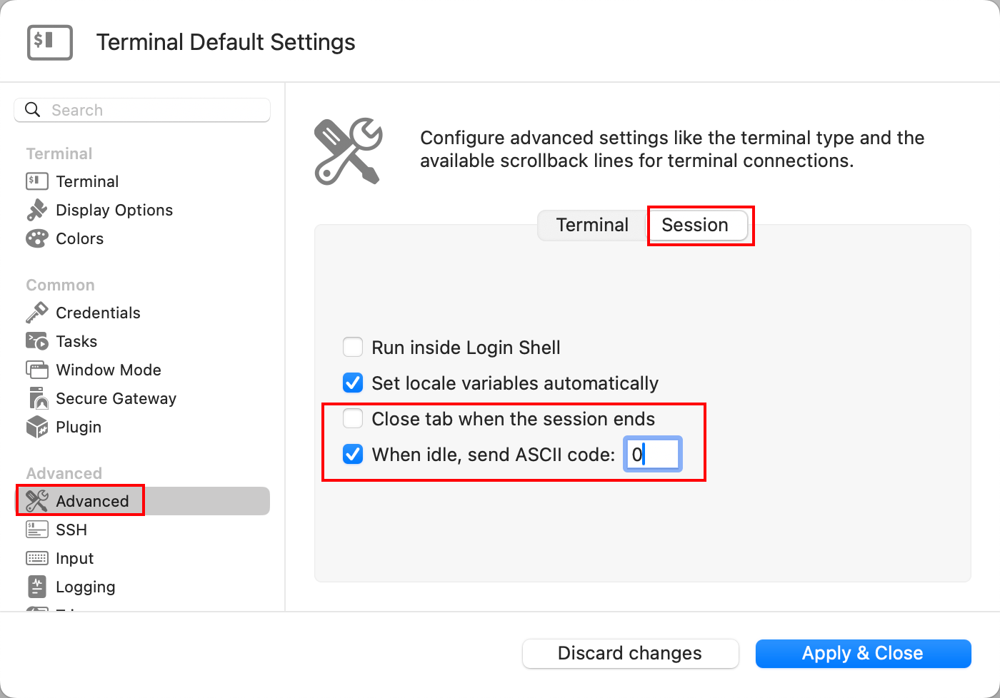

配置`FTP`的默认设置，按照如下所示的操作步骤，选择`SFTP`：

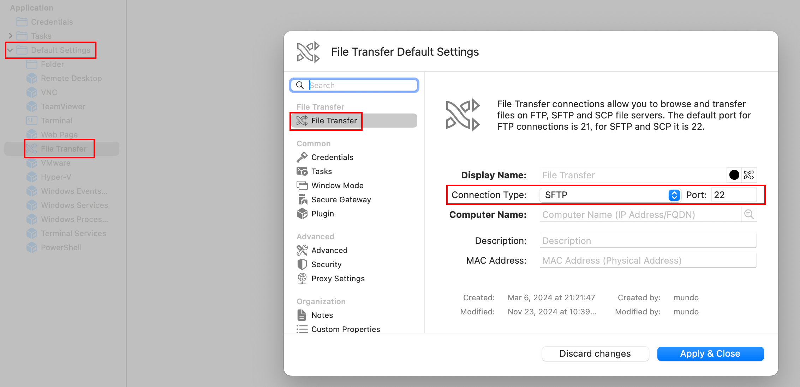

### 创建文档

`Royal TSX`采用`Document`的方式来管理远程主机。刚安装时，软件会自动创建一个默认的`Document`，也就是`Application`。需要注意的是，这个默认的`Document`无法删除，而且也不能在里面直接新建连接：

免费版只可以创建一个`Document`，我们点击`File`，再点击`New Document`：

它就会创建一个名为`New Document`的新文档：

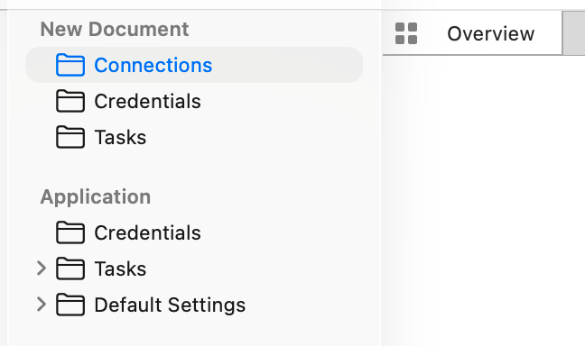

我们右键该文档，选择`Properties`：

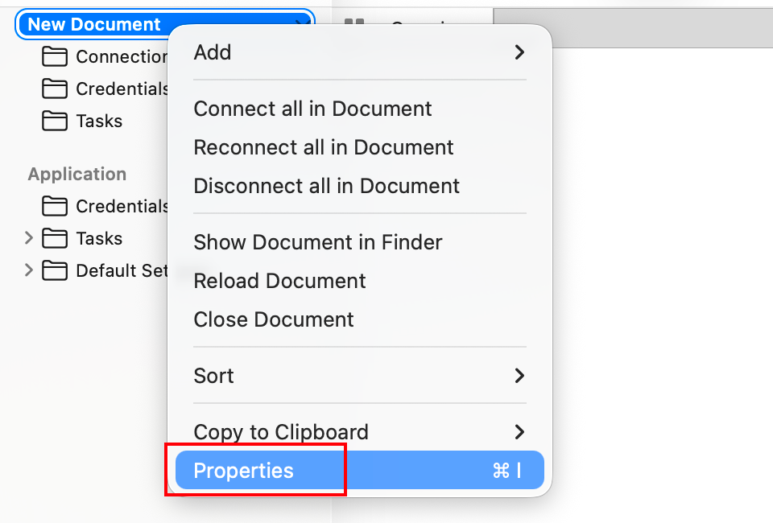

在这里我们可以修改这个文档的名字：

接着使用快捷键`Command + S`，保存该文档：

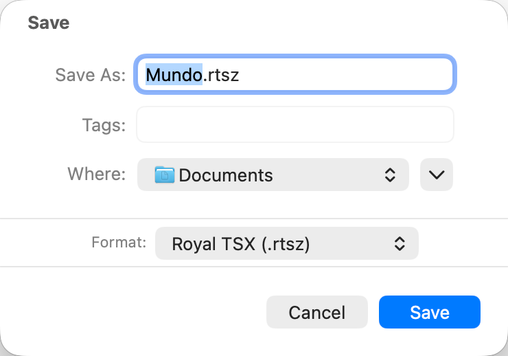

这样一来，就能在当前用户的“文稿”目录中看到该文档，文件后缀为`.rtsz`：

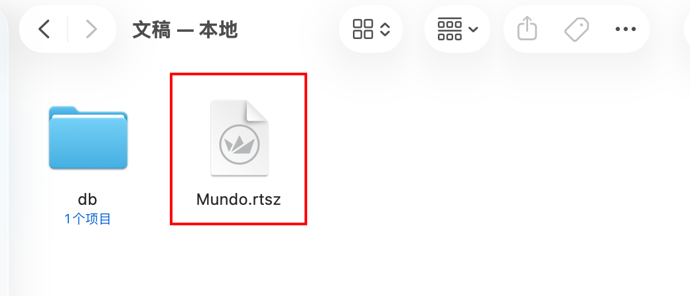

### 创建远程主机凭证

连接远程主机时通常需要输入密码进行安全验证。在`Royal TSX`中，可以创建凭证，把服务器的用户名和密码保存起来。这样，在连接服务器或使用`FTP`操作时，只需关联对应的凭证，就不用每次手动输入密码了，非常方便。

操作路径如下所示：

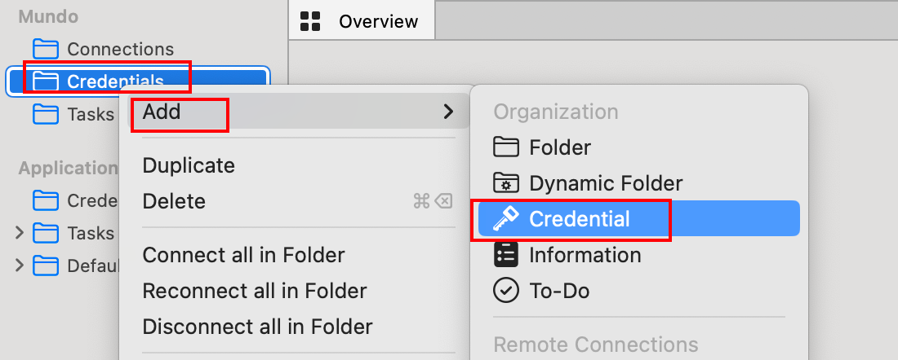

这里的凭证名我使用服务器的公网`IP`，然后输入用户名与密码，保存即可：

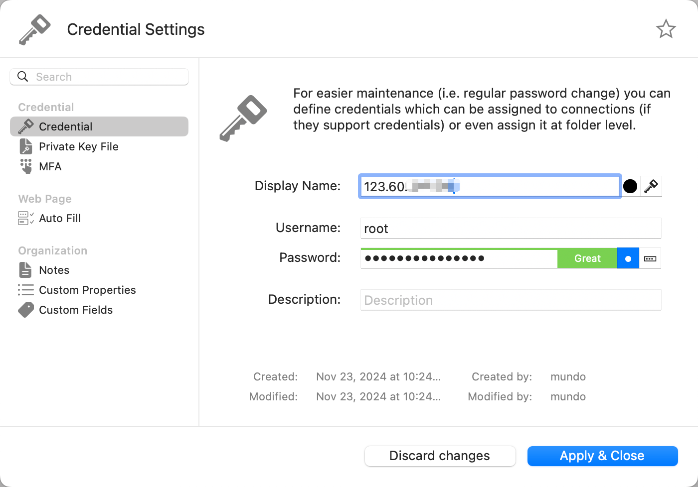

### 创建连接，测试连接

按照如下步骤进行操作，点击`Terminal`：

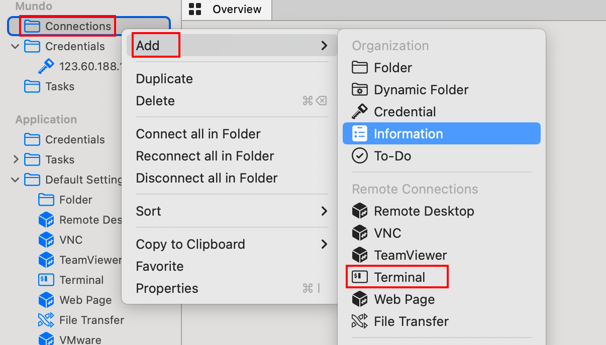

在这里输入要连接的主机的`IP`地址，点击确定：

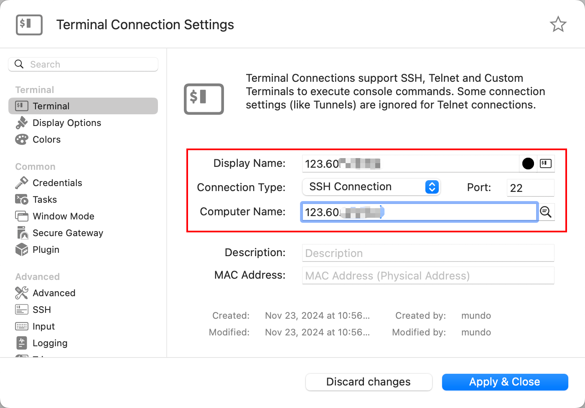

我们把凭证拖动到对应终端连接的上方，表示让该终端打开时使用对应凭证：

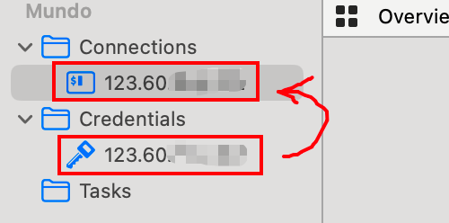

接着双击打开连接。出现下图内容，表示连接已经成功：

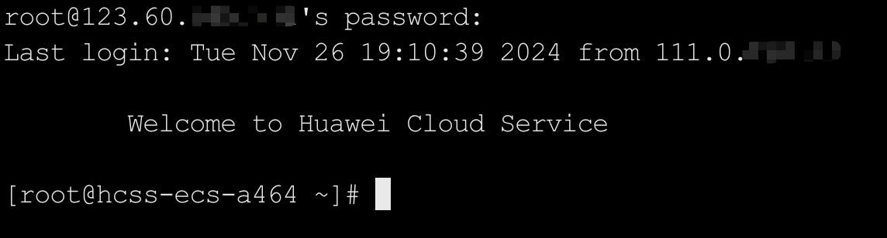

如果想创建`SFTP`的连接，按照如下步骤进行操作，点击`File Transfer`：

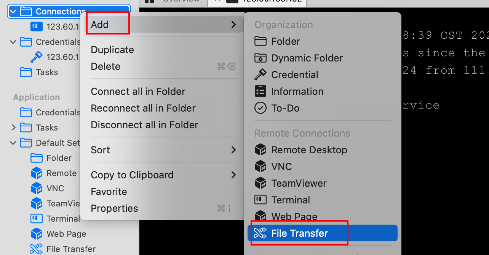

接下来，与连接`Shell`类似，输入目标主机的`IP`地址以建立连接。

创建连接后，将对应凭证拖拽到新创建的`SFTP`会话上以完成认证。接下来双击打开该会话：

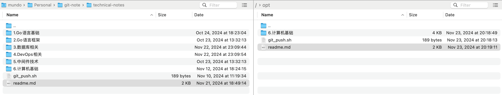

此时，可以直接将文件或目录从左侧拖动到右侧，或从右侧拖动到左侧，实现文件的双向传输。
