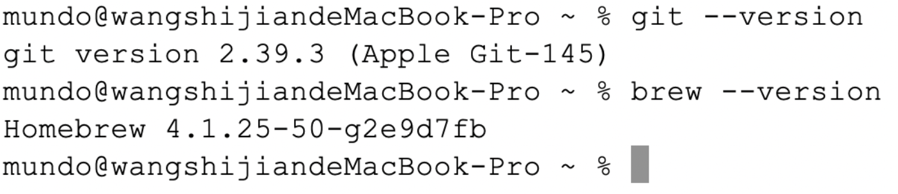
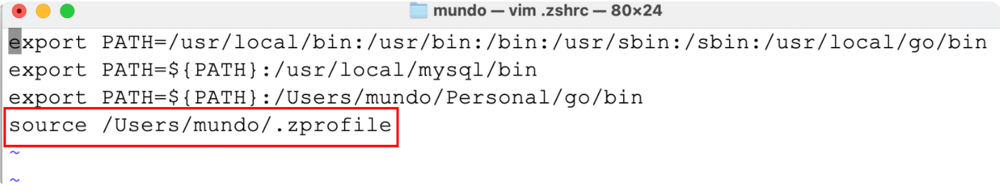
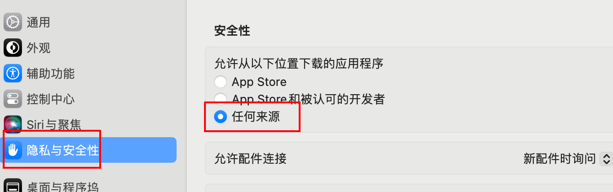

### 1. `Mac`安装`office`软件

`Windows`系统安装教程：https://docs.qq.com/doc/DVm1qZWV0d0pseFF0

`Mac`系统安装教程，及常见问题解决：https://docs.qq.com/doc/DVnJqaFFWVVBOcUp6

### 2. `Mac`安装`Homebrew`与`Git`

> 参考文章：https://blog.csdn.net/ZCC361571217/article/details/127333754

`Homebrew`是`macOS`上的一款包管理工具，旨在简化软件的安装与管理。用户只需通过命令行输入简单的指令，即可自动完成软件下载、编译与配置的全过程。它支持安装数千个常用开发工具与库，是`macOS`开发者日常工作的重要助手。

首先打开`Mac`的终端，输入以下命令，查看本机是否已安装`Homebrew`：

```sh
brew --version
```

如果没有安装`Homebrew`，它会显示`command not found`。

首先，使用`echo $SHELL`命令查看`Mac`的默认`Shell`，一般可能是`/bin/zsh`或`/bin/bash`。以`zsh`为例，使用下面命令：

```sh
/bin/zsh -c "$(curl -fsSL https://gitee.com/cunkai/HomebrewCN/raw/master/Homebrew.sh)"
```

如果本机没有安装`Git`，它会提示你先下载`Git`，按照弹窗指示下载即可。

下载`Git`完成后，再执行一次上面的命令，完成下载。执行下面命令查看版本信息：

```sh
git --version
brew --version
```

查看到的版本信息如下所示：



安装完`Homebrew`后，系统会提示其配置文件被存放在`~/.zprofile`中。但该文件在重启电脑后并不会被自动`source`，这意味着每次重启都需要手动执行一次`source ~/.zprofile`。为了解决这个问题，我们可以编辑`~/.zshrc`文件，将`source ~/.zprofile`的命令添加进去，这样每次打开终端时都会自动加载`Homebrew`的配置。如下所示：



### 3. 安装软件问题解决

当我们在非`App Store`平台安装软件后，首次打开时可能会弹出如下提示窗口：


这种情况并不是安装包本身的问题。打开终端，输入并执行以下代码：

```sh
sudo spctl --master-disable
```

他会让我们输入`Mac`的解锁密码。

下面的命令是上述命令的逆操作，用于将该配置恢复为默认设置：

```sh
sudo spctl --master-enable
```

执行上面代码后，就可以在“系统设置”的“隐私与安全性”中，看到“任何来源”这个按钮被释放了，选择它：



如果还是打不开软件，先在终端输入以下命令：

```sh
sudo xattr -r -d com.apple.quarantine
```

接着，在“应用程序”中找到该软件对应的`.app`文件，拖拽到终端，然后回车执行。

例如执行`Navicat`这个软件的命令是：

```sh
sudo xattr -r -d com.apple.quarantine /Applications/Navicat\ Premium.app
```

这样操作后，一般即可解决问题。
