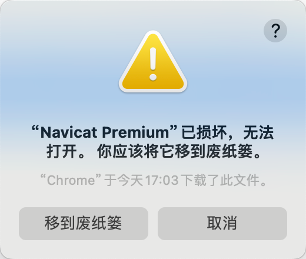

### 1. 安装软件问题解决

当我们在非`App Store`平台安装软件后，首次打开时可能会弹出如下提示窗口：



这种情况并不是安装包本身的问题。打开终端，输入并执行以下代码：

```sh
sudo spctl --master-disable
```

他会让我们输入`Mac`的解锁密码。

下面的命令是上述命令的逆操作，用于将该配置恢复为默认设置：

```sh
sudo spctl --master-enable
```

执行上面代码后，就可以在“系统设置”的“隐私与安全性”中，看到“任何来源”这个按钮被释放了，选择它：


如果还是打不开软件，先在终端输入以下命令：

```sh
sudo xattr -r -d com.apple.quarantine
```

注意命令后要加一个空格。接着，在“应用程序”中找到该软件对应的`.app`文件，拖拽到终端，然后回车执行。

例如执行`Navicat`这个软件的命令是：

```sh
sudo xattr -r -d com.apple.quarantine /Applications/Navicat\ Premium.app
```

这样操作后，一般即可解决问题。如果还未解决，打开“隐私与安全性”，查看是否有系统的阻止信息，点击“仍要打开”即可：


### 2. 关闭远程控制守护进程（`rcd`）

我们有时发现`Mac`一连接蓝牙耳机就会自动打开音乐`App`（`Apple Music`），原因在于`macOS`默认启用了远程控制守护进程`rcd`。该进程会监听耳机按键或蓝牙连接事件，并在触发时自动唤醒音乐`App`。

为解决这个问题，我们在终端输入以下命令：

```sh
launchctl unload -w /System/Library/LaunchAgents/com.apple.rcd.plist
```

该命令的逆命令如下所示：

```sh
launchctl load -w /System/Library/LaunchAgents/com.apple.rcd.plist
```

`2025.12.15`更新：如果上述方法未达效果，可以下载`noTunes`这个`APP`。下载地址：`https://github.com/tombonez/noTunes

下载后将该`APP`移动到“应用程序”中，并打开它：


看到最左边的标识，代表成功。同时我们要把该`APP`设置为开机自启动：


