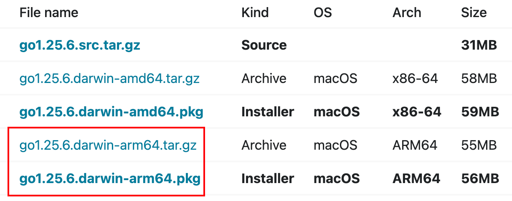

`RPM`全称为`RedHat Package Manager`，由`Red Hat`公司提出，并被众多`Linux`发行版（如`CentOS`）广泛采用。它是一套基于数据库记录的软件包管理机制，用于将所需软件规范化地安装到`Linux`系统中。`RPM`包主要分为两类：二进制`RPM`包和源码`RPM`包。

二进制`RPM`包通常以`.rpm`结尾，内部一般包含已编译完成的可执行文件、库文件、配置文件以及安装和卸载脚本。通过`yum`或`dnf`从官方或第三方仓库安装的软件，均为此类二进制`RPM`包。其安装过程不涉及本地编译，仅执行文件解包及相关脚本，安装速度快、稳定性高、使用便捷，适合绝大多数生产环境。

源码`RPM`包通常以`.src.rpm`结尾，内容通常包括源码压缩包、补丁文件以及`.spec`构建描述文件。源码`RPM`本身不能直接安装为可用软件，需借助`rpmbuild`在本地构建，生成对应架构的二进制`.rpm`后才能安装。

`Linux`中还有一种常见的文件或目录压缩形式`tar.gz`，它本身不包含软件的安装、升级或卸载机制。解压后得到的只是原始文件或目录，是否需要编译、放置到哪个路径以及如何启动，完全由用户自行决定。同时，`tar.gz`不管理依赖关系，也不记录安装状态，升级和卸载需要手动操作，适合定制安装或临时使用，但不适合生产环境的自动化运维。

为了更直观地理解`RPM`与`tar.gz`，可以将这两种文件形式类比为`Windows`和`MacOS`平台上的近似格式进行对照说明：

| 对照对象  | `Windows`       | `macOS`                            |
| --------- | --------------- | ---------------------------------- |
| `.rpm`    | `.msi`安装包    | `.pkg`安装包                       |
| `.tar.gz` | `.zip`/`.rar`等 | `.tar.gz`/`.zip`等、`.dmg`拖拽安装 |

例如我们在官网下载`Go`语言安装包时，可以看到以下两种格式：



`.tar.gz`压缩包本质上属于纯粹的二进制压缩文件，需要通过`tar`命令手动解压至指定目录，并在`~/.zshrc`或`~/.zprofile`中显式配置`$GOROOT/bin`进`PATH`。该方式具备较高的灵活性，适用于在同一台机器上并行安装多个版本的`Go`，或在无管理员权限的受限环境中使用。其卸载流程也较为简洁，直接删除对应安装目录，并移除配置信息即可。

`.pkg`安装包是`macOS`标准的安装程序。只需双击运行，按照图形化界面的提示一路点击下一步即可完成安装。该方式会自动将`Go`安装到`/usr/local/go`目录下，并通常会自动配置好`PATH`环境变量。整体过程简单快捷，无需操作命令行即可完成环境搭建。使用该方式安装时，新版本会默认覆盖此前通过`.pkg`方式安装的旧版本，因此无需手动卸载旧版本即可完成升级。

`RPM`通过本地数据库记录软件包的元信息，包括名称、版本、依赖关系、文件列表以及安装脚本等，以保证软件的完整性和可追踪性。软件的安装、升级与卸载过程均依赖该数据库，用于判断文件状态以及处理依赖关系。`RPM`本地数据库的位置在：

```sh
/var/lib/rpm
```

待办