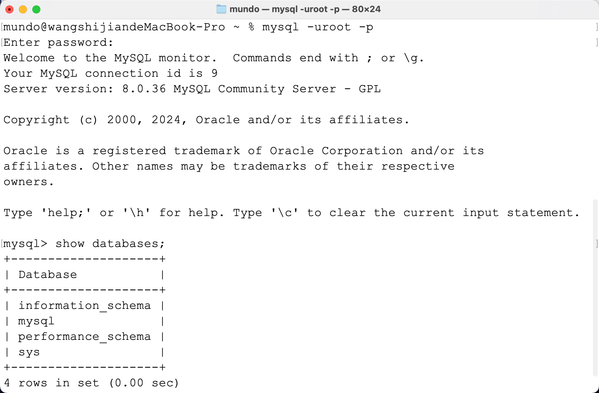

### 一、`Mac`安装`MySQL`

首先先去`MySQL`官网下载`MySQL`的安装包，地址：https://dev.mysql.com/downloads/mysql/。

点击`Archives`：


按照图示进行下拉框选择，这里我们下载`.dmg`结尾的文件：


点击下载时，系统会提示输入`root`密码。请注意，不能使用简单密码如`123456`，设置一个复杂且安全的密码即可。

然后在`Mac`系统设置的最下面，就能看到`MySQL`了：


我们尝试使用终端连接`MySQL`：

```sh
mysql -uroot -p
```

显示`mysql`命令未找到：


这是因为`mysql`命令未配置到环境变量中，需要进行环境变量的配置。

首先，使用`echo $SHELL`命令查看`Mac`的默认`Shell`，可能是`/bin/zsh`或`/bin/bash`。如果是`zsh`，在`~`目录下查找`.zshrc`文件。如果未找到该文件，可能为`.zprofile`或`.zsh_profile`。

只要前面安装`MySQL`的步骤没有更改安装路径，就只需在`.zshrc`文件里加上这一行：

```sh
export PATH=$PATH:/usr/local/mysql/bin
```

如果文件里没有`PATH`，我们在文件开头手动添加下面这一行：

```sh
export PATH=/usr/local/bin:/usr/bin:/bin:/usr/sbin:/sbin
```

然后使用`source ~/.zshrc`立即重启一下这个配置文件，再在终端登录一下`MySQL`：



显示出如上结果就安装成功了，可以使用`Navicat`等软件连接一下。

虽然在上面的安装过程中无法设置简单的密码，但可以在安装完成后，通过以下`SQL`语句修改为任意的密码：

```sql
ALTER USER 'root'@'localhost' IDENTIFIED BY 'new_password';
FLUSH PRIVILEGES;
```

这里我将密码更改成：`123456`。

### 二、`Mac`安装`Redis`

我们使用`Homebrew`来在本机安装`Redis`。执行下面命令，安装最新版的`Redis`：

```sh
brew install redis
```

安装好后，执行下面命令，启动`Redis`服务：

```sh
brew services start redis
```

执行命令后，`Redis`会被设置为开机自启动。如果想停止`Redis`服务，可以执行下面命令：

```sh
brew services stop redis
```

`Redis`安装完成后，其配置文件`redis.conf`会被放置在`/opt/homebrew/etc`目录下。我们编辑配置文件，找到这一行：

```sh
# requirepass foobared
```

将其注释打开，并将`foobared`改为想设置的密码。设置完成后要重启`Redis`服务。

安装完成后，可以在终端使用下面命令，默认会连接到`127.0.0.1`的`6379`端口，也就是本地`Redis`服务：

```sh
redis-cli -a 123456
```

或者也可以使用下面的命令，指定`IP`+端口，显式连接本地`Redis`服务：

```sh
redis-cli -h 127.0.0.1 -p 6379 -a 123456
```

登录后，终端提示符变为以下格式，即代表连接成功：


可以通过`-n`参数指定要连接的数据库，例如执行`redis-cli -h 127.0.0.1 -p 6379 -n 1`表示使用`1`号数据库；如果未指定`-n`参数，则默认使用`0`号数据库。

连接成功后，输入`ping`命令测试通信，返回`PONG`则说明服务连接正常：


如果不想在连接`Redis`服务的时候就输入密码，也可以不添加`-a 123456`，登录到`Redis`的终端后，输入`auth 123456`：


除了命令行连接外，也可以使用客户端，在`Mac`中，推荐使用`Medis`来访问`Redis`服务。