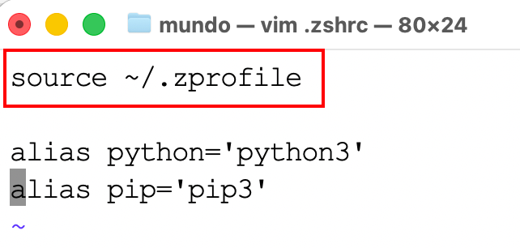
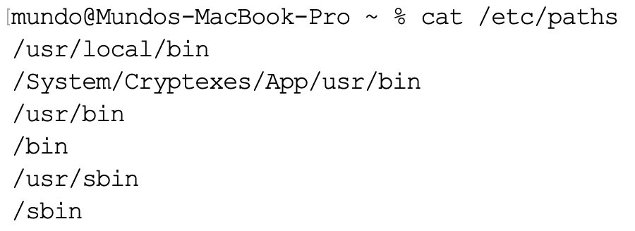

### 1. `Mac`安装`office`软件

`Windows`系统安装教程：https://docs.qq.com/doc/DVm1qZWV0d0pseFF0

`Mac`系统安装教程，及常见问题解决：https://docs.qq.com/doc/DVnJqaFFWVVBOcUp6

### 2. `Mac`安装`Homebrew`与`Git`

> 参考文章：https://blog.csdn.net/ZCC361571217/article/details/127333754

`Homebrew`是`macOS`上的一款包管理工具，旨在简化软件的安装与管理。用户只需通过命令行输入简单的指令，即可自动完成软件下载、编译与配置的全过程。它支持安装数千个常用开发工具与库，是`macOS`开发者日常工作的重要助手。

首先打开`Mac`的终端，输入以下命令，查看本机是否已安装`Homebrew`：

```sh
brew --version
```

如果没有安装`Homebrew`，它会显示`command not found`。

我们使用`echo $SHELL`命令查看`Mac`的默认`Shell`，一般可能是`/bin/zsh`或`/bin/bash`。以`zsh`为例，使用下面命令：

```sh
/bin/zsh -c "$(curl -fsSL https://gitee.com/cunkai/HomebrewCN/raw/master/Homebrew.sh)"
```

如果本机没有安装`Git`，它会提示你先下载`Git`，按照弹窗指示下载即可。这一步耗时较长，耐心等待。

下载`Git`完成后，再执行一次上面的命令，完成下载。执行下面命令查看版本信息：

```sh
git --version
brew --version
```

查看到的版本信息如下所示：


安装完`Homebrew`后，系统会提示其配置文件被存放在`~/.zprofile`中。但该文件在重启电脑后并不会被自动`source`，这意味着每次重启都需要手动执行一次`source ~/.zprofile`。为了解决这个问题，我们可以编辑`~/.zshrc`文件，将`source ~/.zprofile`的命令添加进去，这样每次打开终端时都会自动加载`Homebrew`的配置。如下所示：



如果执行`brew --version`时显示`zsh: command not found: brew`，我们在`.zshrc`或`.zprofile`文件里加上这一行：

```sh
export PATH=$PATH:/opt/homebrew/bin
```

我们会发现配置文件中不会显式定义`PATH`，原因在于`PATH`在系统级配置加载阶段就已经完成初始化。在加载链路中，`path_helper`会读取`/etc/paths`以及`/etc/paths.d/*`中的配置内容，并将合并后的结果注入到登录`Shell`的环境变量中。随后，`Shell`再按既定顺序执行各类用户级配置文件，例如`.zprofile`、`.zshrc`等。

我们查看到`/etc/paths`文件内容如下所示：



`path_helper`会逐行读取`/etc/paths`文件内容，忽略其中的空行与注释行，并按照读取顺序构建`PATH`的基础路径列表。

我们查看到`/etc/paths.d`目录下的内容如下所示：


在该目录中，每个文件通常对应一个软件包。`path_helper`会按照文件名的字典序依次读取`/etc/paths.d/*`目录下的所有文件，并将每个文件中的内容解析为路径项，按顺序追加到`PATH`中，同时在处理过程中自动完成去重。

这正是在`.zshrc`或`.zprofile`文件中即使没有显式定义`PATH`，仍然可以在文件内通过`$PATH`对其进行引用的原因。

> 在`Linux`或`Unix`类系统中，当通过命令名直接执行程序时，如果存在两个同名的可执行文件，且它们分别位于不同的`bin`目录，并且这些目录都已加入`PATH`环境变量，那么系统会按照`PATH`中目录的先后顺序依次查找。当在某个目录中首次找到与命令名匹配且具有可执行权限的文件时，查找过程立即结束，系统最终执行的就是该目录中的可执行文件。
