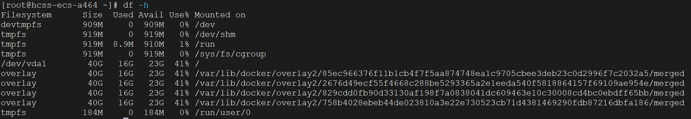
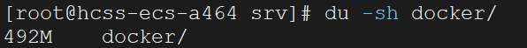
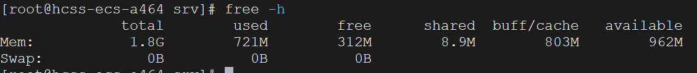

在`Linux`系统运维与开发中，实时监控系统资源和状态是确保性能、排查问题的重要技能。通过监控磁盘、内存、`CPU`、网络等核心指标，可以快速定位瓶颈并采取优化措施。`Linux`提供了一系列强大的命令行工具，帮助用户直观地了解系统运行状况。

#### 1. 磁盘监控

`df`（`Disk Free`）命令用于查看磁盘的总空间和使用情况。常用的命令格式如下：

```sh
df -h
```

其中`-h`是`human-readable`的缩写，用于将数据以更易于人类阅读的形式显示（例如以`GB`或`MB`为单位）。该命令的输出通常包括以下信息：文件系统名称、总大小、已用空间、可用空间、使用率以及挂载点。以下是一个示例输出：



通常，我们需要关注主分区`/dev/vda1`，这是系统的根分区（挂载在`/`）。在上面示例中，该分区的总大小为`40G`，已使用`16G`，剩余`23G`，使用率为`41%`。它是操作系统和主要数据存储的关键位置。

`du`（`Disk Usage`）命令用于查看目录或文件占用的空间。常用的命令格式如下：

```sh
du -sh /path/to/dir
```

`-s`选项用于显示总计。如果未使用该选项，命令会列出目录下所有子目录和文件的空间占用；而加上该选项后，仅显示最外层目录的空间占用。`-h`选项作用和上文相同。以下是一个示例输出：



#### 2. 内存监控

`free`命令用于查看系统内存的使用情况，包括空闲、已用和缓冲区。常用的命令格式如下：

```sh
free -h
```

以下是一个示例输出：



这段输出显示了系统内存（`RAM`）和交换空间（`Swap`）的使用情况。在上述示例中，系统的总内存（`total`）为`1.8G`，其中实际使用的内存（`used`）为`721M`。剩余内存中，未使用（`free`）的为`312M`，可用内存（`available`）为`962M`（包含可动态释放的缓存和缓冲区内存）。系统的缓存和缓冲（`buff/cache`）占用`803M`，表明内存管理正常，操作系统正在利用空闲内存优化性能。由于系统未配置交换空间（`Swap`），内存不足时可能会导致进程被杀死（`OOM`，`Out of Memory`）。

总内存计算公式如下所示：

```scss
total = used + free + buff/cache
1.8G ≈ 721M + 312M + 803M
```

`available`是系统动态计算的值，表示可供新程序使用的剩余内存。它包含`free`内存以及可从`buff/cache`中释放的部分内存：

```scss
available ≈ free + (可释放的buff/cache)
962M ≈ 312M + (buff/cache的一部分被释放，约650M)
```

这里的计算不精确，因为`available`由内核估算，具体算法会考虑某些不可立即释放的缓存数据。

我们也可以使用下面命令，查看详细的内存信息：

```sh
cat /proc/meminfo
```

#### 3. `CPU`监控

`top`命令用于动态显示进程和系统资源的实时使用情况。它会展示一个实时更新的交互式命令行界面，用户可以通过按`Ctrl + C`来退出该界面。我们可以使用下面快捷键对展示结果进行排序：

- `Shift + P`：按`CPU`使用率排序。

- `Shift + M`：按内存使用量排序。

可以使用`htop`命令，它提供一个更加美观且支持交互操作的界面。对于`CentOS 7`及以上版本，通过`yum`进行安装：

```sh
sudo yum install htop
```

安装后就可以直接使用`htop`命令进入交互页面了。

我们还可以安装`sysstat`包用来对`Linux`进行性能监控。使用以下命令安装：

```sh
sudo yum install sysstat
```

安装后，使用下面命令来启用`sysstat`服务：

```
sudo systemctl enable sysstat
sudo systemctl start sysstat
```

使用下面命令实时监控所有`CPU`的使用率：

```sh
mpstat -P ALL 1 5
```

`-P ALL`表示监控所有`CPU`，包括每个逻辑处理器的使用情况。比如，`-P 0`表示仅监控第一个`CPU`的使用情况。如果省略`-P`参数，`mpstat`默认只显示整体`CPU`使用率的汇总结果（标记为`all`）。命令末尾的数字`1`和`5`表示每秒刷新一次，共刷新五次。

也可以使用下面的命令报告`CPU`的使用：

```sh
sar -u 1 5
```

该命令的`-u`参数是`CPU utilization`的缩写，后面的数字同理，表示每秒刷新一次，共刷新五次。

我们也可以使用下面命令，查看详细的`CPU`信息：

```sh
cat /proc/cpuinfo
```

