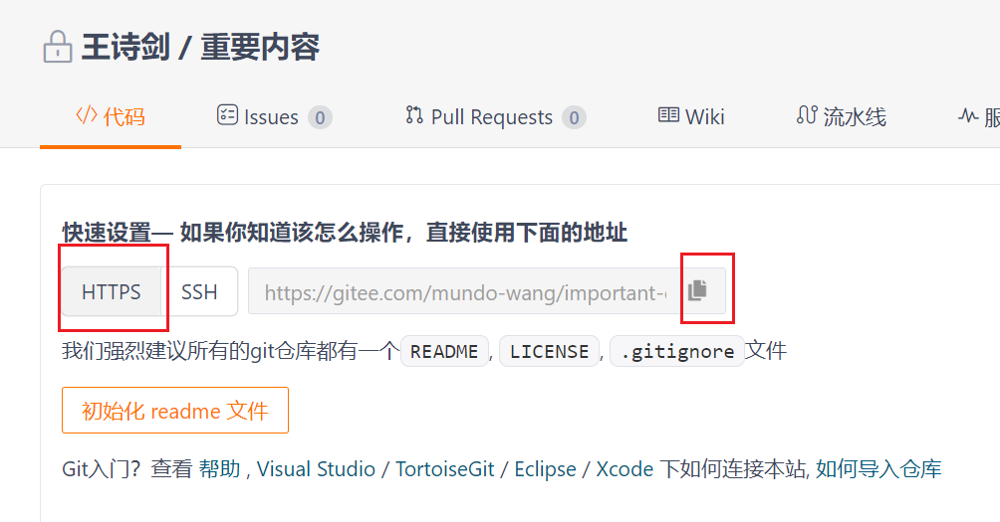

首先，使用`git status`检查当前目录是否被`Git`管理。如果返回结果为：

```sh
fatal: not a git repository (or any of the parent directories): .git
```

说明目录尚未被`Git`管理。此时，可以执行以下命令：

```sh
git init
git add .
git commit -m "init"
```

这三步将创建一个本地的`Git`仓库。在执行`commit`命令后，仓库将有一个默认的`master`分支（需要保证有文件被提交），但未关联任何远程仓库。如果只需在本地使用`Git`管理该目录，操作到这里即可，如果需要关联远程仓库，继续以下步骤。

以`Gitee`为例，首先建立一个仓库：


如果是要存一些敏感信息，记得这里要选择私有。

然后使用下面命令把本地和远程仓库进行关联，这里的关联地址自行去页面复制：



命令如下所示：

```sh
git remote add origin https://gitee.com/mundo-wang/important-content.git
```

这一步也许需要输入密码，输入`Gitee`账号的密码即可。

我们使用以下命令，把本地默认的`master`分支推送到远程仓库：

```shell
git push -u origin master
```

这一条命令会将远程分支与本地分支关联，只需操作一次，后续直接使用`git push`即可。

执行完毕后，检查`Gitee`内容，看看是否已成功推送并关联：


