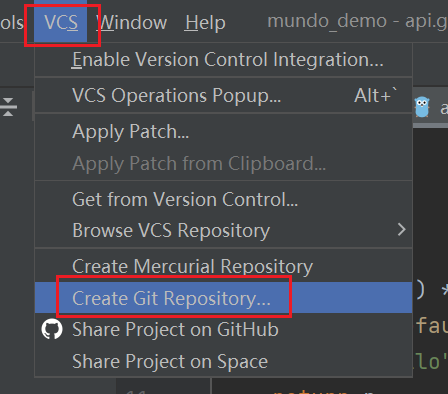
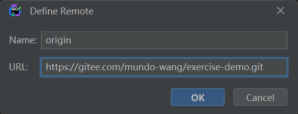
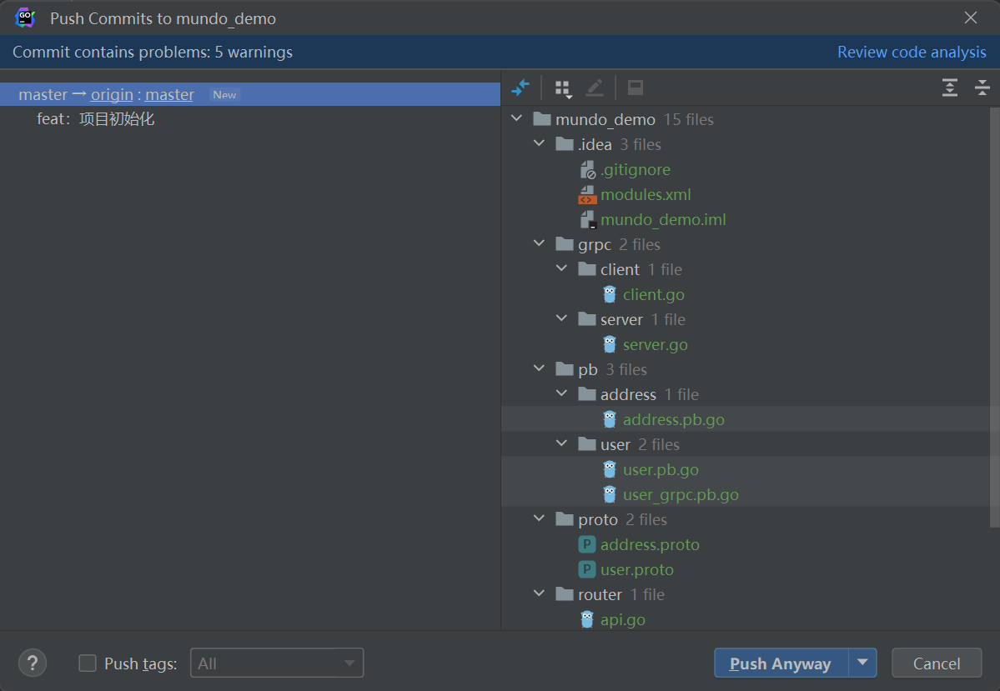

首先还是在`Gitee`上新建一个仓库，具体步骤参考上节的内容。

打开`GoLand`，选择`VCS`下面的`Create Git Repository`选项，创建本地`Git`仓库：

选择需要创建本地`Git`仓库的项目目录：

本地创建完`Git`仓库后，上方的`VCS`会变成`Git`，选择下面选项，设置该项目的远程仓库关联：

把`Gitee`仓库的推送地址复制过来粘贴进去即可：

将本地原有的文件提交到本地`Git`仓库，完成初始化设置：

把刚才的提交`push`到远程：

这一步可能会让你输密码，输入`Gitee`的密码即可。

推送成功，去`Gitee`查看一下是否已推送并关联：

