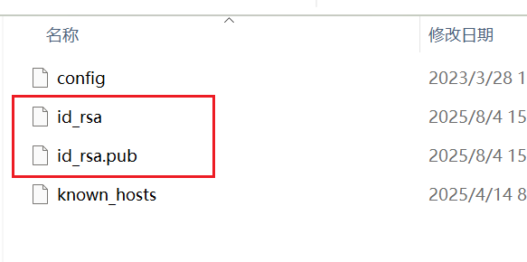
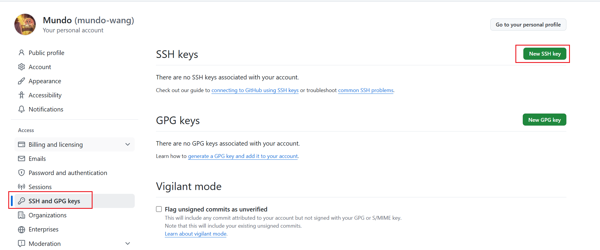

### 一、下载和克隆代码仓库

首先，确保你已经安装并配置好`Git`。接下来，根据你的需求，可以选择使用命令行或`IDE`进行代码仓库的克隆操作。

#### 1. 使用命令行

打开终端，定位到你希望存放代码的目录，执行`git clone`命令，将指定的代码仓库克隆到本地：

```sh
git clone https://github.com/mundo-wang/technical-notes.git
```

如果是首次通过该平台拉取代码，系统会提示输入用户名和密码（或`Personal Access Token`）进行身份认证。

这将在当前目录下创建一个与远程代码库同名的文件夹（例如`technical-notes`），并将所有代码存储在该文件夹中。

#### 2. 使用`GoLand`

打开`Goland`，在顶部菜单栏，选择`VCS`，接着选择`Get from Version Control`：


在弹出的窗口中，粘贴代码仓库地址，选择合适的本地路径，点击`Clone`按钮，完成代码克隆：


同样地，如果是首次通过该平台拉取代码，系统会提示输入用户名和密码（或`Personal Access Token`）进行身份认证。

### 二、配置`SSH`密钥进行代码拉取

上文中提到的`Git`拉取代码方式是通过`HTTPS`，这种方式只需输入用户名和密码，配置简单便捷。除此之外，还可以使用`SSH`方式拉取代码。`SSH`方式基于密钥对认证（公钥和私钥），配置完成后无需每次输入密码即可操作，安全性相较于`HTTPS`更高。

#### 1. 公钥

- 用于加密数据，只有对应的私钥才能解密。
- 公钥需要放到代码托管平台（例如`GitHub`、`GitLab`）上。

#### 2. 私钥

- 用于生成签名，只有对应的公钥才能验证签名。
- 私钥需要妥善保存在本机，不可泄露给他人。

`SSH`密钥对中的公钥和私钥是在本地生成的，我们可以使用`SSH`密钥生成工具（如`ssh-keygen`）来生成一对`SSH`密钥。一台机器理论上可以生成任意多个`SSH`密钥对，每个密钥对都是一组独立的公钥和私钥文件，通常会以不同文件名保存。

我们进入`Git Bash`，运行以下命令：

```sh
ssh-keygen -t rsa -b 4096 -C "userwsj@126.com"
```

该命令的`-C`参数用于设置一段备注，它会在`id_rsa.pub`文件末尾显示，方便区分不同机器或用户的密钥。

这里我们指定密钥的类型为`RSA`算法，指定密钥的长度为`4096`位，并使用邮箱为生成的公钥添加一个注释。

运行命令后，程序会提示你输入保存`SSH`密钥对的位置（默认在`~/.ssh/`目录下，系统隐藏目录）以及设置`passphrase`（密码短语），用于为私钥文件增加额外的保护。这里我们选择使用默认目录，并且不设置密码短语，也就是连按`3`次回车。

命令的运行结果如下所示：


运行后，就可以在`~/.ssh/`目录下看到生成的`SSH`密钥对的文件，其中`id_rsa`为私钥，`id_rsa.pub`为公钥：



我们打开`id_rsa.pub`文件，完整复制内容，打开`GitHub`，进入设置，选择`New SSH Key`：



粘贴前面复制的公钥内容，创建`SSH Key`：


使用以下命令，确认`SSH`代理已启动：

```sh
eval "$(ssh-agent -s)"
```

接着将私钥添加到`SSH`代理：

```sh
ssh-add ~/.ssh/id_rsa
```

使用以下命令，测试`SSH`密钥对在`GitHub`上是否配置成功：

```sh
ssh -T git@github.com
```

运行命令结果如下所示：


第一次通过`SSH`连接到`github.com`时，`SSH`客户端会发出安全提示，内容是：

```sh
The authenticity of host 'github.com (20.205.243.166)' can't be established.
ECDSA key fingerprint is SHA256:...
Are you sure you want to continue connecting (yes/no/[fingerprint])?
```

系统提示你是否信任这个主机，如果信任，就输入`yes`继续。输完后这个指纹信息会被保存在你的`~/.ssh/known_hosts`文件中，下一次连接时就不会再次提示。输入`yes`后出现提示：

```sh
Warning: Permanently added 'github.com,20.205.243.166' (ECDSA) to the list of known hosts.
```

这表示已经信任并记录了`GitHub`的主机指纹，之后连接将不再重复提示。