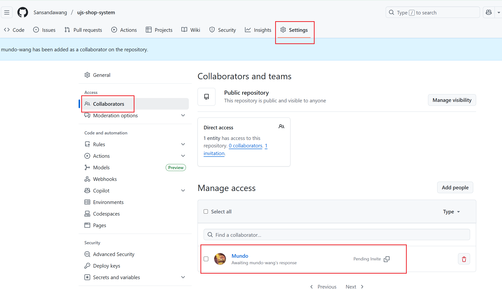
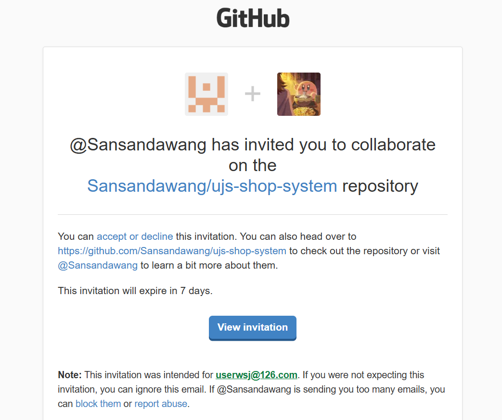
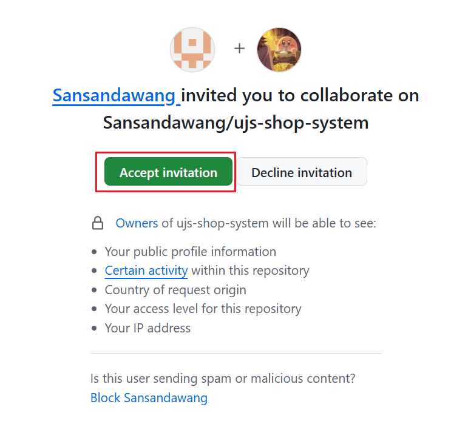
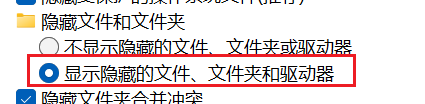
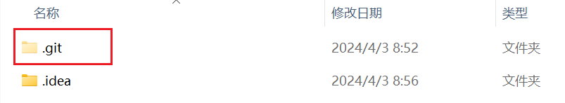
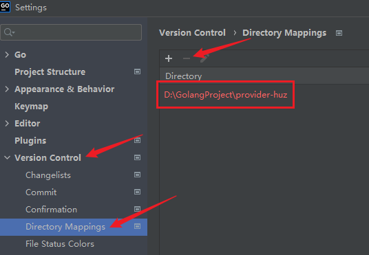

### 一、远程仓库修改

在使用`Git`拉取了他人远程分支的代码后，如果想要移除与该远程分支的关联并切换到自己的远程分支，可以在`Goland`的终端中，切换到项目根目录，并按照以下步骤操作：

#### 1. 查看当前远程仓库

```bash
git remote -v
```

如果展示出如下所示的结果，证明该项目并没有被`Git`管理：

```sh
fatal: not a git repository (or any of the parent directories): .git
```

正常查询出来的结果如下所示：

```
origin  https://gitee.com/mundo-wang/example.git (fetch)
origin  https://gitee.com/mundo-wang/example.git (push)
```

#### 2. 移除远程仓库

```bash
git remote remove origin
```

#### 3. 检验远程仓库是否已被移除

```sh
git remote -v
```

#### 4. 连接自己的远程仓库

首先要创建一个代码仓库，复制代码仓库的地址，操作下面命令进行关联：

```bash
git remote add origin https://gitee.com/mundo-wang/new-repo.git
```

推送代码到新的远程仓库：

```bash
git push -u origin master
```

这里推送的分支名需要通过`git branch`命令具体查看，在某些平台上可能是`main`。

需要注意的是，当向同一`Git`远程托管平台下、但归属于不同账号的仓库推送代码时，会因为权限不足而返回`403`。此时，需要由仓库所有者将当前本地用于认证的账号添加为该仓库的协作者：



然后，登录当前本地认证账号所绑定的邮箱，即可查看到这样一条邮件：



在点进去的界面里，我们点击`Accept invitation`：



> **注意：**完成上述操作后，仍需移除本地旧的`HTTPS`凭据，并重新进行凭据认证，才能正常推送代码。从工程实践角度看，若存在多账号协作同一仓库的场景，应使用`SSH`方式代替`HTTPS`，因为后者不存在凭据缓存错乱或权限生效延迟问题。
>
> 

### 二、移除`Git`管理

如果移除远程仓库后，我们想让这个项目不受`Git`管理，不连接到任何仓库，需要按照以下步骤操作。

首先在`Windows`环境，把“显示隐藏的文件夹”打开：



在项目根目录下出现了一个叫`.git`的文件夹，把它删除掉：




在`Mac`环境，可以使用`Command + Shift + .`快捷键切换隐藏文件和文件夹的可见性，然后删除`.git`文件夹。

也可以直接在终端中在项目根目录下操作如下命令：

```sh
rm -rf .git
```

`.git`文件夹存储了`Git`仓库的所有数据和元数据，通常位于项目根目录下，是一个隐藏目录。

删除`.git`文件夹后，打开编辑器（如`Goland`），按照以下步骤操作，移除远程`Mapping`：



这样操作完，这个目录的`Git`才是被彻底移除了。操作完后别忘了关闭“显示隐藏文件夹”。