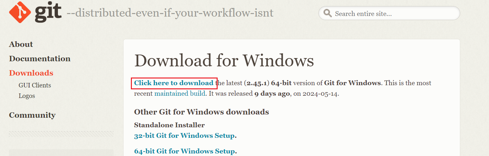
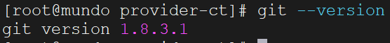
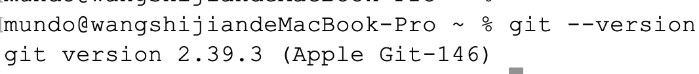

### 1. `Windows`安装`Git`环境

下载网址：https://git-scm.com/download/win

页面中点击下面这个地方，开始下载`Windows`环境的`Git`最新安装包：



下载的安装包名字例如`Git-2.45.1-64-bit.exe`，双击即可进行安装，然后使用`git --version`查看`Git`版本。


### 2. `Linux`（`Centos`）安装`Git`环境

我们使用`yum`命令来安装依赖的包，在终端执行以下命令：

```sh
sudo yum install -y git
```

安装完成后，使用`git --version`显示已安装的`Git`版本：



### 3. `Mac`安装`Git`环境

我们可以使用`homebrew`来安装`Git`，在终端执行以下命令（需要保证`Mac`上有`homebrew`环境）：

```sh
brew install git
```

安装完成后，使用`git --version`显示已安装的`Git`版本：



### 4. 设置`Git`用户信息

无论在什么环境、使用什么方法安装`Git`，都需要设置用户信息，因为每次提交代码时，`Git`会使用这些信息标识提交者。

可以全局设置用户信息，也可以为单个仓库设置用户信息。全局设置用户信息的指令如下：

```sh
git config --global user.name "Your Name"
git config --global user.email "your_email@example.com"
```

若只想为特定的仓库设置用户信息，可以在该仓库的目录下运行以下命令（单个仓库设置会覆盖全局设置，仅在该仓库内生效）：

```sh
git config user.name "Your Name"
git config user.email "your_email@example.com"
```

可以使用以下命令查看当前的`Git`配置信息：

```sh
git config --list
```

或者查看某个具体的配置项：

```sh
git config user.name
git config user.email
```

### 5. 配置`CRLF`和`LF`相关内容

我们还需要注意`CRLF`（`Carriage Return` + `Line Feed`）和`LF`（`Line Feed`）的差异：

- `CRLF`（`\r\n`）：这是`Windows`系统中使用的换行符，包含了回车符（`\r`）和换行符（`\n`）。
- `LF`（`\n`）：这是`Unix`和`Linux`系统中使用的换行符，只包含换行符（`\n`）。

这种差异可能导致跨平台开发中的格式不一致。为避免这个问题，可以在`Git`中进行如下配置：

```sh
git config --global core.autocrlf true  # Windows 上建议使用
git config --global core.autocrlf input # Unix/Linux 上建议使用
```

- `true`：当拉取代码时将`LF`转换为`CRLF`，提交代码时将`CRLF`转换为`LF`。

- `input`：当提交代码时将`CRLF`转换为`LF`，拉取代码时不做转换。
- `false`：`Git`不会处理换行符，文件将保持原样，这是默认的设置。

我发现在`Windows`上使用`Goland`等编辑器，它默认的换行符为`LF`了，也就是说不需要执行上面的命令进行转换了。