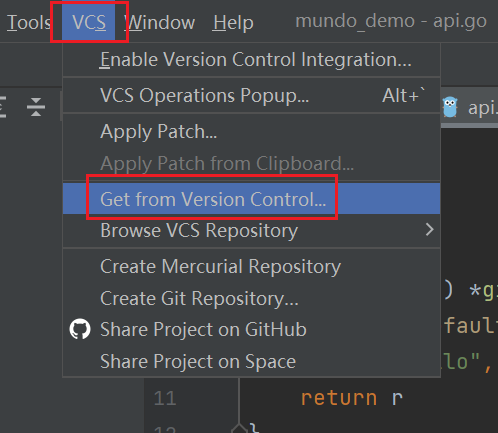
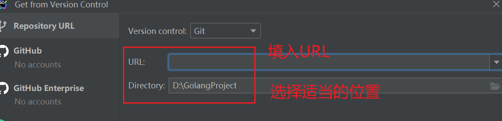

### 下载和克隆代码仓库

首先，确保你已经安装并配置好`Git`。接下来，根据你的需求，你可以选择使用命令行或IDE进行代码仓库的克隆操作。

#### 1. 使用命令行

打开终端，导航到你希望存放代码的目录。执行以下命令，将代码仓库克隆到本地：

```sh
git clone https://gitlab.com/my-repo.git
```

这会在当前目录下生成一个与远程代码库同名的文件夹，所有代码将存放在这个文件夹内。

#### 2. 使用`GoLand`

打开`Goland`，在顶部菜单栏，选择`VCS` > `Get from Version Control`：



在弹出的窗口中，粘贴代码仓库地址（例如`git clone https://gitlab.com/my-repo.git`），选择目标文件路径，点击`Clone`按钮，完成代码克隆：



### 配置`SSH`密钥进行代码拉取

一些公司在代码拉取环节会要求额外的安全配置，比如设置公钥和私钥。下面是对这一过程的解释和优化说明：

#### 1. 公钥

- 用于加密数据，只有对应的私钥才能解密。
- 公钥需要放到公共平台上，如代码托管平台（例如`GitHub`、`GitLab`）。

#### 2. 私钥

- 用于生成签名，只有对应的公钥才能验证签名。
- 私钥自己保留，不与他人分享。

通常，我们会使用`SSH`密钥生成工具（如`ssh-keygen`）来生成一对`SSH`密钥。具体步骤如下：

1. 运行`ssh-keygen`命令生成`SSH`密钥对。
2. 将生成的公钥添加到代码托管平台（如`GitHub`、`GitLab`等）。
3. 在本地配置`SSH`，将私钥与代码托管平台上的公钥关联起来。

完成以上配置后，即可通过`SSH`协议正常使用`Git`进行代码管理。