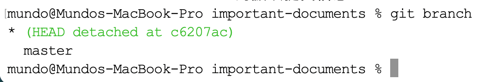
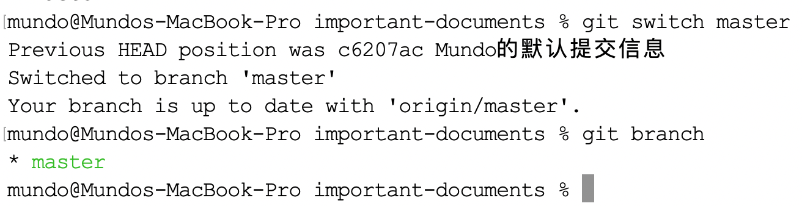

在使用`Git`进行项目开发时，有时我们需要检出某个特定提交节点的代码状态。这在代码回溯、调试历史问题，或从特定代码状态开始新功能开发时非常有用。以下是如何拉取`Git`中某个特定提交节点的代码状态并将其创建为新分支的详细步骤。

### 1. 获取特定提交节点的哈希值

首先，使用下面命令查看当前分支的提交历史：

```sh
git log --oneline
```

这将展示出提交哈希值的前七位，我们可以找到目标提交节点的哈希值。

### 2. 检出特定提交节点

获取到哈希值后，通过以下命令检出该提交节点的代码状态：

```sh
git checkout <commit-hash>
```

执行此命令后，`Git`将把当前工作目录中的代码状态切换到该特定提交。

在`Git 2.23`版本之后，也可以通过`git switch`命令的`--detach`参数检出特定提交节点：

```sh
git switch --detach <commit-hash>
```

### 3. 查看当前工作目录状态

此时运行`git status`命令，可以看到以下信息：

```sh
HEAD detached at <commit-hash>
```

这表示当前处于`detached HEAD`状态（游离`HEAD`），即`HEAD`直接指向某个具体的提交节点，而非指向某个分支的`ref`。此时`HEAD`并未处于任何分支之上，而是停留在该特定提交节点处。

在此状态下若需提交，应先创建新分支与之关联，否则后续提交将因没有分支`ref`跟踪而面临丢失的风险。

### 4. 创建新分支

我们打算在这个特定的提交节点上进行开发，所以创建一个新分支：

```sh
git switch -c <new-branch-name>
```

将`<new-branch-name>`替换为创建的新分支名称。这样，你就会在新分支中工作，而原始的主分支不会受到影响。

### 5. 将新分支推到远程仓库

使用以下命令将新分支推送到远程仓库：

```sh
git push -u origin <new-branch-name>
```

可以使用以下命令查看新分支是否成功推送到远程：

```sh
git branch -r
```

这将列出所有远程分支，确保你的新分支在列表中。

### 6. 恢复`HEAD`指向指定分支`ref`

首先使用`git branch`命令查看当前所在分支及全部本地分支信息，确认目标分支名称：



接着执行以下命令，退出`detached HEAD`状态，将`HEAD`重新指向目标分支：

```
git switch <original-branch-name>
```

这样，`HEAD`便不再游离于具体提交节点，而是重新与`master`分支的`ref`关联，恢复至正常的分支跟踪状态：



也可以执行如下命令，从`detached HEAD`状态回到原来分支：

```sh
git switch -
```

`-`是一个特殊简写，代表「上一个所在的分支」，执行后`HEAD`会重新指向切出前的分支`ref`，脱离游离状态。
