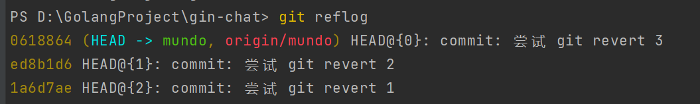
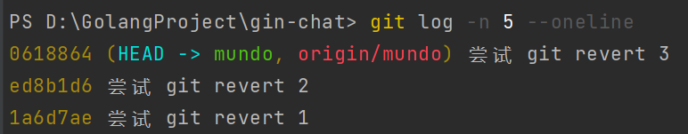
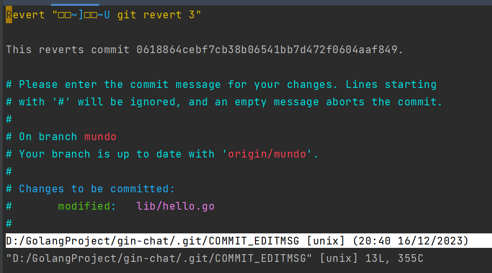
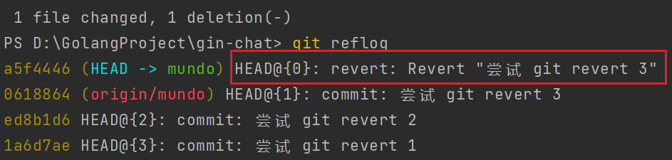
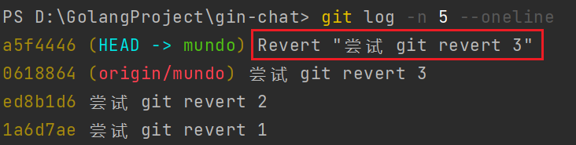
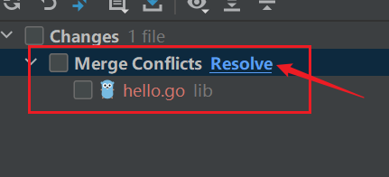
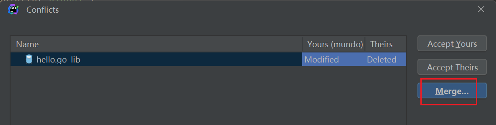

`git revert`用于撤销一个或多个已经`commit`并`push`的`Git`提交。它不会删除原有提交，而是创建一个新的提交，对指定提交执行逆向操作，从而保留完整的提交历史。因此，对于已经推送到远程仓库的提交，`git revert`是一种更安全的回滚方式。

我们进行了三次`commit`和`push`操作，可以通过`git reflog`查看这些提交记录：



使用`git log`查看提交记录如下：



现在想撤销最近一条提交，可以使用下面的命令。撤销哪条提交，就指定对应的提交哈希值：

```bash
git revert 0618864
```

执行后会出现一个类似的提示界面。根据`Linux`下`vim`的退出操作，输入`:q`即可退出：



`git revert`会创建一个新的`commit`，这个`commit`通过反向修改抵消指定提交所引入的变更。

我们再次查看`git reflog`，可以发现新增了一条`revert`记录：



`git log`中也是如此，产生了一条新的`revert`记录：



如果想撤回已经`push`到远程仓库的提交，建议优先使用`git revert`，而不是直接使用`git reset`。`git revert`会保留原有提交记录，并通过新增提交抵消指定提交的修改，因此再次`push`时不会因为重写远程分支历史而导致提交被拒绝。

如果需要撤销剩余的两条提交，可以同时指定多个提交哈希值：

```bash
git revert ed8b1d6 1a6d7ae
```

如果一开始就希望一次性撤销这三个提交，可以使用`^..`指定提交区间：

```bash
git revert <start-commit-SHA>^..<end-commit-SHA>
```

这里的顺序是，较早的提交作为`start`，较晚的提交作为`end`。例如，要撤销上面提到的三条提交，可以执行：

```
git revert 1a6d7ae^..0618864
```

执行过程中，每撤销一条提交都可能出现需要编辑提交信息的提示界面，使用`:q`退出即可，按实际情况完成操作。

当需要撤销的提交不是最近的一次，或者撤销范围不包含最近提交，又或者需要跳过中间某次提交时，都可能产生冲突。例如，三个提交都修改了同一个文件，此时撤销中间某个提交可能无法直接应用反向补丁，从而产生冲突：



此时会弹出冲突文件，可以点击`resolve`，选择`merge`进行冲突处理：



解决冲突后，使用下面的命令继续`revert`操作：

```bash
git revert --continue
```

如果不想解决当前冲突，而是希望取消这次`revert`操作，可以使用：

```bash
git revert --abort
```

如果有以下这样一个`merge`提交，其中`M`提交已经推送到远程仓库：

```mathematica
A --- B --- C ------- M  (release)
       \             /
         D --- E ---   (feature)
```

此时如果要使用`git revert`回滚这次`merge`操作，只需要在`release`分支执行：

```sh
git revert -m 1 <M-hash>
```

或者也可以直接使用：

```
git revert -m 1 HEAD
```

`-m 1`中的`-m`是`--mainline`的缩写，用于告诉`git revert`，对于一个`merge commit`，需要保留哪一个父提交对应的主线，并撤销另一个父提交带来的变更。上面的提交历史中，`M`有两个父提交，第`1`个父提交是`C`，第`2`个父提交是`E`。因此，执行上述`revert`命令，就是将`C`作为主线，计算`M`相对于`C`增加了哪些内容，也就是`feature`分支合并进来的修改。

随后，`git revert`会将这些修改反向应用，并生成一个新的`revert commit`，通过新的提交抵消`M`带来的代码变化。因此，在当前场景中，`-m 1`可以直接理解为：「以`release`原来的提交`C`作为主线，撤销这次`feature`合并带来的修改」。执行完成后，`release`的代码内容在效果上就回到了`C`提交时的状态。

回滚完成后，分支提交记录如下所示：

```mathematica
A --- B --- C ------- M --- R  (release)
       \             /
         D --- E ---   (feature)
```

其中，`R`是一个反向补丁提交。它会计算这次`merge`提交相对于指定父提交所引入的改动，然后生成对应的反向修改，并将这些修改作为一个新的提交保存。之后正常将`R`推送到远程仓库即可。

需要注意的是，不能使用`git revert`回退一次`rebase`操作。因为`git revert`针对的是某个具体提交所产生的差异，而`rebase`通常会重新生成一组新的提交，例如`D'`、`E'`。如果逐个对这些新提交执行`revert`，可能会产生更多反向补丁，使提交历史更加复杂。因此，`rebase`后的历史回滚需要结合具体的`rebase`方式、提交关系以及远程分支状态进行处理。
