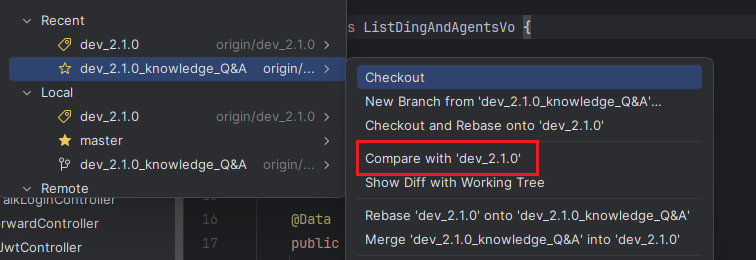
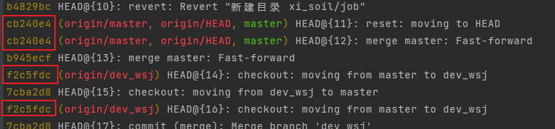

### 一、`git log`命令

`git log`命令用于查看指定分支的提交历史，也就是提交日志。

#### 1. 查看特定分支的提交日志

要查看特定分支的提交日志，使用以下命令：

```shell
git log <branch_name>
```

#### 2. 简化提交历史输出

使用`--oneline`选项简化提交历史的输出，仅显示提交的哈希值和提交信息：

```shell
git log --oneline <branch_name>
```

#### 3. 查看最近的提交

如果只想查看最近的几个提交，使用以下命令（例如查看最近`5`条提交）：

```shell
git log --oneline -n 5 <branch_name>
```

#### 4. 查看提交之间的关系

要查看提交之间的关系（如合并），使用以下命令：

```sh
git log --oneline --graph <branch_name>
```

输出示例如下：

```sh
*   c5f5678 Merge branch 'feature'     # `master` 分支上的 merge 提交
|\
| * 4a6d7b9 Add new feature            # `feature` 分支上的提交
* | 3b2f1a6 Update README              # `master` 分支上的提交
|/
* a1b2c3d Initial commit               # 项目的初始提交
```

在图示中，`* |`表示当前分支的提交，`| *`表示被合并的分支的提交，而分支点`a1b2c3d`及之前的提交是两条分支的共同祖先。

> 在上述命令中，如果未指定`<branch_name>`，则默认查看当前分支的提交日志。通常情况下，我们不会指定该参数。

#### 5. 对比分支提交

`feature`分支是从`release`分支拉出来的。为了确认`feature`分支中新增的提交是否已经合并回`release`分支，可以执行以下命令，列出`feature`分支中存在但`release`分支中不存在的提交：

```sh
git log --oneline release..feature
```

如果命令输出为空，说明`feature`分支中的所有提交已经包含在`release`分支中，即两者的差异已全部合并。

在`JetBrains`的`IDE`中，可以在`release`分支上，进入`feature`分支，点击`Compare with 'release'`，如下所示：



这样就可以查看两个分支之间的提交差异，包含两个分支各自独有、对方不存在的提交。

### 二、`git reflog`命令

`git reflog`用于记录引用（本地引用`ref`以及`HEAD`指针）的变动历史，也就是执行一系列操作时，引用从一个提交移动到另一个提交的过程。每条记录都包含对应的哈希，可用于在误操作后恢复到之前的状态。

我们需要明确本地引用`ref`与`HEAD`指针的关联与区别：

- 本地引用`ref`：每个分支对应一个，用于指向该分支当前被定义为分支顶端的提交。在非重写历史的情况下，执行`commit`操作后，该分支对应的`ref`会推进到新提交。

- `HEAD`指针：`Git`中始终只有一个，在非游离状态下，它指向当前分支的本地引用`ref`，而不直接指向提交。执行`commit`时，当前分支的`ref`被更新，`HEAD`由于指向该`ref`而间接反映到新的提交位置。

在大多数`Git`命令中，`HEAD`都会被自动解引用，因此可以直接将它当作其所指向提交的哈希值来使用。

`HEAD^`等价于`HEAD^1`，表示`HEAD`的第一个父提交；`HEAD^2`表示`HEAD`的第二个父提交。普通提交只有一个父提交，而合并提交通常有多个父提交，`HEAD^1`表示当前分支在合并前的提交，`HEAD^2`表示被合并进来的分支对应的提交。

假设我们有两个分支：`release`和`feature`，它们的提交记录如下所示：

```mathematica
         A --- B --- C  (release)
              	\
                  D --- E  (feature)
```

执行以下命令，将`feature`的提交合并到`release`分支上：

```sh
git checkout release
git merge feature
```

合并完成后，分支提交历史会如下所示：

```mathematica
        A --- B --- C ------- F  (release)
              \             /
               D --- E ----   (feature)
```

这时当前`HEAD`指向提交`F`，`HEAD^1`指向提交`C`，`HEAD^2`指向提交`E`。

> 若`HEAD`指向普通提交（非合并提交），执行`HEAD^2`时`Git`会报错，因为它不存在第二个父提交。

`HEAD~`语法中的`~`用于沿第一父提交链（即`HEAD^`）向前回溯，`HEAD~n`表示连续回退`n`步，只会沿主线历史移动。例如在上述示例中，`HEAD~1`对应提交`C`，`HEAD~2`对应提交`B`，`HEAD~3`对应提交`A`。

`~`和`^`可以组合使用，用来精确定位提交。例如`HEAD^2~1`表示先取`HEAD^2`（即提交`E`），再回退一步得到提交`D`；而`HEAD~1^2`表示先沿第一父链回退`1`步得到提交`C`，再取`C`的第二父提交，由于不存在第二父提交，会报错。实际操作中，建议不要依赖组合方式，而应通过`git log`查看提交的`hash`值后再进行操作。

我们可以通过下面命令，判断当前`HEAD`提交是否为合并提交：

```sh
git rev-list --parents -n 1 HEAD
```

该命令的运行结果格式如下：

```sh
<SHA1> <SHA2> <SHA3>
```

第一个`SHA`表示合并提交本身，第二个`SHA`对应`HEAD^1`，第三个`SHA`对应`HEAD^2`。若仅有一个`SHA`，说明这是初始提交；有两个`SHA`，说明是普通提交；有三个`SHA`，则说明是合并提交。

#### 1. 查看特定分支的`reflog`

要查看特定分支的本地引用`ref`的变动记录，使用以下命令：

```shell
git reflog <branch_name>
```

> **注意：**指定的分支必须是已存在的分支，不能是已经被删除的分支。

#### 2. 查看最近的操作记录

要查看特定分支的本地引用`ref`的最近几条变动记录，使用以下命令（例如查看最近的`5`条命令）：

```bash
git reflog <branch_name> -n 5
```

#### 3. 恢复误操作

如果意外删除了某个分支，可以通过以下方式恢复：

```shell
git switch -c <new-branch-name> <hash>
```

这里的`<hash>`指的是通过`git reflog`命令查找到的该分支最后一次提交对应的哈希值。

#### 4. 查看所有分支`HEAD`指针记录

如果不指定分支名，`git reflog`默认显示`HEAD`指针的所有变动记录，如下所示：



我们看到会显示出一些重复的哈希值，为了避免显示重复的哈希记录，建议在使用时加上分支名参数。

### 三、`git reflog`与`git log`的区别

- `git log`仅展示当前分支上的提交历史，其中也包含`merge`和`rebase`产生的相关提交记录。
- `git reflog`会记录并展示本地引用以及`HEAD`指针的所有变动记录，包括`commit`、`merge`、`rebase`、`checkout`、`pull`、`reset`以及分支的创建与删除等会影响本地引用以及`HEAD`指针位置的操作。

在`Git`默认配置下：普通`reflog`记录会保留`90`天；不可达对象对应的`reflog`记录会保留`30`天。