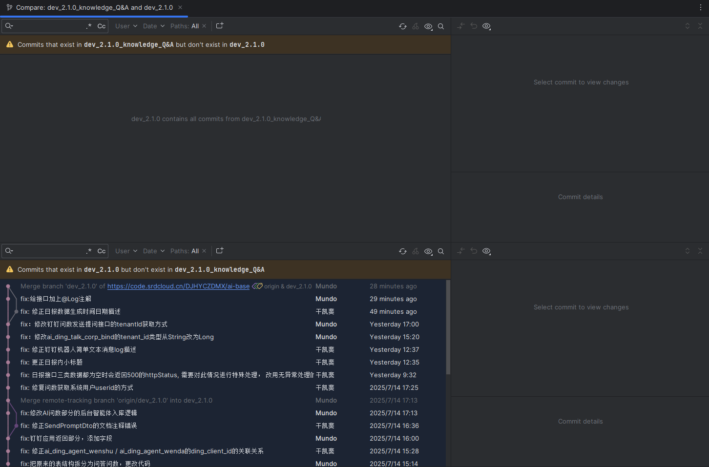

### 一、`git log`命令

`git log`命令用于查看指定分支的提交历史，也就是提交日志。

#### 1. 查看特定分支的提交日志

要查看特定分支的提交日志，使用以下命令：

```shell
git log <branch_name>
```

#### 2. 简化提交历史输出

使用`--oneline`选项简化提交历史的输出，仅显示提交的哈希值和提交信息：

```shell
git log --oneline <branch_name>
```

#### 3. 查看最近的提交

如果只想查看最近的几个提交，使用以下命令（例如查看最近`5`条提交）：

```shell
git log --oneline -n 5 <branch_name>
```

#### 4. 查看提交之间的关系

要查看提交之间的关系（如合并），使用以下命令：

```sh
git log --oneline --graph <branch_name>
```

输出示例如下：

```sh
*   c5f5678 Merge branch 'feature'     # `master` 分支上的 merge 提交
|\
| * 4a6d7b9 Add new feature            # `feature` 分支上的提交
* | 3b2f1a6 Update README              # `master` 分支上的提交
|/
* a1b2c3d Initial commit               # 项目的初始提交
```

在图示中，`* |`表示当前分支的提交，`| *`表示被合并的分支的提交，而分支点`a1b2c3d`及之前的提交是两条分支的共同祖先。

> 在上述命令中，如果未指定`<branch_name>`，则默认查看当前分支的提交日志。通常情况下，我们不会指定该参数。

#### 5. 对比分支提交

`feature`分支是从`release`分支拉出来的。为了确认`feature`分支中新增的提交是否已经合并回`release`分支，可以执行以下命令，列出`feature`分支中存在但`release`分支中不存在的提交：

```sh
git log --oneline release..feature
```

如果命令输出为空，说明`feature`分支中的所有提交已经包含在`release`分支中，即两者的差异已全部合并。

在`JetBrains`的`IDE`中，可以在`release`分支上，进入`feature`分支，点击`Compare with 'release'`，如下所示：


这样就可以查看两个分支之间的提交差异。如下图所示，上半部分显示`release`分支已经包含了`feature`分支的所有提交：



### 二、`git reflog`命令

`git reflog`命令用于查看当前仓库的所有操作记录，包括提交、合并、分支删除等操作。这些记录包括操作的哈希值，便于在需要时恢复之前的工作状态或找回误操作的提交。

#### 1. 查看特定分支的`reflog`

要查看特定分支的操作记录，使用以下命令：

```shell
git reflog <branch_name>
```

#### 2. 查看最近的操作记录

要查看最近的几条操作记录，使用以下命令（例如查看最近的`5`条命令）：

```bash
git reflog <branch_name> -n 5
```

#### 3. 恢复误操作

如果意外删除了某个分支，可以通过以下方式恢复：

```shell
git switch -c <new-branch-name> <哈希值>
```

如果不指定分支名，`git reflog`将显示所有`HEAD`分支的历史记录，如下所示：


我们看到会显示出一些重复的哈希值，为了避免显示重复的哈希记录，建议在使用时加上分支名参数。

### 三、`git reflog`与`git log`的区别

- `git log`只显示当前分支的提交记录，包括`merge`和`rebase`的记录。
- `git reflog`显示所有分支的操作记录，包括`commit`、`merge`、`rebase`、`checkout`、`pull`、`reset`、分支创建和删除等操作。