`git reset`命令用于重置`Git`仓库中的`HEAD`指针和暂存区的状态，常用于撤销提交、修改暂存状态或重写提交历史。该命令支持三种模式：`soft`、`mixed`（默认）和`hard`，下面我们将结合`GoLand`演示这三种模式之间的差异。

### 1. `soft`模式

首先我们这里做了两次本地提交，第一次提交了`hello.go`文件，第二次提交了`duck.go`文件，使用`git reflog`查看操作记录：

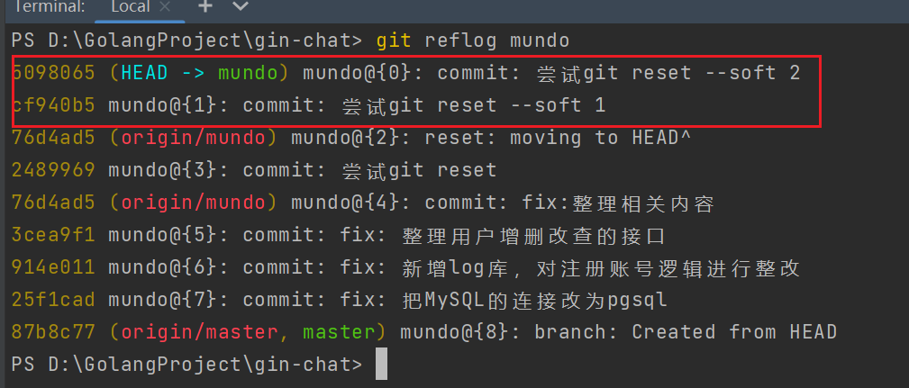

使用`git log -n 5 --oneline`查看提交记录：

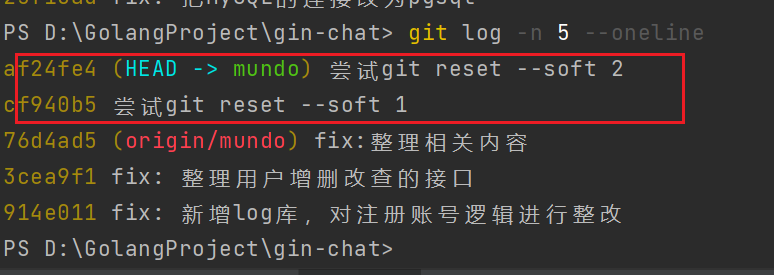

我们使用`soft`模式撤销最近两次本地提交，注意应使用这两次提交之前的提交的哈希值来进行操作：

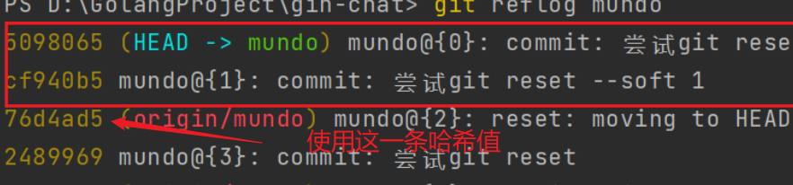

命令如下所示：

```bash
git reset --soft 76d4ad5
```

在`soft`模式下，前两次提交涉及的文件会被“恢复”到暂存区，即处于`git add`后的状态。此时，可以直接执行`git commit`重新提交这些改动。在`GoLand`中，工作区和暂存区没有明显区分，因此恢复后的状态是这样：

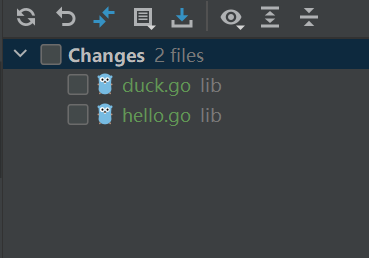

在查看了`git reflog`后，注意到下面这条`git reset`的操作记录：

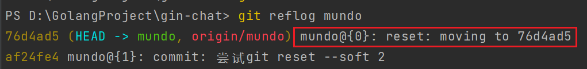

接着使用`git log -n 5 --oneline`命令查看提交日志，发现之前的两条提交记录已经消失：

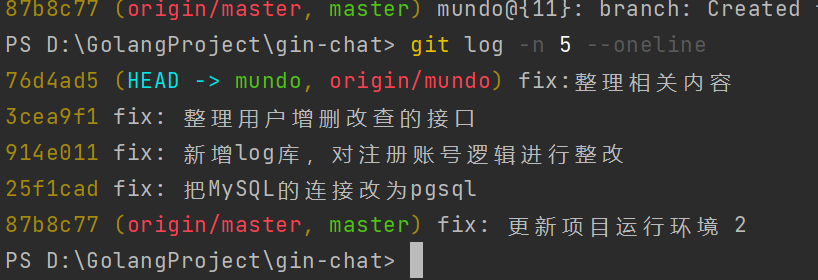

### 2. `mixed`模式

按照同样的步骤做两次提交，然后使用以下命令：

```sh
git reset <哈希值>
```

由于`mixed`模式是`git reset`的默认模式，所以可以不用加`--mixed`参数。使用的哈希值是这两次提交之前的提交的哈希值。

执行完成后，使用`git reflog`命令，看到这样的操作记录：

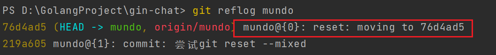

使用`git log`查看提交日志，发现两次提交记录已经消失：

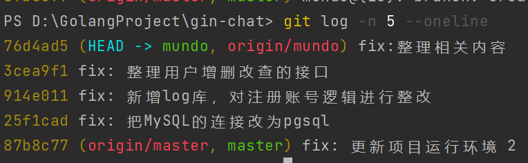

在`mixed`模式下，前两次提交涉及的文件会被“恢复”到工作区，此时需要使用`git add`重新选择哪些文件添加到暂存区，然后再进行提交。在`GoLand`中，`Git`会将那些从暂存区移除的文件标记为`Unversioned Files`：

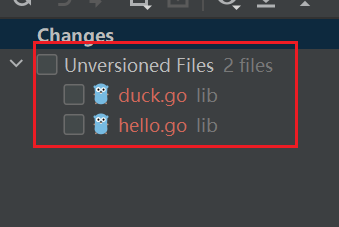

我们可以选择添加它们到`Git`管理，或者是丢弃它们：

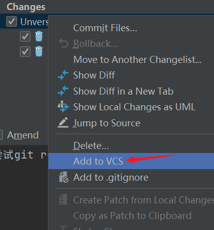

### 3. `hard`模式

最后测试`hard`模式，使用以下的命令：

```sh
git reset --hard <哈希值>
```

这两次提交涉及的文件彻底被清除，不会出现在`commit`栏中：

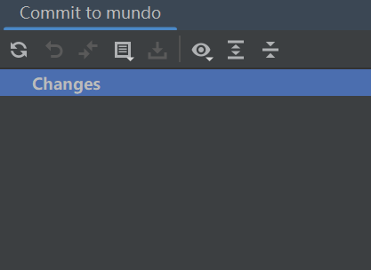

### 4. 注意事项

如果在`git commit`后执行了`push`操作，那么`reset`操作只会影响本地，不会改变远程状态。然而，由于已经撤回了提交记录，下一次推送到远程时，会因为远程有本地不存在的提交记录而被拒绝。在这种情况下，可以使用下面命令进行强制推送：

```bash
git push --force-with-lease
```

因此，`git reset`适合撤回那种已经`commit`但是没有`push`的提交记录，也就是撤回本地仓库的推送。

这里简要说明一下`--force-with-lease`与`--force`的区别。二者的核心差异在于是否对远程分支的状态进行校验：

- `git push --force`的行为是：不进行任何校验，直接使用本地分支覆盖远程分支，存在覆盖他人已推送提交的风险。
- `git push --force-with-lease`的行为是：在执行强制推送前，会校验远程分支当前指向的提交，是否与本地上一次记录的远程分支提交状态一致。如果二者不一致，说明远程分支发生了改变，此时推送会被拒绝，以避免误覆盖他人已提交的内容。

除非确有必要强制覆盖远程分支内容，否则应优先使用`--force-with-lease`，而非`--force`。

`git reset`不仅可以回退`commit`，还可以回退通过`merge`引入的变更。例如这样的一次合并提交：

```mathematica
A --- B --- C ------- M  (release)
      \             /
       D --- E ----  (feature)
```

如果`M`提交还未推送到远程仓库，要回退这次`merge`操作，可以在`release`分支上使用如下命令：

```sh
git reset --hard <C-hash>
```

或者也可以使用下面的命令代替：

```sh
git reset --hard HEAD^1
```

执行完以后，提交历史会重新变回：

```mathematica
A --- B --- C  (release)
        \
         D --- E  (feature)
```

如果`M`提交已推送至远程仓库，在可以保证分支安全的情况下，也可以使用下面命令强制推送：

```sh
git push --force-with-lease
```

这种情况更好的方式是使用`revert`操作，详情可见下一节内容。

对于`rebase`操作的回退，可以通过`git reflog`定位到`rebase`之前的`HEAD`位置，或者如果能够明确知道`rebase`之前的最后一次提交，也可以直接使用该提交的哈希值，再通过`git reset --hard`将分支回退到目标状态。需要注意的是，若`rebase`之后产生的新提交已经推送到远程分支，则必须使用强制推送，将本地回退后的结果同步到远程。
